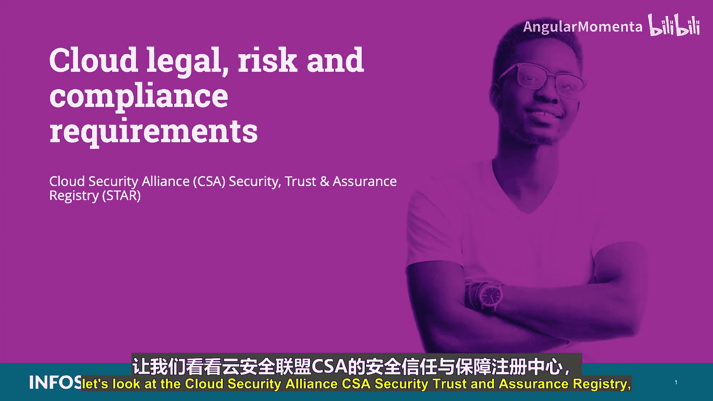
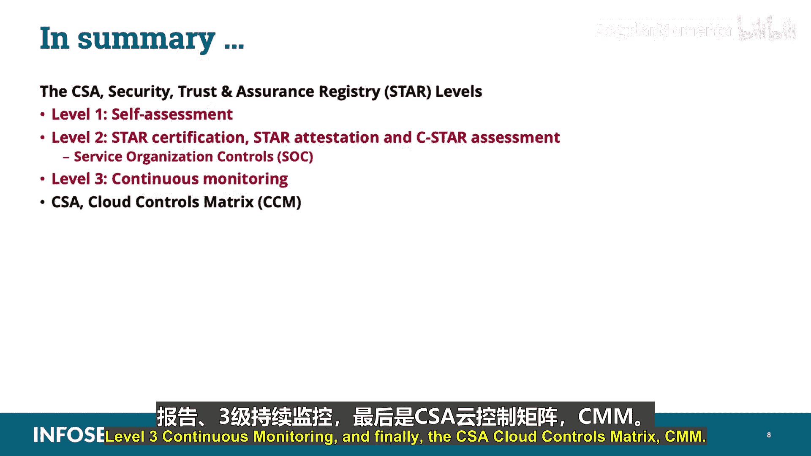

# 039：云安全联盟安全信任与保证注册表（STAR）📚



在本节课中，我们将学习CCSP认证“云法律风险与合规要求”知识域的一个重要组成部分：**云安全联盟安全信任与保证注册表**。我们将了解其背景、三个保证级别以及相关的核心框架。

---

## 课程概述

随着云计算的普及，行业缺乏统一的云安全标准和框架。为应对这一挑战，云安全联盟推出了**安全信任与保证注册表**。STAR是一个免费的公开注册表，旨在提升云服务环境的透明度和保证。云服务提供商可以在此发布其安全评估结果，而云服务用户则可据此评估提供商的安全性。

---

## STAR的三个保证级别

STAR包含三个保证级别，这些级别与**云安全联盟云控制矩阵**的控制目标保持一致。CCM涵盖了14个安全领域的133项控制措施，帮助云客户评估云服务的整体安全风险。

以下我们将逐一探讨这三个级别。

### 第一级：自我评估

第一级是**自我评估**。这要求云服务提供商发布并公开其基于CSA共识评估倡议问卷或云控制矩阵的尽职调查自我评估报告。对于某些场景，自我评估可能已足够，但其他场景可能要求更高级别的第三方验证。

### 第二级：认证、STAR鉴证与C-STAR评估

第二级涉及**认证、STAR鉴证与C-STAR评估**。此级别要求发布由独立第三方基于CSA CCM、ISO/IEC 27001:2013或美国注册会计师协会的服务组织控制报告进行的评估结果。

上一节我们介绍了自我评估，本节中我们来看看更严格的第三方验证，特别是与服务组织控制报告相关的内容。

以下是关于SOC报告的关键信息：

*   **SOC 1报告**：这是一份财务报告，关注与实体财务报告相关的内部控制。其审计依据是**SSAE 18**标准。国际等效标准是**ISAE 3402**。
*   **SOC 2报告**：此报告关注非财务系统，评估组织在保密性、完整性、可用性、安全性和隐私方面的控制框架（如NIST、ISO 27001、COSO）实施情况。它通常是一份**限制使用报告**，因其包含详细的控制信息。
*   **SOC 3报告**：也称为系统信任报告。它与SOC 2类似，但主要区别在于，SOC 3报告是**通用报告**，细节有限，通常用于在网站上展示认证标志（如“ISO 27001 Certified”）。

此外，SOC报告有两种类型：

*   **Type 1报告**：这是一个**时点报告**，涵盖控制措施的设计。
*   **Type 2报告**：这是一个**期间报告**，涵盖控制措施的设计和运行有效性。

### 第三级：持续监控

第三级是**持续监控**。目前，云安全联盟仍在制定该级别的具体要求。它要求基于**云信任协议**发布并公开与安全属性监控相关的结果。

---

## 云控制矩阵

在了解了STAR的级别后，我们来看看其核心基础：**云安全联盟云控制矩阵**。

CCM专门用于为云供应商提供基本安全原则指导，并帮助潜在云客户评估云提供商的安全风险。它提供了一个控制框架，详细阐述了与CSA指南一致的安全概念和原则。

CCM的基础在于它与其他行业公认安全标准、法规和框架（如ISO 27001/2、COBIT、PCI DSS、NIST、Jericho Forum、NERC CIP）的对应关系。它可以增强或为云提供商提供的内部控制报告和鉴证提供指导。

以下是一个CCM模板的示例代码结构，展示了其组织方式：

```plaintext
域: 审计与问责
控制项: AU-01
控制描述: 必须记录和审查审计事件。
相关标准: ISO/IEC 27001:2013 A.12.4.1, PCI DSS 10.1
```

---

## 课程总结



本节课中，我们一起学习了**云安全联盟安全信任与保证注册表**。我们探讨了其背景、三个保证级别（L1自我评估、L2第三方认证与鉴证、L3持续监控），并深入了解了作为评估基础的**云控制矩阵**以及与之相关的**服务组织控制报告**。理解STAR及其组成部分，对于评估云服务提供商的安全性和合规性至关重要。