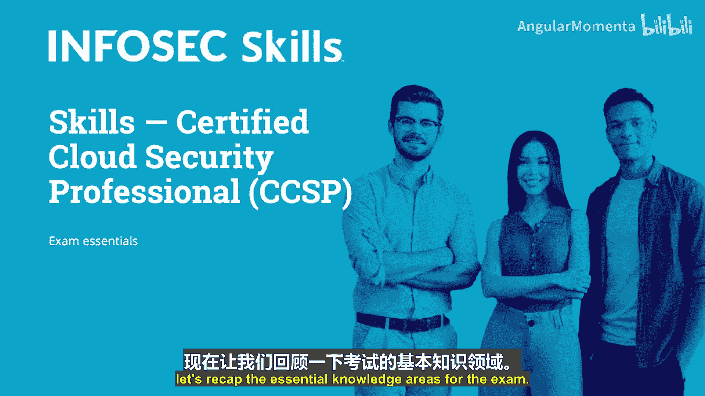
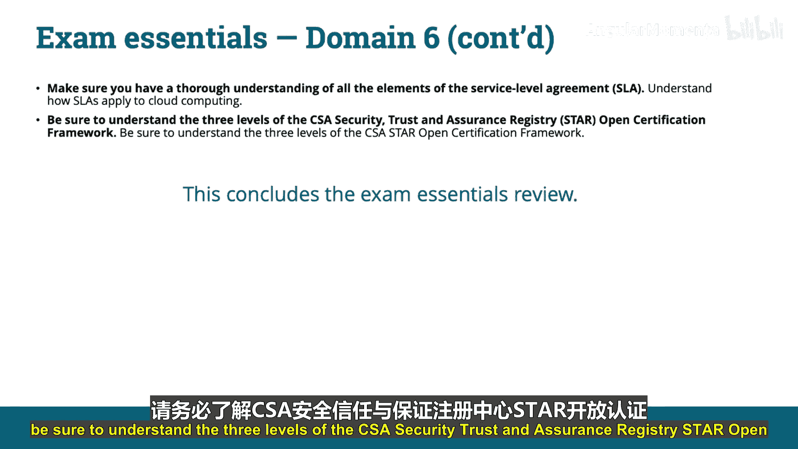

# 040：考试要点回顾 📚

在本节课中，我们将系统回顾CCSP认证考试的六个核心知识领域。我们已经完成了所有领域的学习，现在需要梳理并巩固每个领域的核心要点，为考试做好充分准备。

## 领域一：云概念、架构与设计

上一节我们介绍了课程的整体结构，本节中我们来看看第一个领域的核心要点。该领域关注云的基础概念和设计原则。

以下是您需要掌握的核心知识：
*   **理解业务需求**：始终牢记，所有管理决策（包括安全和风险决策）都由业务需求驱动。安全与风险应在决策前被考虑，但可能不会凌驾于组织的业务和运营需求之上。
*   **掌握云术语与定义**：确保清晰理解本课程中介绍的定义。CCSP考试大量涉及我们描述的术语和定义。
*   **描述云服务模型**：理解三种云服务模型（**IaaS, PaaS, SaaS**）之间的差异及其相关特性至关重要。
*   **理解云部署模型**：同样重要的是理解四种云部署模型（公有云、私有云、社区云、混合云）的特性及其差异。
*   **熟悉云计算角色与职责**：确保了解并理解不同角色及其各自的责任。
*   **确定业务需求**：理解业务影响分析的功能和目的，以及它如何帮助组织确定资产清单的价值和关键性。
*   **熟悉各云服务模型的边界**：了解哪些模型将典型控制措施和依赖项分配给云服务关系中的参与方。
*   **理解合同协商空间**：认识到在所有服务模型中，云提供商和云客户在合同定义责任和权利方面存在大量协商空间。
*   **理解云架构如何支持敏感数据安全**：熟悉设备加固、加密和纵深防御如何增强云中数据的保护。了解在哪里可以找到安全云设计的框架、模型和指南。

## 领域二：云数据安全

在掌握了云的基础架构后，我们进入数据安全领域。数据是云环境中的核心资产，其安全至关重要。

以下是您需要掌握的核心知识：
*   **了解不同形式的数据分析**：熟悉数据挖掘、实时分析和敏捷商业智能的描述。
*   **理解与数据所有权相关的角色、权利和责任**：了解数据所有者、控制者、处理者和保管人是谁，以及各自相关的权利和责任。
*   **理解数据分类和分级的目的与方法**：了解数据所有者为何以及如何对其控制下的特定数据集分配类别和级别。
*   **熟悉数据发现方法**：了解数据如何、何时被标记以及由谁标记。同时了解基于内容的发现以及在发现工作中使用元数据。
*   **了解数据生命周期**：按顺序了解数据生命周期的所有阶段，但请记住，它们不必按该顺序执行。为了考试，请按顺序记住它们，并认识到在实践中不一定按特定顺序执行。
*   **熟悉各种知识产权保护措施**：了解版权、商标、专利和商业秘密的保护。
*   **了解数据保留、审计和处置策略应包含的内容**：理解保留和处置条款、保留格式、法规如何规定这些事项等基本方面，以及每项策略都需要包含维护、审查和执行的细节。

## 领域三：云平台与基础设施安全

数据安全依赖于底层的平台和基础设施。接下来，我们探讨支撑云服务的平台与基础设施的安全考量。

以下是您需要掌握的核心知识：
*   **理解与云数据生命周期每个阶段相关的风险和安全控制**：每个阶段都有其伴随的风险，这些风险通常与特定的一组或一类安全控制相关联。
*   **理解各种云数据存储架构**：能够区分文件存储、块存储、数据库和内容分发网络。
*   **理解云中如何以及为何实施加密**：了解密钥管理的基本要素，特别是要知道加密密钥不应与它们用于加密的数据存储在一起。
*   **了解新兴技术**：如同态加密，以及未来它如何可能用于处理加密数据而无需先解密。
*   **熟悉数据混淆实践**：了解数据脱敏、隐藏、匿名化和令牌化的不同技术。
*   **熟悉SIEM技术**：了解SIEM实施的目的以及使用这些解决方案相关的挑战。
*   **理解出口监控的重要性**：熟悉数据防泄漏解决方案的目标、它们如何工作，以及云客户尝试在云数据中心内实施DLP可能面临哪些挑战。
*   **了解客户与提供商之间的责任分担**：这一点非常重要。请记住课程中提供的责任级别概念图表，其中各方的责任级别取决于所提供服务的量。客户始终对数据和治理、风险与合规负责，云服务提供商始终对物理安全负责。您还必须了解哪些是共同责任，这取决于服务类型。
*   **理解云中的业务连续性与灾难恢复**：注意与传统环境中BCDR计划和活动的相似之处，但要特别关注云客户与云提供商之间必要安排的复杂性增加，以及合同中这些安排的重要性。

## 领域四：云应用安全

在稳固的基础设施之上运行的是应用程序。本节我们关注云环境中的应用安全，这是保护服务的最后一道防线。

以下是您需要掌握的核心知识：
*   **了解云数据中心设计中如何实施冗余**：请记住，所有基础设施、系统和组件都需要冗余，包括公用设施（电力、水、传导性）、处理能力、数据存储、人员以及应急和应急服务。出口路径、应急照明和燃料也需要冗余。
*   **了解正常运行时间研究所发布的四个数据中心冗余等级**：理解从第1级到第4级设计的复杂程度升级，以及每个等级之间的基本差异。
*   **了解培训与意识的重要方面**：理解培训如何影响组织的风险，并了解哪些要素支持培训工作，特别是高级管理层的认可、充足的资金以及与工作任务的关联性。
*   **理解静态应用安全测试与动态应用安全测试的区别**：了解SAST是白盒测试，涉及源代码审查；DAST是黑盒测试，在运行时（即应用程序运行时）执行。
*   **理解系统和组件监控**：确保熟悉监控数据中心所有基础设施、硬件、软件和介质各个方面的重要性和目的，包括温度、湿度和事件日志记录。
*   **透彻理解维护策略和程序**：这些策略和程序包括维护模式与正常操作、执行更新和升级的流程，以及手动与自动补丁管理的风险和益处。
*   **了解变更管理的目的和一般方法**：理解变更管理委员会的组成及其运作方式。
*   **理解业务连续性与灾难恢复策略、规划和测试的所有方面**：重点关注BCDR策略、规划和测试，特别是与云数据中心相关的部分。了解备用电源的考虑因素以及测试BCDR计划有效性的方法。

## 领域五：云安全运营

安全的设计需要有效的运营来维持。现在，我们转向确保云环境持续安全运行的日常活动和流程。

以下是您需要掌握的核心知识：
*   **了解提供商在数据中心提供安全物理、逻辑和网络元素的职责**。
*   **理解提供商将如何使用安全流程、方法和控制措施，为客户提供一个可信的业务环境**。
*   **了解在每个云服务模型中，哪一方最可能承担哪些特定的安全责任**：了解在基础设施即服务、平台即服务和软件即服务配置中，提供商和客户各自的任务是什么。
*   **理解云客户和云提供商可能共享哪些责任**：了解操作系统和应用程序基线化管理责任可能被共享，身份和访问管理在某种程度上也可能被共享。
*   **了解最可能用于云数据中心的不同类型审计报告**：理解SOC 1、2、3报告以及类型1和类型2之间的区别。了解哪种报告更适用于详细分析，以及云客户最可能接触到哪种。
*   **理解ANF和ONF之间的区别**：ONF代表所谓的“安全容器网络”，是一个组织利用的应用程序安全最佳实践目录的子组件。它由多个ANF组成。ANF代表围绕特定业务应用程序以达到目标信任级别的ONF组织的任何子集。请记住，**一个ONF对应多个ANF**。
*   **能够阐述STRIDE模型的组成部分**：STRIDE威胁模型代表六类威胁：假冒、篡改、抵赖、信息泄露、拒绝服务和权限提升。不要忘记DREAD模型，它由损害潜力、可再现性、可利用性、受影响用户和可发现性组成。
*   **能够描述SDLC的阶段**：确保理解SDLC模型中的阶段。SDLC包括以下阶段：定义、设计、开发、测试、安全运营和处置。
*   **理解身份和访问管理及其如何融入云环境**：随着基于角色的访问控制的出现，身份和访问管理在管理用户方面起着关键作用。理解这一点以及联合身份的重要性。
*   **理解云应用架构的具体要求**：并非所有应用程序都设计为在云中运行。务必理解在设计或尝试将应用程序迁移到云时架构上的差异。

## 领域六：法律、风险与合规

最后，任何安全实践都必须在法律和合规的框架内进行。本节总结云安全所涉及的法律、风险和合规性要求。

以下是您需要掌握的核心知识：
*   **基本理解相关的ISO和IEC标准**：如ISO 27001。ISO标准不是法律，而是来自世界各地的专家共同制定的操作标准。许多国家和联盟（如欧盟）的许多政策都基于ISO相关标准。
*   **清晰理解围绕电子取证的相关问题**：包括取证、证据链保管以及在云环境中进行取证收集所面临的挑战。由于地理和地缘政治分散等因素，在云环境中尝试进行电子取证可能非常具有挑战性。
*   **理解审计流程**：理解基本的审计概念，如内部审计与外部审计，以及在执行审计时独立性的差异和重要性。可靠性较低的内部审计协助内部运营，而更为独立的外部审计则能更彻底地发现可能给组织带来风险的敏感问题。
*   **熟悉个人可识别信息的基本定义**。
*   **熟悉合同规定与受监管的、国家特定法规之间的差异**。
*   **理解敏感与非敏感PII之间的区别**：使用直接和间接标识符。此外，请注意，即使PII本身可能是非敏感的，当与其他非敏感信息结合时，也可能变得敏感。
*   **确保牢固掌握本课程讨论的模型、框架和标准**：包括ISO标准、NIST标准和ENISA标准。
*   **熟悉数据管理角色**：确保理解各种数据角色、活动以及各自的责任。
*   **确保透彻理解服务等级协议的所有要素**：理解服务等级协议如何适用于云计算。
*   **务必理解CSA安全、信任和保证注册的三个级别**：即开放认证框架。

---

本节课中，我们一起系统回顾了CCSP认证考试六个领域的核心要点，从云基础概念、数据安全、平台安全、应用安全、安全运营到法律风险与合规。掌握这些要点对于通过考试和在实际工作中应用云安全知识至关重要。建议结合图表和实际案例进行深入理解，并做好充分的练习准备。