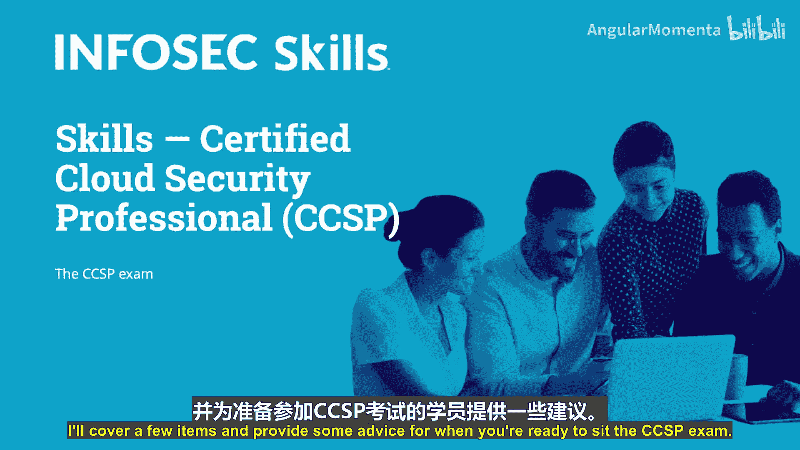
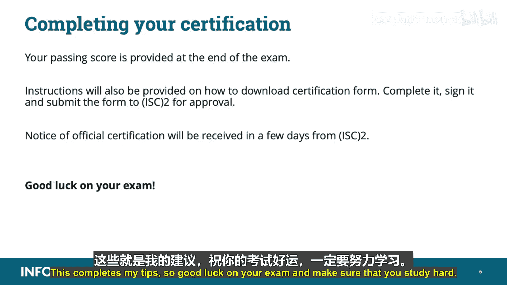

# 041：考试概览与准备策略 📘

在本课程中，我们将介绍CCSP认证考试的相关事项，并提供一些备考建议。无论您是否已满足屏幕上列出的官方要求，都可以参加CCSP考试。但请注意，只有在满足所有要求后，您才能获得正式认证；在此之前，您可能只会获得“准CCSP”资格。

## 认证要求与道德准则

要获得CCSP认证，您需要满足以下工作经验要求之一：
*   拥有**五年**全职带薪工作经验。
*   拥有**四年**工作经验，并持有有效的CSA CCSK（认证云安全知识）认证。
*   若已持有CISSP认证，则可**完全替代**CCSP的经验要求。

除了满足经验要求，您还必须同意并遵守(ISC)²的道德准则，该准则可在 `www.isc2.org/ethics` 查阅。

## 认识CCSP六大知识域

上一节我们明确了考试资格，本节中我们来看看考试的核心内容。您需要熟悉CCSP的六个知识域。以下是基于考试权重划分的、各知识域可能的题目数量分布，这有助于您更有针对性地复习。

## 考试题型与策略

考试大部分题目是标准四选一单选题。部分题目会基于一个提供的场景或情境，您需要先阅读材料。

**面对场景题的黄金法则**：务必先看问题，再带着问题去阅读场景。请确保理解题目在问什么，并寻找关键词。例如，题目是问“以下哪项**不是**要求”还是“以下哪项**是**要求”？是要求“选择以下两项”还是“选择一项”？

考试至少包含125道选择题，其中25道是不计分的测试题。这些题目随机混合在试卷中，您无法区分，因此必须认真作答所有125道题目。

## 考试时间与变化

目前，您有**4小时**完成考试，平均每题约2分钟。但请注意，**自8月1日起，考试时间将缩短为3小时**。考试内容本身基本保持不变，主要变化是一些知识点可能在知识域之间迁移或重组。因此，您复习的内容依然有效，只是答题时间更为紧张。

考试结束后会立即显示成绩。请记住，**未作答的题目不得分**。

## 考前注册与现场须知

在Pearson VUE注册考试时，请确保提供的姓名与您考试当天出示的有效身份证件上的姓名完全一致。例如，如果您的证件显示“Robert”，即使您常用名是“Bob”，也必须注册为“Robert”，否则将被拒绝入场。

请提前到达考场。您可以携带饮料和食物，但必须存放在考场提供的储物柜中，仅在休息时可取用。请注意，休息期间考试计时**不会停止**，请谨慎管理时间。

## 核心备考技巧

以下是一些关键的备考与应试技巧：

*   **完成模拟试题**：认真完成提供的模拟考试。
*   **研究错题**：对做错的每一道题进行研究，可能需要查阅资料或深入学习。
*   **高效答题**：答题时保持高效，不要浪费时间，并时刻留意剩余时间。
*   **排除法**：在猜测答案前，尝试先减少或排除一些明显错误的选项。
*   **注意问题格式**：再次强调，务必注意问题的提问方式。
*   **利用草稿板**：使用考场提供的白板做笔记。
*   **审题与思考**：阅读问题时问自己：这个问题是在寻找一个**程序**、**政策**还是**法规**？是问什么对公司**最有利**还是对安全**最有利**？我在此情境中扮演什么**角色**或应该站在什么**立场**？
*   **关键词与视角**：记住，**最佳答案并不总是最安全的那个**。始终牢记答题时所处的视角。另外请注意，“客户”和“企业”在题目中通常可互换使用，含义相同。若未特别说明，则默认您处于**客户或企业**的视角；如果题目未提及，则通常是指云服务提供商。

## 通过考试与获得认证

一旦您通过考试，考试结束时会立即提供您的成绩。同时会获得如何下载认证申请表、填写、签署并提交给(ISC)²审核的指引。(ISC)²通常会在几天内发出正式认证通知。

## 总结

本节课中我们一起学习了CCSP考试的基本要求、知识域构成、题型策略、时间安排、考场规则以及一系列实用的备考与答题技巧。关键点包括：确保注册信息准确、掌握先读问题再读场景的方法、注意考试时间变化、在答题时保持正确的角色视角。祝您考试顺利，请务必努力学习！

