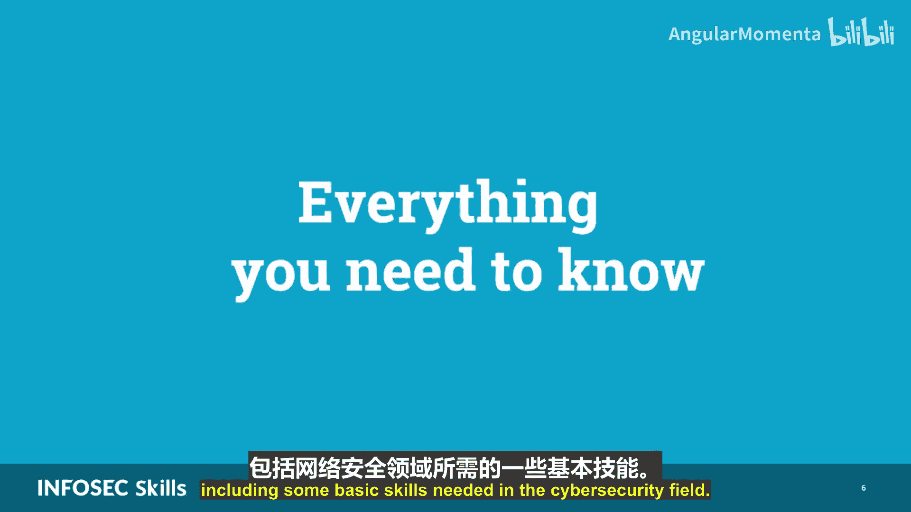
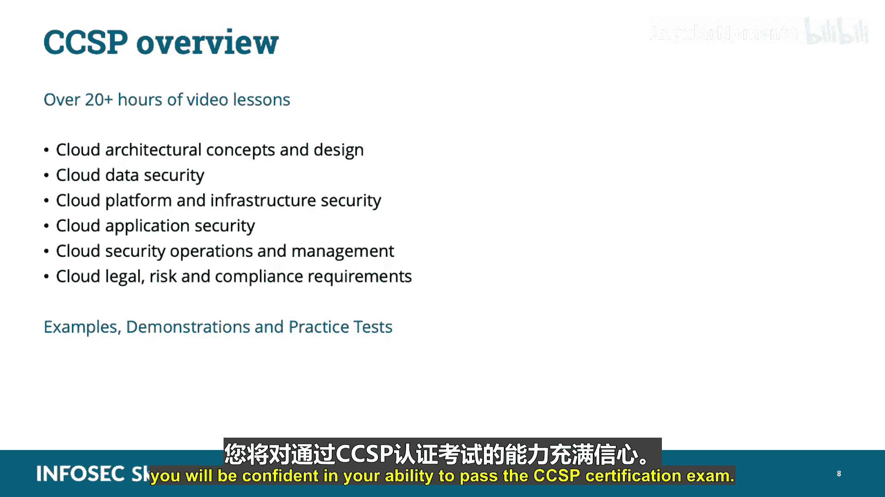
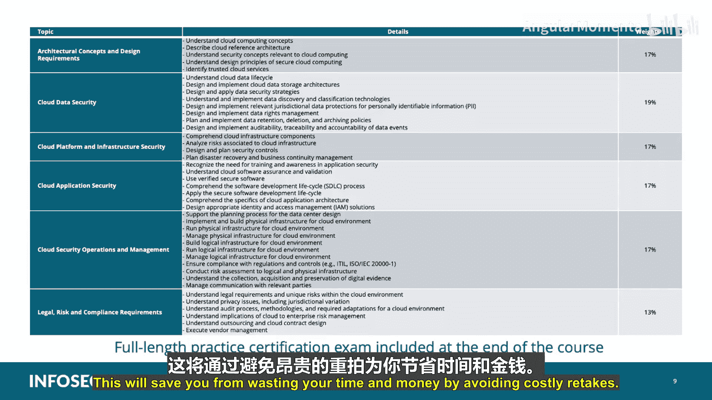
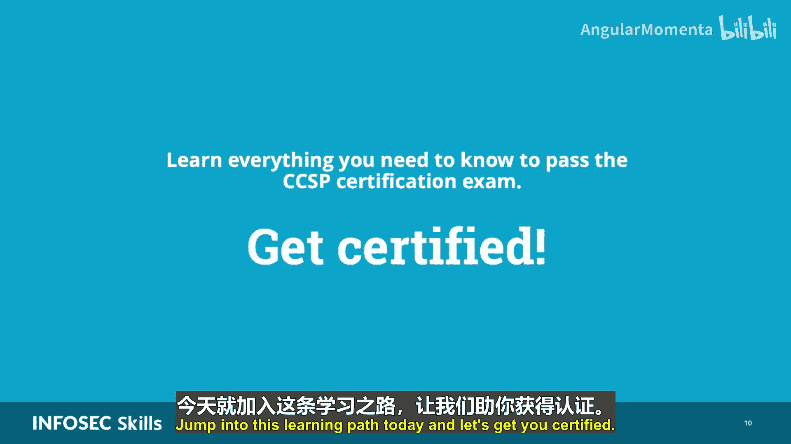

# 001：课程概述 🚀

在本节课中，我们将要学习CCSP认证云安全专家课程的整体介绍，了解课程目标、内容结构以及它如何帮助你通过认证考试。

你是否希望按照自己的时间安排，准备并通过认证云安全专家考试？如果是，那么这门学习路径正是为你设计的。国际信息系统安全认证联盟与云安全联盟合作，开发了CCSP认证，以满足市场对训练有素的合格云安全专业人员日益增长的需求。

我是Ross Cassonnova，在网络安全领域工作超过20年，持有CCSP、CCSK、CISSP、CM IT Foundation、SMSP、GAC Security Plus以及NSA的IAM等多项认证。我已帮助数千名学生通过认证考试，成功进入网络安全领域。我设计这门学习路径，旨在聚焦于你通过CCSP认证考试并推动职业发展所需掌握和理解的核心知识。

你是否一直想了解云计算及其如何改变商业世界？或者希望通过获得新技能来推进你的网络安全或信息技术职业生涯？如果是，那么这门学习路径非常适合你。

我们将教授你参加并通过CCSP认证考试所需的一切知识。尽管认证云安全专家认证是针对具备一定领域背景的从业者的专业认证，但我们的学习路径涵盖了所有你需要了解的内容，包括网络安全领域所需的一些基本技能。

云安全是网络安全领域需求极高的技能。在这门学习路径中，我将带你学习CCSP的六个知识域，它们分别是：
1.  云架构概念与设计需求
2.  云数据安全
3.  云平台与基础设施安全
4.  云应用安全
5.  云安全运营与管理
6.  云法律、风险与合规要求

以及所有与云安全相关的子领域要素。

这门学习路径是你完整全面的学习解决方案。我将为你提供超过20小时的视频课程，结合理论与概念，并辅以示例、演示和多项实践测试。完成本学习路径后，你将对通过CCSP认证考试充满信心。

在本学习路径的结尾，我们包含了一套完整的模拟认证考试。因此，你将能够判断自己是否已准备好参加CCSP认证考试，并对通过考试充满信心。这将帮助你避免因重考而浪费时间和金钱。

你可以信任我，帮助你学习所需的一切知识。那么，还在等什么呢？今天就加入这门学习路径，让我们一起助你获得认证！😡

本节课中，我们一起学习了CCSP认证云安全专家课程的概述，明确了课程的目标、内容结构以及它如何帮助你高效备考并成功通过认证。