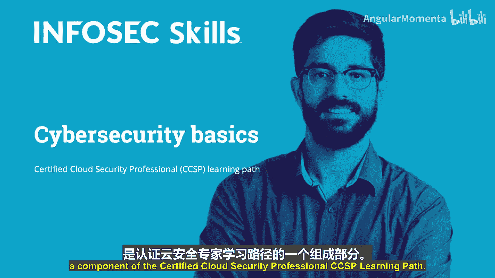
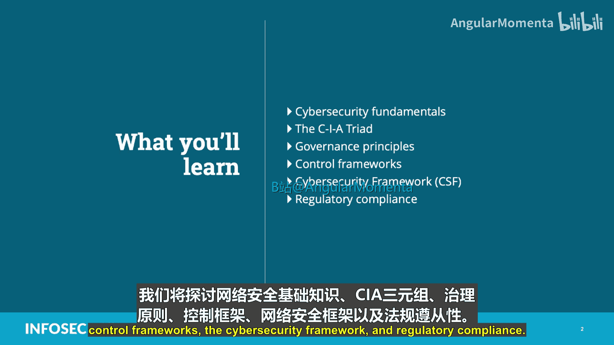
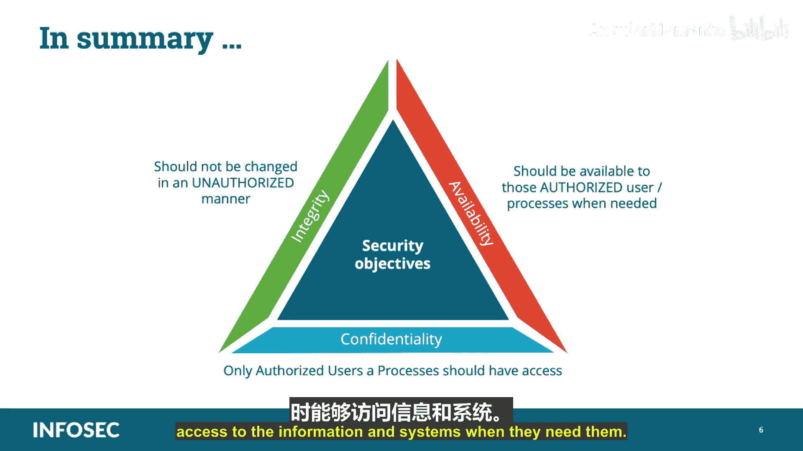

# 002：网络安全基础与CIA三元组

在本节课中，我们将学习网络安全的基础知识，核心是理解CIA三元组（保密性、完整性、可用性）的概念。这是构建所有安全策略和控制的基石。

## 网络安全基础

上一节我们介绍了课程概览，本节中我们来看看网络安全的基本定义与范畴。

网络安全被定义为：通过应对威胁来保护信息资产，这些信息由互联信息系统处理、存储和传输。它也被定义为保护网络、程序和数据的完整性，使其免受未经授权的访问、损坏或攻击的措施。

信息安全旨在维护数据的保密性、完整性和可用性，它是网络安全的一个子集。网络安全可以成为组织整体风险管理流程中一个重要且强化的组成部分。与财务和声誉风险一样，网络安全风险也会影响公司的盈亏。

在审视业务驱动因素时，还应理解网络安全与信息安全之间的区别。信息安全处理信息，无论其格式如何（例如纸质文件、数字和知识产权、口头或视觉文件、任何媒介的通信）。网络安全则关注保护数字资产的保密性、完整性和可用性，这些资产可以包括网络硬件或软件，以及由联网信息系统处理、存储或传输的信息。

## 理解CIA三元组

了解了网络安全的广义定义后，我们聚焦于其核心原则：CIA三元组。

信息安全管理的目标，是使信息安全与组织对**保密性**、**完整性**和**可用性**的要求保持一致。这被称为CIA三元组。在某些出版物中，它可能被列为AIC（可用性、完整性、保密性），但本质相同。

它平衡了风险与安全投资及回报，为将风险控制在组织可接受水平内提供了监督机制，并衡量信息安全绩效的有效性，同时设定政策、程序、标准、基线和指南。

安全程序有许多大大小小的目标，但它们都基于简单的原则：资产需要保护，而这种保护基于保密性、完整性和可用性的要求。安全通过**安全治理**来确保，安全治理由管理实践和管理监督组成，并通过合规性来体现。

合规性可以是法律或法规遵从，包括遵守适用的法律和监管要求、适用的政策标准程序和指南、人员安全策略以及资产保护措施，这些构成了安全的基础。资产的意外泄露、未经授权的修改或破坏都可能影响安全。

## CIA三元组详解

现在，让我们逐一深入探讨CIA三元组的每一个组成部分。

### 保密性

保密性是指信息未被披露给系统实体（如用户、进程或设备）的特性，除非它们已被授权访问该信息。它还包括维护对信息访问和披露的授权限制，包括保护个人隐私和专有信息的方法。

这通过**最小权限原则**来强制执行，即只给予人们完成工作所需的最低限度访问权限，不多不少。它也基于**须知原则**。

### 完整性

完整性是指实体未被以未经授权的方式修改的特性，基本上是防止不当的信息修改或破坏，并包括确保信息的不可否认性和真实性。换句话说，确保信息被正确处理且未被未经授权的人员修改，并保护信息在网络中传输时的安全。

### 可用性

可用性是指经授权的实体在需要时能够访问和使用的特性。根据美国国家标准与技术研究院的定义，它是确保授权用户能够及时、可靠地访问和使用信息。换一种说法，就是确保系统启动并运行，以便授权人员和功能在需要时可以使用它们。

实现这一原则所需的安全级别因公司而异，因为每个公司都有其独特的业务和安全目标及要求的组合。此外，漏洞和风险是根据它们对CIA三元组一个或多个组成部分构成的威胁来评估的。换句话说，所有安全控制机制和保障措施的实施都是为了提供一个或多个这些原则，而所有风险、威胁和漏洞都是根据其破坏一个或全部CIA原则的潜在能力来衡量的。

## CIA的对立面：DAD

理解了CIA的目标后，我们来看看它们的反面，即DAD。

CIA三个目标的相反面被称为DAD：
*   **泄露** 是保密性的反面。保密性是确保只有授权用户能看到信息，泄露则相反。
*   **篡改** 是完整性的反面。完整性确保信息未被未经授权的方式修改，而篡改就是以任何方式修改信息。
*   **破坏** 是可用性的反面。可用性确保应用程序在需要使用时处于启动和可用状态，如果它们被破坏，就会变得不可用。

## 如何实现CIA原则

知道了目标和威胁，我们来看看如何通过具体措施来实现CIA原则。

以下是实现CIA三元组的一些常见技术方法：

*   **保密性** 可以通过使用**加密**来实现，例如：`encrypt(data, key)`。
*   **完整性** 可以通过**校验和**、**哈希值**、**数字签名**或**职责分离**来实现。
*   **可用性** 可以通过实施**备份**、**远程站点**、**集群**或不同级别的**独立磁盘冗余阵列**来实现。

## 总结

本节课中我们一起学习了网络安全的基础与核心CIA三元组。

总而言之：
*   **保密性** 的核心是确保只有那些授权的用户和进程能够访问系统和信息。
*   **完整性** 确保系统或信息不会被授权或未授权的个人以未经授权的方式更改。
*   **可用性** 的核心是确保那些授权的用户和进程在需要时能够访问信息和系统。

理解并平衡这三个原则，是设计有效安全策略的第一步。