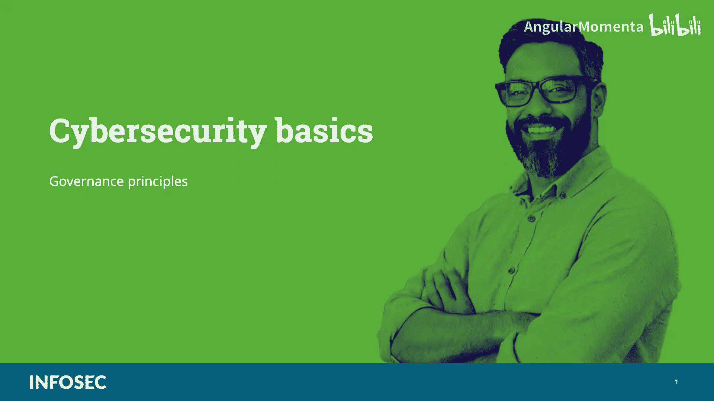
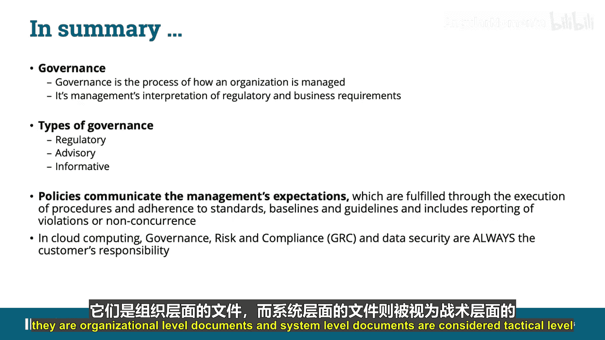

# 003：治理原则

在本节课程中，我们将学习信息安全治理的核心原则。我们将探讨安全策略、标准、基线、指南和程序之间的关系，以及它们如何共同构成一个有效的信息安全治理框架。理解这些概念对于在云环境中建立和维护安全至关重要。

## 安全策略与期望

安全策略传达管理层对保护组织**CIA三要素**（保密性、完整性和可用性）的期望。这些期望通过执行**程序**和遵守**标准、基线和指南**来实现。策略文档创建后，需要确保其合规性。

此外，策略必须是技术和解决方案独立的。它必须概述目标和使命，但不将组织束缚于实现这些目标的特定方式。

## 策略的支持组件

上一节我们介绍了策略定义了管理层的期望，本节中我们来看看支持策略实施的具体组件。程序、标准、指南和基线是支持安全策略实施和合规性的组成部分。换句话说，策略确立了战略计划，而较低层次的元素提供战术支持。

以下是这些支持组件的详细说明：
*   **程序**：执行策略的具体步骤，定义了谁、在何时、何地、如何做事。
*   **标准**：为组织建立一致性，设定了必须遵守的、可接受的水平或准则。
*   **基线**：为系统或过程建立的最低安全配置或起点。
*   **指南**：提供建议和最佳实践，通常是可选的，但有助于实现标准。

策略通过执行程序和遵守标准、基线及指南来实现，并包括对违规行为（例如数据泄露）的报告。策略文档创建后，需要确保合规性。

程序、标准、指南和基线是支持安全策略实施和合规性的基础。它们是全面有效的信息安全计划的基石。它们识别违规裁决、内部纪律处分、外部制裁以及刑事、民事和监管要求的流程，并建立创建、批准、审查、更新和分发策略的正式流程。许多组织将这些文档放在内网或共享文件夹中以便访问。

## 治理文档层级结构

我们讨论的策略、标准、流程、程序和支持文档构成了一个层级结构。如下图所示，策略定义了组织应遵循的方向。这是管理层对监管要求或业务目标的解读。

标准设定了组织必须遵守的水平。组织必须就什么是可接受的水平达成一致。如果没有标准，就没有质量，因为缺乏一致性。因此，标准为组织建立了一致性，换句话说，它确立了策略的**标准**。

流程是实际达到预期目标的输入和输出系统。它们支持标准。

程序是具体步骤，定义了谁做什么、何时、何地以及如何做。它们支持流程。

支持文档，如指南、手册、计划、模板、检查表、表格、工作辅助工具等，进一步支持流程或程序，并可能包含详细步骤。

## 策略的分类

策略通常分为以下几类：

以下是三种主要的策略类型：
*   **监管性策略**：确保组织遵循特定行业法规设定的标准，例如《健康保险流通与责任法案》（HIPAA）、《格雷姆-里奇-比利雷法案》（GLBA）、《萨班斯-奥克斯利法案》（SOX）、《支付卡行业数据安全标准》（PCI DSS）。这类策略通常非常详细，针对特定行业，用于金融机构、医疗设施、公共事业和其他政府监管的行业。
*   **建议性策略**：强烈建议员工在组织内应该和不应该进行哪些类型的行为和活动。它还概述了如果员工不遵守既定行为和活动可能产生的后果。例如，这类策略可用于描述如何处理医疗或财务信息，如个人身份信息（PII）或个人健康信息（PHI）。一些组织将可接受使用协议作为其合规策略的一部分。
*   **告知性策略**：告知员工某些主题。这不是可强制执行的策略，而是教育员工了解与公司相关的特定问题。它可以解释公司如何与合作伙伴互动、公司的目标和使命，或特定情况下的通用报告结构。

## 理解治理

可以将治理视为组织如何被管理的过程。这包括组织决策的各个方面，并且通常包括组织用于做出这些决策的策略、角色和程序。

因此，我们可以将**治理、风险管理和合规**视为分析风险和管理缓解措施，以使其与业务和合规目标保持一致的方法。换句话说，治理就是建立流程来支持网络安全活动符合适用的隐私法律、法规和宪法要求。

治理分为内部和外部：
*   **内部治理**是组织如何被管理的过程。换句话说，它促进与组织愿景和使命的一致性，明确组织中谁有权做出决策，确定行动的责任和结果的责任，并说明将如何评估预期绩效。
*   **外部治理**包括合同、服务水平协议（SLA）、谅解备忘录（MOU）、协议备忘录（MOA），适用于您的供应商、承包商和供应商，并通过审计、现场评估、政策和程序的实施或第三方评估来强制执行。

请记住，策略、程序和流程用于管理和监控组织的监管、法律、风险、环境和运营要求，并向管理层通报网络安全风险。

## 云环境中的治理责任

**治理、风险与合规**（GRC）以及数据安全始终是**企业**（也称为客户）的责任，无论从云服务提供商购买何种类型的服务。我们将在课程后面更详细地讨论这一点，但在我们讨论云计算中的治理时，现在理解这一点很重要。

在云计算中，治理成为一个定义行动、分配责任和验证绩效的持续过程。GRC和数据安全始终是客户的责任。

信息和数据治理的类型可能因组织而异。一些例子包括信息分类策略、信息管理策略、位置和司法管辖区策略、授权或保管权策略。

## 总结

本节课中我们一起学习了信息安全治理的核心原则。

**治理**是组织如何被管理的过程。换句话说，它是管理层对监管和业务要求的解读。

我们讨论的治理策略类型包括监管性、建议性和告知性。
*   **监管性策略**确保组织遵循特定行业法规（如HIPAA、GLBA、SOX、FISMA或PCI DSS）设定的标准。
*   **建议性策略**强烈建议员工在组织内应该和不应该进行哪些类型的行为和活动。
*   **告知性策略**告知员工与公司相关的某些主题或问题。

最后，请记住，高级别策略被视为战略级文档，即组织级文档；而系统级文档被视为战术级文档。

