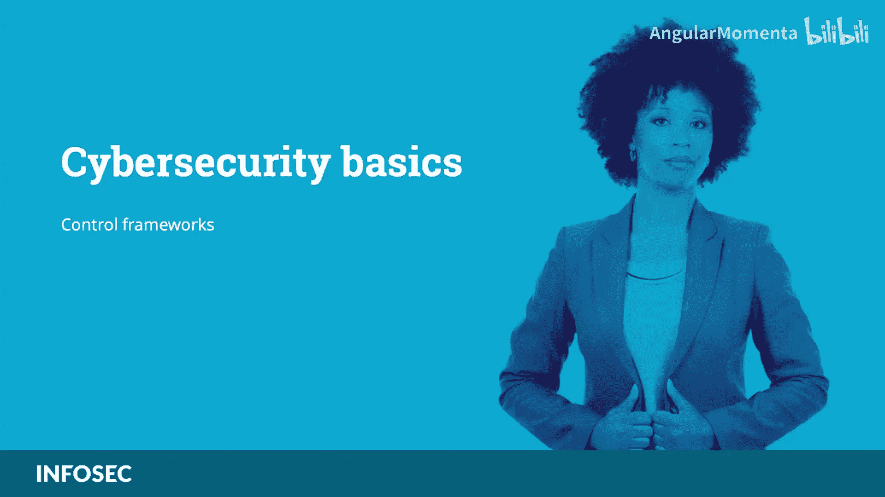
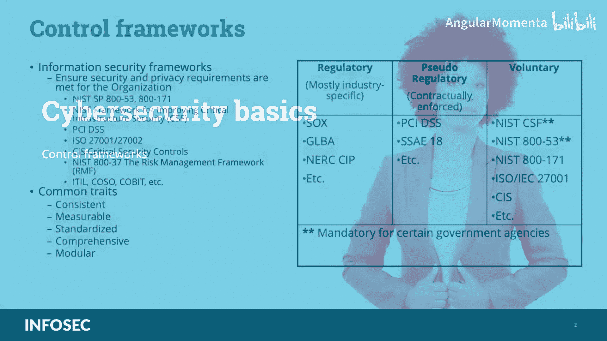
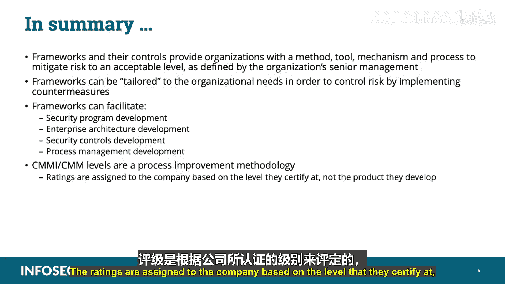

# 004：控制框架 🛡️

在本节课中，我们将要学习信息安全控制框架的基础知识。控制框架是一系列标准化的方法和工具，组织通过实施它们来定义、管理和评估其信息安全策略与程序，以满足安全和隐私要求。

---

## 什么是信息安全框架？

信息安全框架是一系列文档化的流程，用于定义在企业环境中实施和持续管理信息安全控制的政策和程序。组织基于安全控制实施框架，作为其治理计划的一部分，以确保满足安全和隐私要求。

---

## 常见的框架及其特点

组织可以采用多种方法和框架来应对风险。以下是几个主要的框架：

*   **NIST SP 800-53**：美国国家标准与技术研究院制定的控制框架，包含19个控制族下的385项可能控制。该框架允许根据组织的特定任务和要求来调整控制范围。
*   **ISO/IEC 27000系列**：国际标准化组织制定的信息安全管理体系标准，其中最著名的是**ISO/IEC 27001**。它包含14个组别下的114项控制，是建立信息安全管理体系的国际通用标准。
*   **CIS关键安全控制**：由互联网安全中心制定，包含20项关键安全控制措施。其核心优势在于通过优先处理少数高回报的行动来提供具体的网络防御指导。
*   **其他框架**：还包括**ITIL**（侧重于变更控制和服务管理）、**COSO**（类似于ISO 27001，侧重于财务报告内部控制）和**COBIT**（由ISACA制定，用于IT治理和管理）。

所有这些框架都提供**安全控制**，即用于缓解风险的方法、工具、机制和流程。在风险发生之前，我们就以控制措施的形式部署防护手段。

---

## 风险、威胁与脆弱性

在选择并部署框架后，组织通过部署**对策**来降低信息安全风险。我们需要理解几个核心概念：

*   **风险**：威胁源利用一个或多个脆弱性，从而对组织资产造成重大影响的可能性。
*   **脆弱性**：信息系统、安全程序、内部控制或实施中固有的、可能被威胁源利用的弱点。可以理解为资产中的弱点或防护措施的缺失。
*   **威胁源**：任何可能影响或损害受保护资产的人员、事件或环境因素。
*   **受保护资产**：包括网络及其组件、文件与数据、财务资产，甚至人员或组织声誉。

用一个牧羊人的比喻来理解：狼是**威胁**，羊是**资产**，栅栏上的洞就是**脆弱性**。牧羊人修补栅栏（部署**对策**）就是为了降低狼（威胁）利用洞（脆弱性）伤害羊（资产）的风险。

所有安全控制都会对运营产生影响。控制措施的选择必须进行成本效益分析，并针对组织进行定制。理想情况下，对策的成本应低于资产价值，或能显著增加攻击者的攻击成本。

---

## 深入探讨特定框架

上一节我们介绍了框架的通用概念，本节中我们来看看几个具体框架的侧重点。

以下是不同目标框架的分类：

**1. 处理安全程序开发的框架**
*   **ISO/IEC 27000系列**：关于如何开发和维护信息安全管理体系的国际标准。

**2. 处理企业架构开发的框架**
*   **Zachman框架**：企业架构开发模型。
*   **TOGAF**：由开放群组制定的企业架构开发方法论。
*   **DoDAF/MoDAF**：分别由美国国防部和英国国防部制定，确保系统互操作性以支持军事任务。
*   **SABSA**：类似于Zachman的信息安全企业架构开发方法，强调在架构开发中所有实体的沟通与协作。

**3. 处理安全控制开发的框架**
*   **COBIT**：允许IT企业管理和治理的业务框架。
*   **NIST SP 800-53**：保护美国联邦系统的控制集。
*   **COSO**：旨在帮助降低财务欺诈风险的内部控制集成框架。

**4. 处理流程管理开发的框架**
*   **ITIL**：IT服务管理和服务改进的事实标准。
*   **六西格玛**：用于执行流程改进的业务管理策略和工具集。
*   **能力成熟度模型集成**：组织流程改进的方法论。

---

## 理解CMMI成熟度等级

CMMI是一种流程改进方法论，其评级基于公司认证的流程成熟度级别，而非公司开发的产品质量。CMMI包含五个成熟度等级：

以下是CMMI的五个等级及其含义：

1.  **初始级**：流程是临时的、未文档化的起点。
2.  **可重复级**：建立了基本的项目管理流程，能重复早期类似项目的成功。
3.  **已定义级**：流程已文档化、标准化，并集成为组织的标准流程。
4.  **已管理级**：使用定量指标来管理和控制流程。
5.  **优化级**：持续基于量化反馈进行流程改进和优化。

---

## 总结

本节课中我们一起学习了信息安全控制框架的核心知识。框架及其控制措施为组织提供了一套方法、工具、机制和流程，以将风险降低到高级管理层定义的可接受水平。框架可以根据组织需求进行定制，通过实施对策来控制风险。它们能够促进安全程序开发、企业架构开发、安全控制开发以及流程管理开发。最后，CMMI等级是一种流程改进方法论，其评级针对公司认证的流程成熟度，而非其产品。