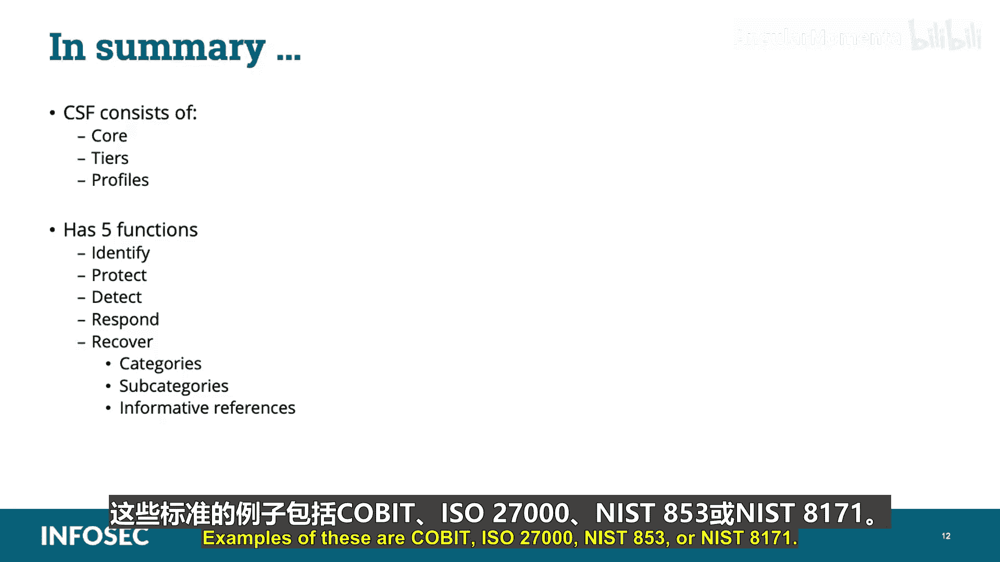

# 005：NIST网络安全框架 🛡️

在本节课中，我们将要学习美国国家标准与技术研究院（NIST）制定的网络安全框架（CSF）。这是一个用于评估和管理网络安全风险的通用框架，广泛应用于各类组织。

## 概述

NIST网络安全框架（CSF）为美国私营部门组织提供了一套计算机安全指导政策框架，帮助其评估和改进预防、检测和应对网络攻击的能力。它提供了一个高层次的网络安全成果分类法，以及评估和管理这些成果的方法。

## 框架的起源与发展

上一节我们介绍了CSF的基本概念，本节中我们来看看它的起源与法律依据。

2013年，奥巴马总统签署了第13636号行政命令，旨在改善关键基础设施安全。该命令指示NIST与其他行业利益相关者合作，基于现有标准、指南和实践，开发一个自愿性框架，以降低关键基础设施面临的网络安全风险。

第13636号行政命令指示行政部门：
*   开发一个技术中立、自愿性的网络安全框架。
*   促进和激励网络安全实践的采用。
*   增加网络威胁信息共享的数量、及时性和质量。
*   将强有力的隐私和公民自由保护纳入每一项保护关键基础设施的举措中。
*   探索利用现有法规来促进网络安全。

2017年5月11日，特朗普总统签署了第13800号行政命令，题为“加强联邦网络和关键基础设施的网络安全”。该命令旨在改善国家的网络安全态势和能力，以应对日益严峻的数字和物理安全威胁。

第13800号行政命令在以下方面采取行动：
*   保护代表美国人民运作的联邦网络。
*   鼓励与行业合作，保护维持美国生活方式的关键基础设施。
*   加强美国的威慑态势并建立国际联盟。
*   重点关注建设更强大的网络安全人才队伍，这对国家长期加强网络防护和能力至关重要。

第13800号行政命令第1节C小节进一步规定，各机构负责人应使用NIST制定的改进关键基础设施框架（或任何后续文件）来管理机构的网络安全风险。这使得联邦机构使用CSF不再是自愿的，而是必须根据第13800号行政命令实施该框架。

## 框架的核心组件

了解了框架的背景后，本节我们来深入探讨其核心结构。NIST网络安全框架由三个主要组件构成：框架核心、框架实施层级和框架配置文件。

### 框架核心

框架核心由四个元素组成：功能、类别、子类别和信息性参考。

**功能** 提供了组织管理网络安全生命周期的高层次战略视图。共有五个功能，称为 **IPDRR**：
1.  **识别**：确定需要保护的流程和资产。
2.  **保护**：确定可用的保障措施。
3.  **检测**：确定可以识别事件的技术。
4.  **响应**：确定可以控制事件影响的技术。
5.  **恢复**：确定事件发生后可以恢复能力的技术。

每个功能被划分为**类别**、**子类别**和**信息性参考**。

*   **类别**是与特定活动（如“识别”功能下的“资产管理”）紧密相关的网络安全成果。
*   **子类别**是支持实现每个类别的具体技术或管理活动成果。其命名格式为 `{功能缩写}.{类别缩写}-{编号}`，例如 `ID.AM-1`（识别-资产管理-1）。
*   **信息性参考**是说明实现每个子类别相关成果方法的特定跨部门标准、指南和有效实践，例如 NIST 800-53、ISO 27001、COBIT等。

### 框架实施层级

框架实施层级提供了组织如何看待网络安全风险以及管理该风险的现有流程的背景。层级描述了组织的网络安全风险管理实践在多大程度上体现了框架中的特征，如风险和威胁意识、可重复性和适应性。

以下是层级的分类：
*   **第1级：部分**：风险管理流程非正式化，以临时和被动方式管理风险。
*   **第2级：风险知情**：风险管理实践获得管理层批准，但可能未确立为全组织政策。
*   **第3级：可重复**：组织的风险管理实践被正式批准并表述为政策。
*   **第4级：自适应**：组织基于先前的网络安全活动（包括经验教训和预测性指标）自适应地调整其网络安全实践。

每个层级都展示了风险管理的严谨性和复杂性以及与整体组织需求整合程度的递增。组织决定哪个层级符合其风险管理需求和能力。当变更能够有效降低网络安全风险时，鼓励向更高层级发展。

### 框架配置文件

框架配置文件将功能、类别和子类别与组织的业务需求、风险承受能力和资源对齐。它们使组织能够建立一条降低网络安全风险的路线图，该路线图与组织和行业目标保持一致，并考虑法律、监管要求和行业最佳实践。

组织可以根据其复杂性和技术环境，选择拥有多个与特定组件对齐的配置文件。配置文件支持业务或任务需求，并有助于在组织内部或业务单元之间沟通风险。它们也可用于描述特定网络安全活动的当前状态或期望的目标状态。

*   **当前配置文件**：指示当前正在实现的网络安全成果。
*   **目标配置文件**：指示实现期望的网络安全风险管理目标所需的成果。

比较配置文件（例如，当前配置文件和目标配置文件）可以揭示需要解决的差距，以满足网络安全风险管理目标。解决这些差距以完成给定类别或子类别的行动计划，可以构成组织网络安全路线图的一部分。

## 框架的详细结构与应用

上一节我们介绍了框架的三大组件，本节中我们来看看其具体结构和应用实例。

在CSF中，每个功能区域的类别和子类别都将始终带有指示功能、类别和子类别的字母。例如，`RC.RP` 表示“恢复-恢复计划”，然后子类别会以 `-1`、`-2` 等形式出现。

每个类别都有相关的子类别和信息性参考。**子类别**是核心中最深层次的抽象，共有97个，它们是结果驱动的陈述，为创建或改进网络安全计划提供考虑因素。

**信息性参考**是映射到CSF的框架。CSF旨在与像NIST 800-53、COBIT或ISO 27000这样的框架结合使用，这些框架为控制措施的实施提供了更全面和技术的指导。例如，NIST 800-171也是一个重要的信息性参考框架。

## 总结与关键要点

本节课中我们一起学习了NIST网络安全框架（CSF）。以下是关键要点总结：

1.  **无层级结构**：功能之间没有等级层次，框架不打算让功能作为检查清单运行。组织必须同时且持续地处理所有功能。
2.  **功能细分**：功能进一步细分为类别和子类别。框架、类别和子类别并非排他性的，组织可以制定自己的。
3.  **类别定义**：类别是与组织需求和特定活动相关的网络安全预期最终结果组。例如，“身份管理、身份验证和访问控制”是“保护”功能下的一个类别。
4.  **子类别定义**：子类别将给定类别进一步划分为支持实现每个类别期望成果的特定活动。例如，“身份被证明并绑定到凭证”是访问控制的一个子类别。
5.  **信息性参考**：信息性参考是展示实现每个子类别相关成果方法的安全标准、指南和实践，例如COBIT、ISO 27000、NIST 800-53或NIST 800-171。

通过理解和应用NIST CSF，组织可以更系统、更主动地管理其网络安全风险，从当前状态向更安全的目标状态迈进。