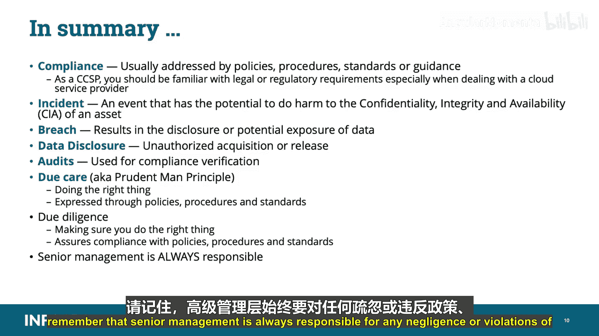

# 006：法规遵从性 📜

在本节课中，我们将学习法规遵从性的基础知识。作为云安全专业人员，确保组织的云基础设施符合适用的法规标准或法律是核心职责之一。我们将了解不同类型的法律、合规要求，以及如何通过适当的流程来证明合规性。

---

## 法律与法规概述

上一节我们介绍了法规遵从性的重要性，本节中我们来看看构成合规框架的各种法律类型。

**国际法** 管理国家之间的关系。在CCSP考试中，如果出现术语“state”，应将其理解为“国家”。

国际法的组成包括：
*   **国际公约**：经同意国家明确承认的规则。
*   **国际惯例**：作为法律被接受的普遍实践证据。
*   **法律一般原则**：文明国家所承认的原则。
*   **司法判例**：作为确定法律规则的辅助手段。

**可执行的政府请求** 指能够根据政府命令执行的要求或命令。

**美国州法律** 指美国各州的法律，各州拥有独立的宪法、政府和法院体系。

以下是其他几种关键的法律类型：

*   **版权法**：保护思想的原创表达，授予原创作品创作者专有权利。**侵权**发生在非信息合法所有者的人提供或共享受版权保护的材料时。
*   **隐私法**：定义个人决定何时、如何以及在何种程度上发布个人信息的权利。通常要求当不再需要保留个人信息时必须将其销毁。
*   **刑法**：定义政府禁止的行为，旨在保护公众安全与福祉的法律和法规体系。案件由政府检察官提起，被告被判有罪或无罪。
*   **民事或侵权法**：一套关于权利、义务和救济的体系，为因他人不法行为而遭受损害的人提供救济。案件由私人当事方提起，被告对损害负有责任或不负责任。

---

## 知识产权

在讨论了基本法律类型后，我们需要特别关注**知识产权**，它在商业和云环境中至关重要。

知识产权描述心智创造物，如文字、文学、徽标、符号或其他艺术创作和文学作品。版权、商标和专利保护都是为了保护个人或公司的智力权益。

知识产权分为两大类：
1.  **工业产权**：也称为商业财产，包括**专利**、发明、**商标**、服务标志、蓝图、**商业秘密**、工业设计等。
2.  **版权**：包括文学和艺术作品、现场及录制的表演、作者权利、软件、照片、雕塑等。

**商标**保护商品或服务的独特标识，例如可以识别公司产品或服务的词语、口号或徽标（品牌保护）。
**商业秘密**受《1996年经济间谍法》保护。要保持商业秘密状态，必须在组织内实施充分的控制，确保只有需要知情的授权人员才能访问。还必须确保任何无权访问的人员都受到**保密协议**的约束。
**专利**是发明者的知识产权，授予发现者新颖、有用且非显而易见的发明。

---

## 合规性要求

理解了相关法律后，我们来看看如何实现和证明合规性。立法和监管合规性关注的是确保风险得到适当管理。

例如，法律和监管合规性可能包括使用某种框架（如NIST 800-53或ISO/IEC 27000）在全组织范围内实施信息安全控制，以满足《联邦信息安全管理法案》或其他监管要求（如萨班斯-奥克斯利法案或格雷姆-里奇-比利雷法案）。

**隐私合规性**包括隐私法律和原则、违规通知法律，例如：
*   欧盟-美国隐私盾（旧安全港协议）
*   欧盟的《通用数据保护条例》
*   经济合作与发展组织的隐私指南

对于CCSP考试，不需要记住所有国家特定的法律，但需要了解一些国际公认的法律，如**GDPR**。

GDPR适用于非欧盟基地的组织，其基本要素与旧安全港法类似，并要求：
*   收集信息需获得同意
*   24小时数据泄露通知要求
*   个人有权访问自己的数据
*   被遗忘权
*   数据可移植性规定
*   隐私设计
*   要求设立集中的数据保护官

不遵守GDPR可能导致公司遭受巨额罚款。

---

## 事件、违规与披露

在合规性管理中，清晰区分事件、违规和披露至关重要。以下是这三个重要术语的定义：

*   **事件**：可能对资产的**保密性、完整性、可用性**造成损害的事件。
*   **违规**：导致数据**披露或潜在暴露**。
*   **数据披露**：未经授权获取以计算机化形式维护的个人信息，损害了个人信息的安全性、保密性或完整性。

**示例**：有人经过办公室，看到员工使用凭据登录系统，或从某人桌子上拿起标记为“敏感”的USB驱动器，这是一个**事件**。然后，该人使用登录信息访问公司系统或打开未加密的USB驱动器，这就是**违规**。最后，该人检索信息并将其发布到互联网上，这就成为了**披露**。

根据数据泄露通知法律，一些组织需要报告符合特定条件的事件。

---

## 审计、应有注意与应有勤勉

许多法律和法规要求组织定期完成审计以证明合规性，即展示其践行了**应有注意**和**应有勤勉**。

例如，支付卡行业数据安全标准要求组织至少每年执行一次Web应用程序漏洞扫描，或安装专用的Web应用程序防火墙以增加针对Web漏洞的保护层。我们通过审计和扫描来验证这一点。

作为CCSP，应该理解如何处理云环境特有的各种法律和监管挑战。为实现和保持合规性，理解云环境中使用的审计流程非常重要，包括审计控制、保证问题和特定的报告属性。

以下是两个关键术语：

*   **应有注意**：一个法律概念，涉及提供商对客户负有的责任，也称为“审慎人原则”，意味着做正确的事。它通过**政策、程序和标准**来表达，旨在展示你承担保护信息资源和人员在这些资源上活动的责任。例如，部署病毒扫描程序或加密技术展示了应有注意。
*   **应有勤勉**：供应商为展示或提供应有注意而采取的行动，确保你做的是正确的事。应有勤勉通过**检测、检查和审计方法**来保证对政策、程序和标准的遵守。例如，从不更新已部署的病毒扫描程序的补丁，导致系统感染，就是未践行应有勤勉。

**应有注意和应有勤勉之间的差距就是疏忽产生的地方**。如果公司不践行应有注意和应有勤勉，管理人员可能因疏忽而被追究责任，并对资产和财务损失负责。高级管理层负有最终责任。

---

## 公司的法律责任

每个公司都有不同的法律责任。我们在此指出几种可能的要求：

*   法律上承认的义务
*   近因
*   违反任何法律
*   违反应有注意
*   违反隐私法

**近因**是与损害有充分关联的事件，被法院视为损害的原因。它是保险的一个关键原则，关注损失或损害实际是如何发生的。

在应有注意和应有勤勉责任方面，每个公司都有不同的要求。**疏忽可能使公司付出巨大代价**。例如，任何违反GDPR或未能达到GDPR合规要求的行为都可能导致巨额罚款。

---

## 总结

本节课中我们一起学习了法规遵从性的核心内容。

*   符合法律或监管要求通常通过**政策、程序、标准或指南**来解决。
*   作为CCSP，应该熟悉法律或监管要求，尤其是在与云服务提供商打交道时。
*   **事件**是可能对资产的CIA三性造成损害的事件。
*   **违规**导致数据的披露或潜在暴露。
*   **数据披露**是数据的未经授权获取或发布。
*   审计用于**验证合规性**。
*   **应有注意**（审慎人原则）是做正确的事，通常通过政策、程序和标准来表达。
*   **应有勤勉**是确保我们做正确的事，并保证遵守那些政策、程序和标准。
*   最后，请记住，**高级管理层始终对任何疏忽或违反政策、程序和标准的行为负责**。