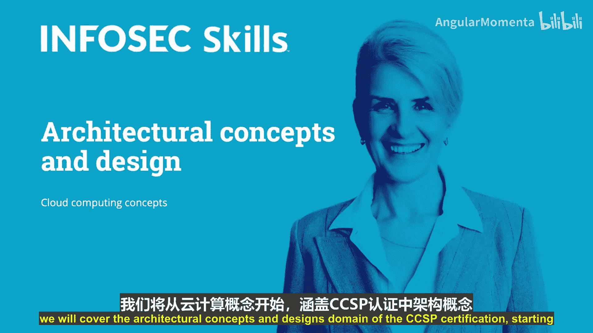
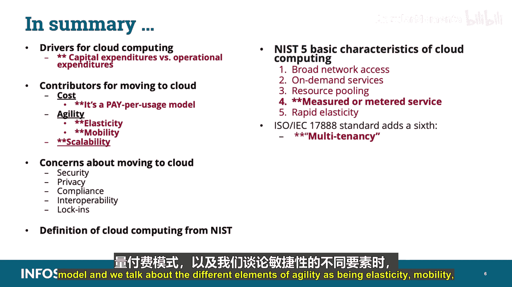

# 007：云计算概念 🚀

在本节课中，我们将开始学习CCSP认证的“架构概念与设计”领域，首先聚焦于云计算的核心概念。我们将探讨企业采用云计算的驱动力、关键术语、NIST定义及其五大基本特征，为后续深入学习打下基础。

## 驱动力与成本考量 💰

企业考虑迁移至云计算有多种驱动力。这可能是由于当前IT基础设施解决方案的拥有成本，或是持续维护的预期成本。

您必须理解**资本性支出**（Capex）与**运营性支出**（Opex）之间的区别。组织越来越关注资本性支出（例如建筑、计算机设备或硬资产）和运营性支出（例如公用事业或建筑维护），尤其是在员工超过5000人的组织中。

迁移到云对组织具有吸引力，因为使用云平台服务有助于降低资本性支出（例如，无需续签设备租约或购买新设备来替换过时系统），并在某些方面也降低了运营性支出（例如，无需为数据中心供电）。

## 云服务模型与优势 ⚙️

基于订阅的云计算服务，如**基础设施即服务**（IaaS）、**平台即服务**（PaaS）或**软件即服务**（SaaS），是一个便捷的选择，几乎不需要物理维护成本。

**按使用付费模型**允许组织仅为所需的资源付费，基本上无需投资云中的物理资源。也没有基础设施维护或升级成本。

为何要选择一个实施复杂、扩展昂贵且在达到性能极限时反应迟缓的平台呢？

## 敏捷性及其要素 🏃

敏捷性关乎**弹性**和**移动性**。弹性是云计算的主要优势，因为环境能根据动态变化的需求透明地管理用户的资源利用率。

您还拥有移动性，因为用户能够从全球各地访问数据和应用程序，这促进了协作与创新。用户开始将云视为一种在公共数据和信息上同时或协作工作的方式。

**可扩展性**是指当传统平台达到上限时能够增长的能力，正常运行时间等因素会受到影响。按需可扩展性允许客户决定资源使用量，使用户能够访问大量可根据需求和虚拟化进行扩展的资源。

**虚拟化**使得每个用户对可用资源都有一个单一的视图，而不管服务器上实际有什么。这正是云对企业有价值的原因。

## 云计算的抑制因素 ⚠️

然而，并非一切都是美好无瑕的。云计算也存在一些抑制因素。仍有许多公司出于各种原因对云感到担忧，其中**安全**似乎是企业压倒性的顾虑。

云中还存在**隐私**问题。这种紧张关系在公司努力在个性化和匿名性之间找到平衡时就会出现。

还有对**符合监管要求**的担忧，以及一些潜在的云服务购买者仍未理解集成云解决方案或**互操作性**的价值。

可能最普遍的担忧是**锁定**。这加剧了客户对使用本地产品与云解决方案以降低风险的恐惧。组织可以采用多种方法和框架之一，例如COSO企业风险管理综合框架或NIST风险管理框架800-53或800-37。

您必须记住，安全与运营之间存在权衡。通常，事物越安全，效率就越低。这就是为什么业务安全需求是由业务功能或需求驱动的，安全支持这些功能或需求，而不是驱动它们。

## NIST云计算定义 📖

云计算或云对不同的人意味着不同的事物。为了便于讨论，云计算已被美国国家标准与技术研究院（NIST）正式定义为：

> 云计算是一种模型，用于实现对可配置计算资源（例如，网络、服务器、存储、应用程序和服务）共享池的**无处不在**、**便捷**、**按需**的网络访问，这些资源可以以最小的管理努力或服务提供商交互快速配置和释放。

您必须为考试掌握此定义并能回忆起来。我在此指出的两个关键术语是**按需**和**快速配置**。这是您必须从此定义中理解的两个要素。

可以将云计算想象成您的电力公司或电网。它始终开启，并可供连接到电网（或在此类比中，连接到云）的每个人使用。这是一种**按使用付费**的模式。换句话说，您为使用的内容付费，使用越多，付费越多。相同的概念可以应用于云计算。

## NIST云计算五大特征 🔑

对于考试，重要的是您要理解NIST云计算的这五个基本特征。

以下是NIST云计算的五个基本特征：

1.  **广泛的网络访问**：这是促进使用异构（即混合的瘦客户端或胖客户端）平台（如手机、笔记本电脑、平板电脑或工作站）的标准机制。换句话说，这意味着不应存在网络带宽瓶颈。这通常通过使用高级路由技术、负载均衡器、多站点托管和其他技术来实现。

2.  **按需自助服务**：这是指根据需要配置计算能力（如服务器时间和网络存储），而无需人工交互。这意味着您应该能够扩展计算或存储需求，而无需云服务提供商的大量干预，基本上是实时配置。云的本质是始终开启且始终可访问，为用户提供对资源、数据和其他资产的广泛访问。想想便利性：在需要时从任何位置访问您想要的内容。

3.  **资源池化**：这是云计算所有优点的核心。通常，传统的非云系统可能在一周的几个小时内看到其资源利用率在80%到90%之间，而在其余时间平均利用率在10%到20%之间。云所做的是将资源分组或汇集起来，供整个用户环境或多个客户使用，然后可以根据用户或客户的工作负载或资源需求进行扩展和调整。云提供商通常拥有大量可用资源，从数百到数千台服务器、网络设备、应用程序等，可以容纳大量客户，并可以为每个客户优先安排和提供适当的资源或资源配置。换句话说，资源被汇集起来，使用**多租户模型**为多个客户服务。基本上，云服务提供商在其客户之间共享其云资源投资，因此资源不会利用不足。

4.  **可度量的服务**：这是您必须为考试理解的一个概念。云计算提供了一个独特而重要的组件，这是传统IT部门难以提供的：资源使用可以被**测量**、**控制**、**报告**和**告警**，从而在提供商和客户之间带来多重好处和整体透明度。就像您可能有一个计量电力服务或需要充值话费的手机一样，这些服务允许您控制并了解成本。本质上，您为使用的内容付费，并且能够获得详细账单或使用明细。我希望您记住的是，可度量的服务通过利用计量能力（例如，存储、处理和带宽）自动控制和优化资源使用。这意味着您为使用的内容付费，仅此而已。消耗越多，账单越高。

5.  **快速弹性**：这允许组织根据需要或工作负载要求获取额外资源（如存储或计算能力）。这通常对组织是透明的，必要时以无缝方式添加更多资源。回想一下我的公用事业例子：如果您需要更多的水或电，您只需打开水龙头或打开更多的灯，而无需联系公用事业公司安排更多的水或电。它只是在需要时发生。由于云服务采用按使用付费的概念，您为使用的内容付费。这对利用云服务的季节性业务或活动型业务特别有益。想象一下像Ticketmaster这样的提供商，在重大体育赛事或音乐会门票发售日期前，销售数十万张门票。在门票发售前，可能几乎不需要计算资源。然而，一旦门票开始销售，他们可能需要在30到40分钟内容纳10万名用户。这就是快速弹性和云计算相比传统IT部署真正有益的地方，后者将不得不大量投资于资本性支出，以有能力支持这种特定需求。

## ISO/IEC标准与多租户 🏢

ISO/IEC（国际标准化组织和国际电工委员会）标准17888（信息技术 云计算 概述和词汇）包含了那五个NIST特征，并增加了第六个：**多租户**。

多租户以物理或虚拟资源隔离的方式，使多个租户及其数据彼此隔离且无法相互访问。基本上，云内的不同用户共享相同的应用程序和物理硬件来运行他们的虚拟机（VM）。云部署的多租户性质需要一个逻辑设计来分区和隔离客户数据。未能这样做可能导致对租户数据的未经授权访问、查看或修改。

请记住，根据NIST，云计算的决定性要素包括：广泛的网络访问、按需自助服务、资源池化、可度量的服务、快速弹性。而ISO 17888增加了多租户。

## 总结 📝

本节课中我们一起学习了：
*   企业采用云计算的**驱动力**。
*   **资本性支出**与**运营性支出**的区别。
*   迁移到云的**贡献因素**（如敏捷性、可扩展性、虚拟化）。
*   对迁移到云的**担忧**（如安全、隐私、合规、锁定）。
*   根据NIST提供的**云计算定义**，并指出了为考试能够识别和理解它的重要性。
*   最后，我们讨论了NIST云计算的**五个基本特征**：广泛的网络访问、按需自助服务、资源池化、可度量的服务和快速弹性，以及附加的ISO/IEC 17888特征：多租户。

我还指出了您需要理解当我们说**按使用付费模型**以及将敏捷性的不同要素（弹性、移动性、可扩展性和虚拟化）时意味着什么。

