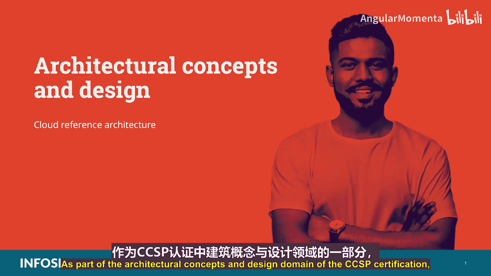
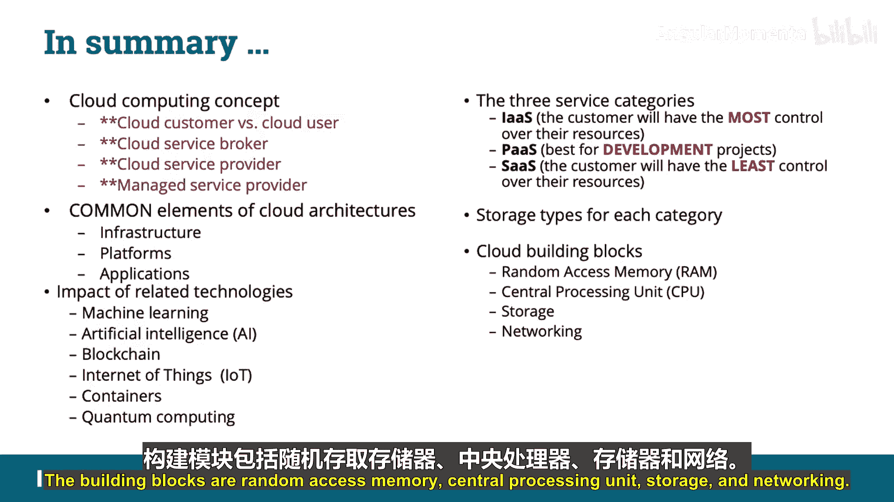

# 008：云参考架构 🏗️

在本节课中，我们将学习CCSP认证“架构概念与设计”领域的一个核心内容：云参考架构。我们将系统性地了解云计算的基本术语、服务模型、关键组件以及相关技术。

## 概述

云参考架构是理解云计算如何构建和运作的蓝图。它定义了云环境中的关键角色、服务模型和基本构建模块。掌握这些概念对于通过CCSP考试至关重要。

## 云计算术语

在深入架构之前，我们必须明确几个核心术语。这些术语是理解云服务关系的基础。

以下是您必须为CCSP考试掌握的关键术语：

*   **云客户**：指购买云服务的任何个人或组织。
*   **云用户**：指实际使用云服务的个人。云客户公司的员工或独立的个人都可以是云用户。
*   **云服务经纪人**：指作为云服务客户与云服务提供商之间中介的第三方实体。他们根据客户需求选择最佳提供商并监控服务。
*   **云服务提供商**：指向其他组织或个人提供基于云的服务（如平台、基础设施、应用程序）的公司。**CSP决定了提供给云客户的技术和操作流程**。
*   **托管服务提供商**：指根据合同为客户提供IT管理服务的供应商。**客户决定技术和操作流程，MSP负责执行**。

## 云服务模型

上一节我们介绍了云环境中的关键角色，本节中我们来看看他们提供的服务类型。美国国家标准与技术研究院定义了三种主要的云服务模型。

以下是CCSP考试要求掌握的三种服务模型：

1.  **基础设施即服务**
2.  **平台即服务**
3.  **软件即服务**

尽管市场上存在其他“即服务”的营销术语，但考试只需掌握以上三种。

### 基础设施即服务

IaaS是最基础的云服务产品。它为客户提供虚拟化的计算资源。

**定义**：IaaS提供的功能是**处理、存储、网络**和其他基础计算资源的配置，使客户能够部署和运行任意软件（包括操作系统和应用程序）。

在IaaS模型中，客户拥有对其资源的最大控制权。客户不管理底层的云基础设施，但可以控制操作系统、存储、已部署的应用程序，并可能有限控制某些网络组件（如主机防火墙）。

IaaS的主要优势包括：
*   按使用量计费，并可分摊至具体部门。
*   能够根据实际使用情况弹性伸缩基础设施。
*   降低拥有成本，无需购买实体资产，减少维护和支持费用。
*   降低能源和冷却成本，实现绿色IT。

**关键点**：IaaS用户负责管理应用程序、数据、运行时、中间件和操作系统。云服务提供商管理虚拟化、服务器、硬盘存储和网络。

IaaS使用两种存储类型：
*   **卷存储**：类似于可附加到虚拟机实例的虚拟硬盘，用于在文件系统中托管数据。例如：Amazon EBS。
*   **对象存储**：通过API或Web界面访问，类似于文件共享。数据以包含元数据和唯一标识符的对象形式存储。例如：Amazon S3。

**API类型**：对象存储系统通常提供REST API。考试需了解四种主要API类型：
*   **开放API**：公开可用，无访问限制。
*   **合作伙伴API**：需要特定权限或许可证才能访问。
*   **内部API**：仅在组织内部使用，不对外公开。
*   **复合API**：组合不同的数据和服务，用于加速执行过程。

**API格式**：考试需了解不同API格式的区别：
*   **REST**：一种架构风格，基于简单接口和资源操作，驱动因素是数据，带宽要求低。
*   **XML-RPC**：使用特定XML格式传输数据的协议，比SOAP简单。
*   **JSON-RPC**：类似XML-RPC，但使用JSON格式传输数据。
*   **SOAP**：使用XML格式的协议，有严格的规则和高级安全性，驱动因素是功能，带宽要求高。

**JSON vs XML**：
*   **JSON**：支持文本和数字，侧重于数据，安全性较低。
*   **XML**：支持多种数据类型（文本、数字、图像等），侧重于文档，安全性高于JSON。

### 平台即服务

PaaS在IaaS的基础上，增加了由云供应商提供的操作系统。

**定义**：PaaS用于在云基础设施上部署客户创建或获取的应用程序。客户使用云服务提供商支持的编程语言、库服务和工具。客户不管理底层云基础设施，但可以控制已部署的应用程序及其托管环境的配置设置。

PaaS为开发人员提供了一个可以构建、开发、测试和部署应用程序的框架，整个过程快速、简单且经济。

**关键点**：企业运营团队或第三方提供商管理操作系统、虚拟化、服务器、存储、网络和PaaS软件本身。开发人员则管理应用程序。

PaaS使用两种数据存储类型：
*   **结构化数据**：具有高度组织性的信息，如关系数据库，易于搜索。
*   **非结构化数据**：不存储在传统行列数据库中的信息，如电子邮件、文档、视频、图片等。

PaaS的主要特点和优势包括：
*   操作系统及相关服务可频繁更改和升级。
*   全球分布的开发团队可在同一环境中协作。
*   服务可从跨国界的多样化来源获取。
*   通过使用单一供应商，降低前期和持续成本。

### 软件即服务

SaaS是最顶层的云服务模型，包含了IaaS和PaaS的所有内容，并增加了服务提供商提供的软件程序。

**定义**：在SaaS模型中，客户不管理或控制底层云基础设施、网络、服务器、操作系统、存储，甚至单个应用程序功能（可能除外有限的用户特定配置）。应用程序通过Web交付，由第三方供应商管理。

**关键点**：在此模型中，客户对其资源的控制权最小。云客户基本上只负责在提供商托管的环境中上传和处理数据。

SaaS使用两种主要数据存储类型：
*   **信息存储与管理**：通过Web界面输入并存储在SaaS应用程序后端数据库中的数据。
*   **内容或文件存储**：存储在应用程序内的基于文件的内容。

SaaS的主要特点和优势包括：
*   易于使用，管理需求少。
*   自动更新和补丁管理，用户始终使用最新版本。
*   标准化和兼容性，所有用户使用相同的软件版本。
*   全球可访问性。

## 云计算的构建模块

了解服务模型后，我们来看看构成所有云服务的基础。云计算的构建模块是**随机存取存储器、中央处理器、存储和网络**。

IaaS拥有任何云服务中最基础的构建模块，即所有云应用程序赖以构建的处理、存储和网络基础设施。

## 相关技术

云计算与其他前沿技术紧密结合，共同推动数字化转型。以下是CCSP考试需要了解的相关技术。

### 机器学习与数据分析

机器学习、数据分析和云计算相结合，帮助企业更好地理解目标受众、自动化生产、根据市场需求改进产品、操纵实时数据并做出预测。云服务（如AWS、Azure、Google Cloud）使各种规模的公司都能以较小的初始投资访问机器学习算法和技术。

### 人工智能

人工智能指能够模仿人类智能执行任务，并能根据收集的信息迭代改进的机器系统。AI通过处理大量数据并识别模式来完成特定任务。表现形式包括聊天机器人、智能助手和推荐引擎等。AI为企业提供了对数据的更全面理解，并能通过预测自动化复杂或繁琐的任务。

### 区块链

区块链是一种使用密码学链接的不断增长的记录列表。每个区块包含前一个区块的加密哈希值、时间戳和交易数据。区块链因其数据一旦记录就难以篡改的特性，被应用于物流管理、投票、移动支付、医疗记录存储等多个领域。

### 物联网

物联网由小型专用设备组成，这些设备通常形式紧凑，并连接到通用网络。其安全漏洞包括：
*   供应商对更新的支持有限。
*   设备本身安全能力有限。
*   由于快速部署周期导致的代码管理不善。
*   标准协议上的安全实现薄弱或受限。

**缓解措施**包括：将IoT设备隔离在私有网络中、选择具有安全功能和可更新性的产品、进行产品安全与渗透测试、禁用不必要的功能。

### 容器化

容器是一种标准的软件包，它将应用程序代码与相关配置文件、库及其依赖项捆绑在一起，使应用程序能在不同环境中无缝运行。容器提供了轻量级的**不可变基础设施**。

**可变 vs 不可变基础设施**：
*   **可变基础设施**：可更改。允许直接登录服务器更新配置，但可能导致配置漂移，难以维护一致性。
*   **不可变基础设施**：一旦建立便不可更改。需要更新时，需用包含更改的全新基础设施替换旧有设施。这能保证环境一致性，避免配置漂移，并简化问题解决（只需删除有问题的实例）。

容器化与DevOps实践结合，能提高敏捷性、实现应用程序可移植性，并支持快速弹性伸缩。

### 量子计算

量子计算是一种利用量子力学原理来解决经典计算机过于复杂的问题的快速新兴技术。虽然量子计算机在可计算性上未提供额外优势，但对于某些特定问题，量子算法的时间复杂度显著低于已知的经典算法。量子计算机特别擅长处理涉及大量变量和潜在结果的模拟或优化问题。

## 总结

本节课中我们一起学习了云参考架构的核心内容。我们讨论了云计算概念，明确了CCSP考试必须掌握的术语：云客户、云用户、云服务经纪人、云服务提供商和托管服务提供商。

我们理解了云架构的通用元素：基础设施、平台和应用程序，以及三种服务类别：**基础设施即服务**（客户控制权最大）、**平台即服务**（最适合开发项目）和**软件即服务**（客户控制权最小）。

我们识别了每个服务类别的关键优势和存储类型：IaaS使用卷存储和对象存储；PaaS使用结构化和非结构化存储；SaaS使用信息存储与管理以及内容或文件存储。

我们还介绍了相关技术的影响，如机器学习、人工智能、区块链、物联网、容器和量子计算，考试中应对这些技术有所了解。

最后，我们讨论了云计算的构建模块，您必须能够回忆起来，它们是：**随机存取存储器、中央处理器、存储和网络**。