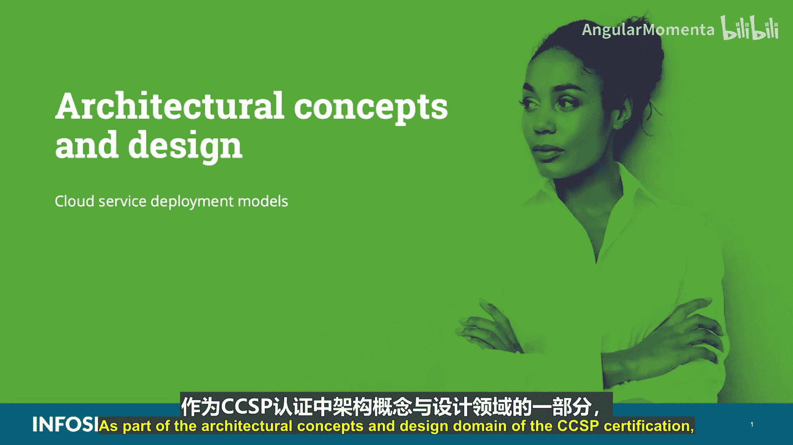
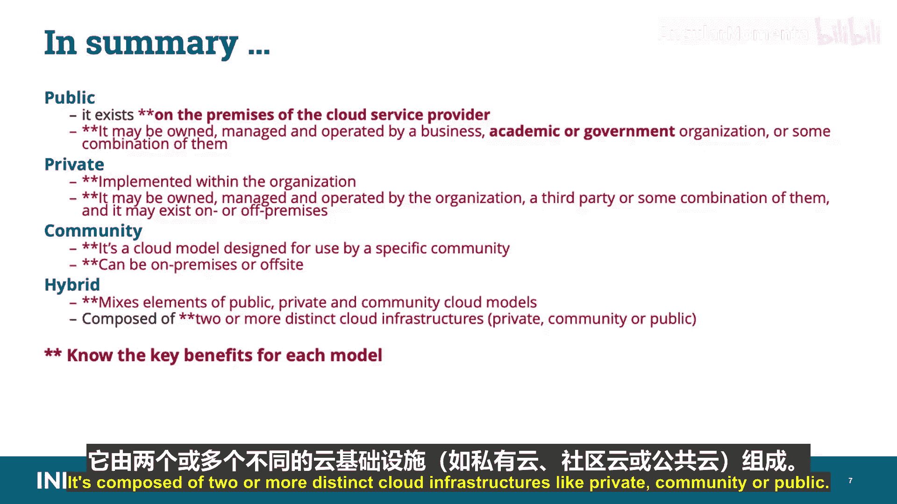

# 009：云服务部署模型 🏗️

在本节课中，我们将要学习云服务部署模型。这是CCSP认证“架构概念与设计”知识域的核心内容。我们将详细探讨四种主要的部署模型：公有云、私有云、社区云和混合云，并了解它们各自的定义、特点、适用场景以及关键优势。

在开始学习之前，需要指出的是，为了帮助您备考CCSP考试，我们将使用双星号（**）来标记必须掌握的关键信息。

**您必须掌握以下所有术语：混合云、私有云、社区云和公有云。** 这些正是我们接下来要讨论的内容。

上一节我们介绍了云服务类型（IaaS、PaaS、SaaS），本节中我们来看看这些服务是如何整合到不同的部署模型中的。

美国国家标准与技术研究院（NIST）和国际标准化组织（ISO）都描述了以下四种部署模型：公有云、私有云、社区云和混合云。组织选择哪种云部署模型，取决于多种因素，并可能深受其风险偏好、成本、合规与监管要求、法律义务以及其他内部业务决策和战略的影响。

---

## 公有云 ☁️

当我们讨论云提供商时，通常想到的就是公有云。其基础设施、硬件、软件、设施和人员由服务商提供，并出售、租赁或出租给公众开放使用。

**它可能由商业、学术或政府组织或其组合拥有、管理和运营，并且位于云提供商的场所内。** 换句话说，它是为任何购买、租赁或租用其服务的公众所部署的基础设施。

鉴于对公有云服务日益增长的需求，许多提供商现在都将其服务作为公有云产品来提供。

以下是公有云模型的关键优势，您应该能够识别：
*   **易于设置且成本低廉**：因为提供商承担了硬件、应用和带宽成本。
*   **资源调配流程简化且便捷**。
*   **可扩展以满足客户需求**。
*   **没有资源浪费**：采用按使用量付费的模型。

最后，屏幕上列出了一些公有云供应商的例子。**您无需为考试记住任何特定的供应商名称。**

---

## 私有云 🔒

私有云是在组织内部实现的云计算平台。它旨在提供与公有云系统相同的特性和优势，但通过提供对企业或其客户数据的更多控制、提高可靠性、减少安全担忧以及与法规遵从性或合同协议相关的问题，消除了公有模型的一些顾虑。

**在此模型中，云基础设施专供由多个客户（即业务部门）组成的单一组织独占使用。它可能由该组织、第三方或其组合拥有、管理和运营，并且可能位于组织内部或外部（本地或非本地）。**

换句话说，私有云由独立的组织拥有和运营，仅供其客户和用户独占使用。可以将私有云视为具有网络连接和远程访问能力的传统遗留IT环境。如果您的组织托管了一台Web服务器并允许通过远程服务访问，这就可以被视为一个私有云实例。私有云的例子包括我们所说的内联网，它们通常托管共享的内部应用程序、存储和计算资源，例如内部托管的SharePoint站点。

**请不要混淆公有云和私有云：记住，公有云由特定公司拥有，并向任何与其签订服务合同的人提供；而私有云由特定组织拥有，但仅对该组织授权的用户可用。**

以下是私有云模型的关键优势，您应该能够识别：
*   **增强了对数据、底层系统和应用的控制**。
*   **保留并拥有治理控制权**。
*   **更好地保证数据位置，并消除了多司法管辖区的法律和合规要求**。

---

## 社区云 👥

社区云是为特定社区使用而设计的云模型。

**社区云基础设施专供来自具有共同关注点（如使命、安全要求、政策和合规性考虑）的组织的特定客户社区独占使用。它可能由社区内的一个或多个组织、第三方或其组合拥有、管理和运营，并且可能位于本地或非本地。**

社区云可以是本地或非本地的，它应能提供公有云部署的优势，同时提供更高级别的隐私、安全性和法规遵从性。换句话说，它是由相似群体拥有和运营的基础设施和处理能力，其中某些部分可能由个人或不同组织拥有或控制，但它们以某种方式聚集在一起执行联合任务和功能。

例如，游戏社区可以被视为一个社区云。PlayStation网络就是一个例子，它涉及许多不同的实体聚集在一起进行在线游戏：索尼负责网络的身份和访问管理任务；特定的游戏公司可能托管一组服务器，为特定游戏运行数字版权管理（DRM）功能和处理；而个别用户则在本地自己的PlayStation机器上进行部分处理和存储。

以下是社区云模型的关键优势，您应该能够识别：
*   **结合了公有云模型的优势，并具有更高水平的隐私、安全性和法规遵从性**。

---

## 混合云 🔀

混合云模型融合了公有云、私有云和社区云模型的元素。

**混合云基础设施由两个或多个不同的云基础设施（如私有云、社区云或公有云）组成，这些基础设施保持独立实体，但通过实现数据和应用程序可移植性的标准化或专有技术绑定在一起。** 换一种说法，其基础设施是其他云基础设施中两种或多种的组合，并且依赖于能够实现数据和应用程序可移植性的技术。

混合云环境的一个例子可能包括一个托管的内部分云（如SharePoint站点），其中划出一部分供需要访问共享服务的外部合作伙伴使用。对他们而言，这看起来像是一个内部云。因此，它将以混合模式运行。

以下是混合云模型的关键优势，您应该能够识别：
*   **保留了对关键技术任务和流程的所有权和监督权**。
*   **可以重用组织内先前对技术的投资**。
*   **可以控制最关键的业务组件和系统**。
*   **最后，它可以作为一种经济有效的方式，利用公有云组件来实现非关键业务功能**。

---

## 总结 📝

本节课中我们一起学习了四种云服务部署模型：

1.  **公有云**：位于云服务提供商的场所，可能由商业、学术或政府组织或其组合拥有、管理和运营。
2.  **私有云**：在组织内部实现，可能由该组织、第三方或其组合拥有、管理和运营，并且可能位于本地或非本地。
3.  **社区云**：为特定社区使用而设计，可以位于本地或非本地。
4.  **混合云**：融合了公有云、私有云和社区云模型的元素，由两个或多个不同的云基础设施（如私有云、社区云或公有云）组成。