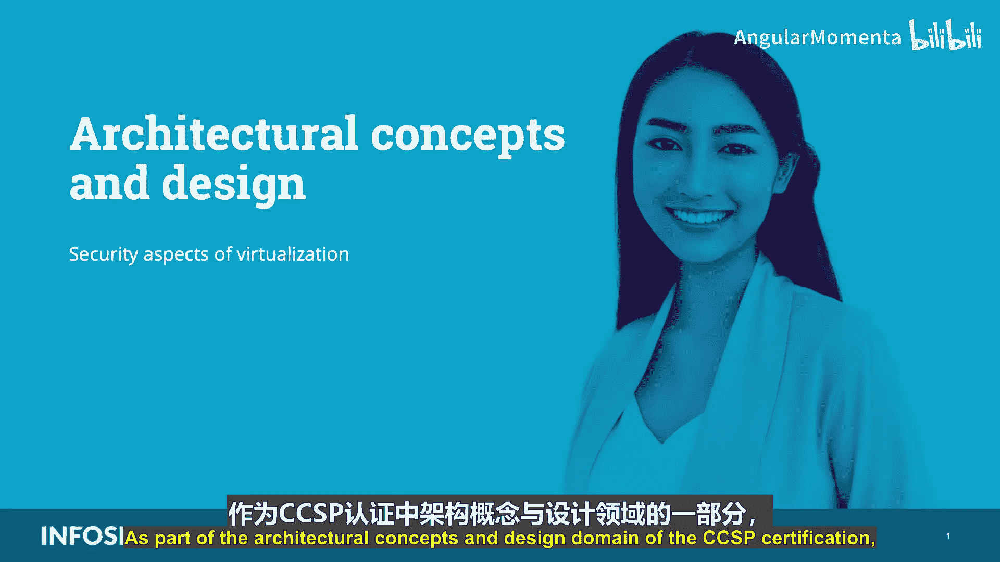
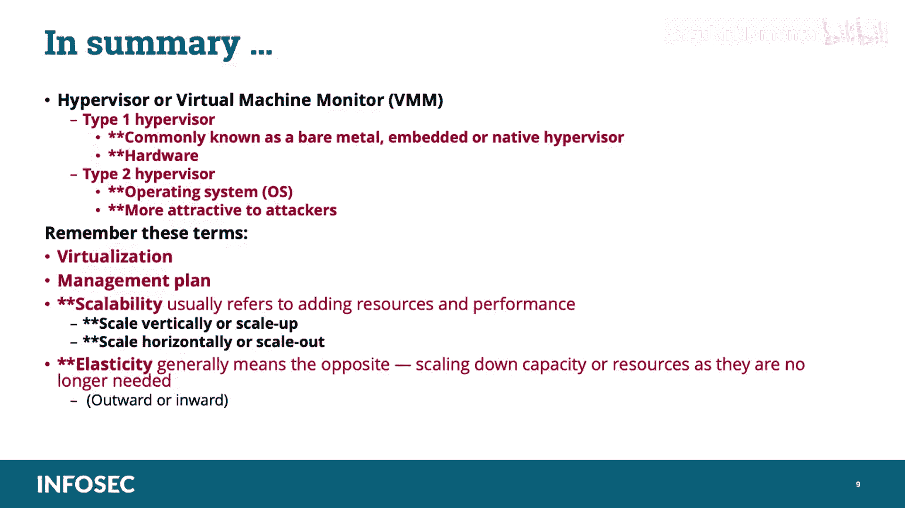

# 010：虚拟化的安全方面

在本节课中，我们将要学习CCSP认证架构概念与设计领域中的一个核心主题：虚拟化的安全方面。我们将深入探讨虚拟机管理程序（Hypervisor）的概念、类型、安全考量，以及虚拟化、可扩展性和弹性的关系。

## 概述

虚拟化是云计算得以实现的基础技术。它允许在单一物理硬件上运行多个独立的操作系统（称为客户机），从而更高效地利用资源。然而，这种共享环境也引入了独特的安全挑战。本节课程将系统性地介绍虚拟化的核心组件及其安全影响。

## 虚拟机管理程序（Hypervisor）简介

上一节我们介绍了虚拟化的基本概念，本节中我们来看看其核心组件——虚拟机管理程序。

虚拟机管理程序（Hypervisor）是“Supervisor”（操作系统内核的传统术语）的一个变体。其角色是允许多个操作系统共享单个硬件主机，并使每个操作系统都感觉自己独占了主机的处理器、内存和资源。

**核心定义**：虚拟机管理程序（或称虚拟机监视器VMM）是一种计算机软件、固件或硬件，用于创建和运行虚拟机。它将一部分物理资源呈现给客户机系统，客户机系统将这些资源视为自己独立的物理机器。

运行虚拟机管理程序的计算机称为**主机**，而每个虚拟机则称为**客户机**。

## 虚拟机管理程序的类型与安全

理解了虚拟机管理程序的基本功能后，我们需要区分它的两种主要类型，这对安全态势有决定性影响。

从安全角度来看，我们需要评估哪种虚拟机管理程序能提供更强大的安全态势，以及哪种更容易成为攻击者的目标。**Type 1 虚拟机管理程序显著减少了攻击面**。

### Type 1 虚拟机管理程序（裸机管理程序）

Type 1 虚拟机管理程序直接运行在主机硬件上，监控运行在其上的操作系统。它通常被称为**裸机、嵌入式或原生管理程序**。

其安全优势在于：
*   供应商控制构成管理程序包的相关软件（包括虚拟化功能和操作系统功能，如设备驱动和I/O堆栈），降低了恶意软件被引入基础层的可能性。
*   对嵌入式操作系统的有限访问和严格控制，大大提高了可靠性和健壮性。
*   技术和软硬件的标准化能有效降低风险并提升安全态势。

### Type 2 虚拟机管理程序（托管管理程序）

Type 2 虚拟机管理程序运行在主机操作系统之上，依赖于主机操作系统提供虚拟化服务（如I/O设备支持和内存管理）。

由于其基于操作系统，使其对攻击者更具吸引力，原因包括：
*   操作系统层存在更多已知漏洞。
*   操作系统层中其他应用程序可能带来额外风险。
*   操作系统及其他层缺乏标准化可能打开额外的攻击窗口。

以下是使用Type 2架构的风险与挑战：
*   管理程序的安全漏洞可能导致恶意软件针对其上的单个虚拟机或基础设施中的其他组件。
*   有缺陷的管理程序可能促成虚拟机间攻击（如虚拟机跳跃），当虚拟机间隔离不完善时，一个租户的虚拟机可能窥探另一个租户的数据。
*   虚拟机间的网络流量对物理网络安全控制可能不可见，这意味着可能需要额外的安全控制。
*   资源可用性可能存在问题，单个虚拟机可能因资源不足而“饥饿”。
*   虚拟机及其磁盘镜像只是存储在某个位置的文件，这意味着如果未施加控制，已停止的虚拟机可能被第三方通过文件系统访问。

**考试要点**：
*   **Type 1 管理程序**是硬件基础的（裸机）。针对Type 1的攻击通常局限于管理程序及其所在的机器，通常需要物理访问。
*   **Type 2 管理程序**是基于操作系统的。操作系统的任何缺陷都可能导致攻击。攻击者更偏好Type 2，因为其攻击面更大：他们可以攻击管理程序本身、底层操作系统以及与管理程序直接关联的机器。

## 虚拟化、可扩展性与弹性

现在我们已经理解了虚拟机管理程序的概念和功能，让我们看看虚拟化、可扩展性和弹性。

**虚拟化**是使云计算成为可能的基础技术。它基于使用强大的主机来提供共享资源池，通过管理以最大化每台主机上运行的客户操作系统数量。可以将其理解为在一个物理系统内创建更多称为虚拟系统的逻辑IT资源。

虚拟化系统控制涉及以下组件，它们均由**管理平面**统管：
*   计算（Compute）
*   存储（Storage）
*   网络（Network）

这些组件实施控制以隔离租户，强制执行保密性、完整性和可用性（即**CIA三要素**）。虚拟化层也是其他控制措施（如流量分析、数据防丢失系统和病毒扫描）的潜在驻留地。

当虚拟化组件实施的控制不够强大时，可以使用**信任区**来隔离物理基础设施，应对保密性风险，并控制可用性和容量风险。信任区可以定义为一个网络段，其中数据流相对自由，而流入和流出该区域的数据则受到更严格的限制。

## 管理平面的角色与安全

管理平面是虚拟化架构中的指挥中心，其安全性至关重要。

管理平面的关键功能是创建、启动和停止虚拟机实例，并为它们配置适当的虚拟资源（如CPU、内存、永久存储和网络连接）。当虚拟机管理程序支持时，管理平面还控制虚拟机实例的实时迁移。

由于管理平面是整个云基础设施中最强大的工具，它集成了身份验证、访问控制以及对所使用资源的日志记录和监控。它由最受信任和拥有特权的用户（即具有提升权限或管理员账户的用户）使用。

管理平面的主要接口是**应用程序编程接口**，面向被管理的资源以及用户。图形用户界面或网页通常构建在这些API之上。

**安全考量**：管理平面控制整个基础设施，是需要保护的主要资源。其部分组件会暴露给客户，因此需要根据供应商的强化标准和安全指南进行加固，包括恶意软件检测和补丁管理。必须为所有相关操作（如机器镜像更改、配置更改或管理访问）启用日志记录。管理平面组件是软件漏洞方面风险最高的组件之一，因为这些漏洞也可能影响租户隔离（例如，一个虚拟机管理程序缺陷可能允许客户操作系统突破并访问其他租户的信息，甚至接管管理程序本身）。需要考虑将管理网络与其他网络、存储和租户环境隔离，有时为了满足合规要求，可能需要独立的物理网络。

## 可扩展性与弹性详解

在云计算的语境下，可扩展性和弹性都指环境根据需求扩展和收缩的适应能力，但两者并不完全相同。

*   **可扩展性**通常指在应用层讨论，强调系统、网络或流程处理不断增加的工作量的能力，或其扩大以适应增长的潜力。它通常指**添加资源和性能**。
*   **弹性**通常意味着相反的操作：在不再需要时**缩减容量或资源**。在云基础设施中，弹性涉及使虚拟机管理程序能够创建具有实时需求资源的虚拟机或容器。

**可扩展性的两种类型**：
1.  **垂直扩展（Scale Up）**：通过将应用程序迁移到更大的虚拟机或调整虚拟机大小来实现，基本上是**增强单个虚拟机或服务器的能力**。
2.  **水平扩展（Scale Out）**：通过在额外的虚拟机上配置更多应用层实例，然后在它们之间分配负载来实现。

**快速弹性**是云的一个关键特征。功能可以弹性地配置和释放（有时是自动的），以快速向外和向内扩展，匹配需求。对消费者而言，可供配置的能力通常看起来是无限的，并且可以在任何时间以任何数量获取。

## 总结

本节课中我们一起学习了CCSP认证中关于虚拟化安全的核心知识。

我们讨论了**虚拟机管理程序**（又称虚拟机监视器VMM），它是一种创建和运行虚拟机的计算机软件、固件或硬件。存在两种类型：**Type 1（裸机管理程序）** 直接运行在硬件上，攻击面较小；**Type 2（基于操作系统的管理程序）** 攻击面较大，因此对攻击者更具吸引力。

我们明确了**虚拟化**的主要驱动力是共享资源以实现高效灵活的硬件利用，以及简化管理和减少维护。虚拟化组件包括计算、存储和网络，它们均由**管理平面**统管。

我们还区分了**可扩展性**（通常指添加资源和性能）和**弹性**（通常指在不再需要时缩减资源）。可扩展性有两种类型：垂直扩展和水平扩展。最后，**快速弹性**允许根据用户需求或工作负载无缝地获取或释放额外资源。

掌握这些概念对于理解云安全架构和应对CCSP考试至关重要。