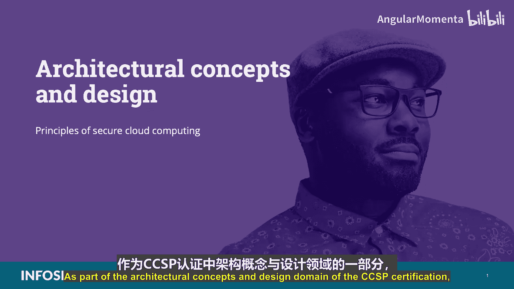
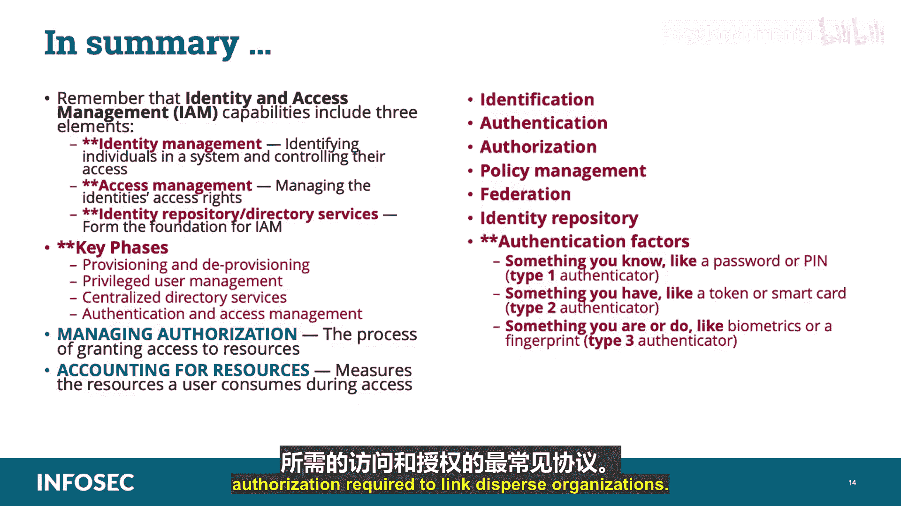

# 011：安全云计算原则 🛡️

在本节课中，我们将学习CCSP认证“架构概念与设计”领域中的一个核心主题：安全云计算原则。我们将重点探讨身份与访问管理（IAM）的基础知识、关键组件及其在云环境中的应用。

---

## 概述

身份与访问管理是云安全架构的基石。它涉及管理用户、流程和程序，以确保只有经过验证的身份才能根据资源的分类和分级获得适当的访问权限。本节将系统性地介绍IAM的各个阶段和核心概念。

---

## 身份与访问管理（IAM）的核心要素

身份与访问管理能力包含三个基本要素：**身份管理**、**访问管理**和**身份存储库**（或目录服务）。

以下是构成企业身份与访问管理基础的关键阶段：

*   **身份供应与撤销**：创建和移除用户身份。
*   **特权用户管理**：监控和管理具有高级权限的账户。
*   **集中式目录服务**：存储和管理用户身份及其属性的结构化存储库。
*   **认证与访问管理**：验证用户身份并控制其对资源的访问。

---

## 身份管理

身份管理是指在系统中识别个体，并通过将其用户权限和限制与其提供的已建立身份相关联，来控制他们对该系统内资源的访问。简而言之，身份管理是为所有相关实体及其属性进行注册、供应、撤销以及信息审计的完整过程。

---

## 访问管理

访问管理涉及管理身份的访问权限。它处理的是个体对资源的访问，核心问题是“你是谁？”以及“你可以访问什么？”。访问管理是做出真正风险决策的地方，控制访问权限比控制身份数量更为重要。

---

## 授权管理

授权处理的是身份与访问管理中“你能做什么”的方面。**授权是授予资源访问权限的过程**。它可以基于身份、身份属性（如角色）或上下文信息（如位置或时间）。在联合身份模型中，授权通常在相关资源附近的策略执行点（PEP）强制执行。

---

## 审计

审计衡量用户在访问期间消耗的资源。这可以包括系统时间或用户在会话期间发送/接收的数据量。审计通过记录会话统计和使用信息来执行，并用于授权控制、计费、趋势分析、资源利用和容量规划活动。

**考试必须记住以下术语：**

*   **标识**：每个主体被分配一个唯一的身份声明。
*   **认证**：识别个体并确保他们是其所声称的身份。它通过询问“你是谁？”和“我如何信任你？”来建立身份。认证是身份提供者（IdP）的功能。
*   **授权**：在认证发生后，评估“你可以访问什么？”。
*   **策略管理**：根据业务需求和可接受的风险程度建立安全和访问策略。
*   **联合**：组织之间为促进关于其用户和资源的适当信息交换而达成的联合，以实现协作和交易。
*   **身份存储库**：包含用于管理用户账户属性的目录服务。

---

## 身份供应

供应是身份管理的第一阶段，为每个主体分配一个唯一的身份声明（如唯一的用户ID和密码），用于验证身份。其目标是将用户与基于唯一用户ID的适当控制绑定，提供可追溯所有活动的问责制和受保护的审计跟踪。

在公有云领域，身份提供者使用 **OpenID** 和 **OAuth** 作为标准协议来管理“你是谁”的问题。

*   **OpenID**：允许用户通过合作站点（称为依赖方，RP）使用第三方服务进行认证，无需网站提供自己的临时登录系统。
*   **OAuth**：一种开放标准的访问授权协议，通常用于让互联网用户授权网站或应用程序访问其在其他网站上的信息，而无需提供密码。

在企业环境中，公司身份存储库（如微软的Active Directory）被广泛使用。相关的标准协议包括**安全断言标记语言（SAML）** 和 **WS-Federation**。

---

## 认证

认证是验证用户身份的过程。用户身份与只有用户知道或拥有的信息相结合，以验证用户的真实性。这建立了用户与系统之间的信任，以便分配权限。身份与访问管理通常寻求利用**多因素认证**。

**考试需要了解不同类型的认证器：**

*   **类型1认证器**：你知道的东西，如密码或PIN。`type1 = “something you know”`
*   **类型2认证器**：你拥有的东西，如令牌或智能卡。`type2 = “something you have”`
*   **类型3认证器**：你本身具有或所做的行为，如生物特征或指纹。`type3 = “something you are/do”`

多因素认证（也称为双因素认证或强认证）在验证交易合法性时增加了额外的保护层。要成为一个多因素系统，用户必须能够提供至少两种类型的认证器。**一次性密码（OTP）** 也属于多因素认证的范畴，它是一个自动生成的数字或字母数字字符串，用于对用户的单次交易或会话进行认证，且永不重复。

一些额外的供应因素或程序包括**升级认证**，这通常由高风险交易或违反策略规则触发。常用的方法有挑战问题、带外认证（如电话或短信验证）等。

---

## 授权

一旦用户被识别并正确认证，授权就是流程的最后一步。它定义了允许该用户基于其权限访问的资源，并进行监控。授权是定义用户所需的具体资源，并确定用户对这些资源可能拥有的访问类型或权限的过程。

在这里，我们实施**最小权限**、**职责分离**和**需知**原则。在自服务身份管理配置中，云客户负责供应每个用户的身份。

授权或访问权限流程始于业务和安全需求，并将其转化为一组规则。这些规则代表了风险决策，是在使用户能够高效工作与同时减少滥用可能性之间取得平衡。这些规则被转化为授权决策，并在称为策略执行点（PEP）或策略决策点（PDP）的不同位置通过各种技术强制执行。

---

## 访问管理

创建身份（即供应身份）、认证用户并授权他们访问云资源后，就需要管理访问。访问管理是流程中处理控制对资源访问的部分，每次用户尝试访问资源时，都会基于其凭据和身份特征来识别用户是谁以及他们被允许访问什么。

这通过**认证**（建立身份）、**授权**（评估访问权限）和**策略管理**（作为认证和授权的执行臂）的组合来实现。

---

## 联合与身份存储库

*   **联合**：是促进组织之间就用户和资源进行适当信息交换的联合，允许它们跨不同组织共享资源。
*   **身份存储库**：是用于管理用户账户及其相关属性的目录服务，可以看作是功能强大的Active Directory。

除了身份存储库，身份与访问管理的其他核心方面还包括联合身份管理、联合标准、联合身份提供者、各种类型的单点登录（SSO）、多因素认证和补充安全设备。

---

## 集中式目录服务

集中式目录服务构成了企业和云部署中身份与访问管理及安全的基础。目录服务存储、处理和促进结构化信息存储库的访问，并配有唯一标识符和位置。

最广泛使用的目录服务是**轻量级目录访问协议（LDAP）** 和 **X.500标准**。目录服务允许管理员自定义用户角色和身份。

在处理联合时，这一点变得更加重要，因为必须有一种一致的方法来访问这些身份及其相关属性，以便在不相关的系统之间工作。与集中式目录服务相关的主要协议是LDAP，它基于X.500标准构建。

LDAP作为应用协议，用于查询和修改目录服务提供者（如Active Directory）中的项目。它基于分层树结构存储信息，并支持TLS等安全标准。

---

## 身份撤销

撤销或移除用户账户是身份与访问管理流程的最后一步。当用户不再需要访问基于云的服务和资源时，账户将被禁用。这不仅限于用户离开组织，也可能由于用户变更角色、职能或部门。撤销是一种风险缓解技术，旨在降低授权或特权蔓延的风险。

---

## 特权账户管理

特权账户因其被入侵后带来的风险和影响而需要密切监控。这些账户用于供应账户、提升权限以及最终停用账户。应使用特权身份管理功能来管理目录的管理员，跟踪使用情况、认证成功与失败、授权时间日期，记录成功和失败事件，强制执行密码管理，并确保日志包含与特权用户账户相关的足够级别的审计和报告。

---

## 云访问安全代理（CASB）

云访问安全代理是为云服务提供商和云客户提供独立身份与访问管理服务的第三方实体，通常充当中介。它可以采取多种服务形式，包括单点登录、证书管理和加密密钥托管。这是考试需要了解的一个术语。

---

## 联合身份管理

联合身份管理是指从多个身份管理系统收集身份和授权设置，使不同系统能够定义用户能力和访问权限。身份和授权是跨多个权威服务的共同责任。

**OAuth 2.0** 和 **SAML 2.0** 是两种最常见的协议，支持连接分散组织所需的访问和授权。

*   **OAuth 2.0**：广泛用于Web和移动应用程序的授权服务。
*   **SAML 2.0**：用于在安全域之间交换认证和授权数据，支持基于Web的认证和授权场景，包括单点登录。

联合身份意味着将一个人的电子身份和存储在不同身份管理系统中的属性链接起来。在联合环境中，会有身份提供者（IdP）和服务提供者（SP，也称为依赖方）。

联合单点登录通常用于促进组织内和安全域内对资源的访问。不应将单点登录与简化登录混淆，后者通常通过某种形式的凭据同步操作，存在安全顾虑。

---

## 总结

本节课我们一起学习了身份与访问管理（IAM）。我们明确了需要记住的三个要素：身份管理、访问管理和身份存储库（目录服务）。我们还讨论了关键阶段：供应与撤销、特权用户管理、集中式目录服务以及认证与访问管理。

我们详细阐述了：
*   **身份管理**：识别系统中的个体并控制其访问。
*   **访问管理**：管理身份的访问权限。
*   **授权管理**：授予资源访问权限的过程。
*   **审计**：衡量用户在访问期间消耗的资源。

考试必须掌握的术语包括：标识、认证、授权、策略管理、联合和身份存储库。

此外，我们深入探讨了三种认证因素：你知道的东西（类型1）、你拥有的东西（类型2）以及你本身具有或所做的行为（类型3）。我们还介绍了构成IAM基础的集中式目录服务，其中最常用的是LDAP和X.500标准。

最后，我们提到了作为独立IAM服务提供者的云访问安全代理（CASB），并详细讨论了联合身份管理。联合身份管理提供了跨组织管理身份和可信系统访问的策略、流程和机制，其中OAuth和SAML是支持连接分散组织所需访问和授权的最常见协议。