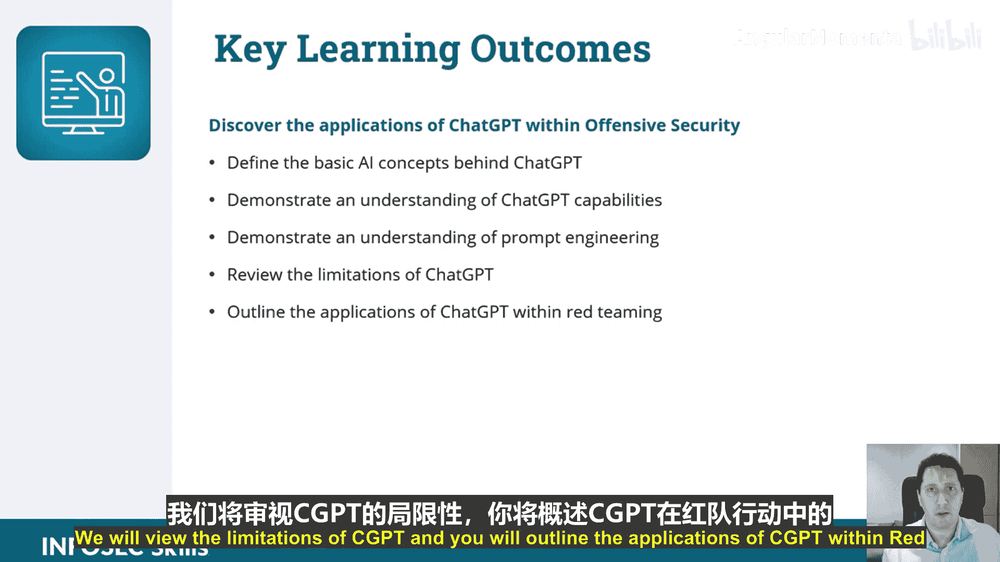

# 001：课程与ChatGPT概述 🚀

在本节课中，我们将学习本课程的整体介绍，并了解ChatGPT的基础知识及其在攻击性安全领域的应用潜力。

## 课程概述

欢迎来到本课程。本节是课程的第一部分，旨在介绍ChatGPT。在攻击性网络安全的语境下，我们将ChatGPT简称为CGPT。本课程的重点是探讨CGPT在攻击性网络安全、红队行动和道德黑客中的实际应用。课程将涵盖关键的AI概念，并提供提示工程的基础介绍。

本课程专为希望将ChatGPT整合到其攻击性安全工作流程中的网络安全专业人员设计。

## 主要学习目标

以下是本课程希望您达成的几个关键学习成果：

*   您将了解CGPT在攻击性网络安全中的具体应用。
*   您将能定义CGPT背后的基本AI概念。
*   您将展示对模型能力的理解。
*   您将展示对提示工程的理解。
*   您将审视ChatGPT的局限性。
*   您将概述CGPT在红队行动中的应用。

那么，让我们开始吧。

---

本节课中，我们一起学习了本课程的整体框架和核心目标，明确了ChatGPT在攻击性安全领域的定位。下一节，我们将深入探讨ChatGPT背后的基本AI概念。