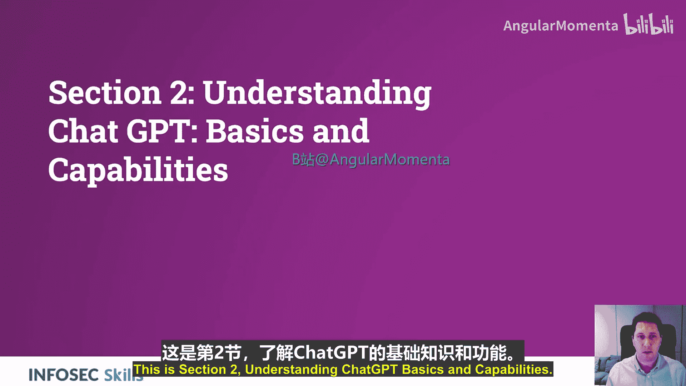
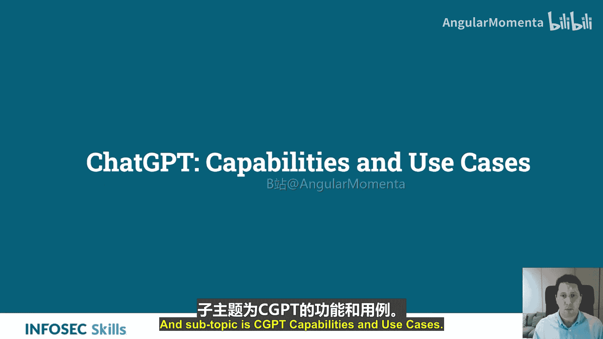
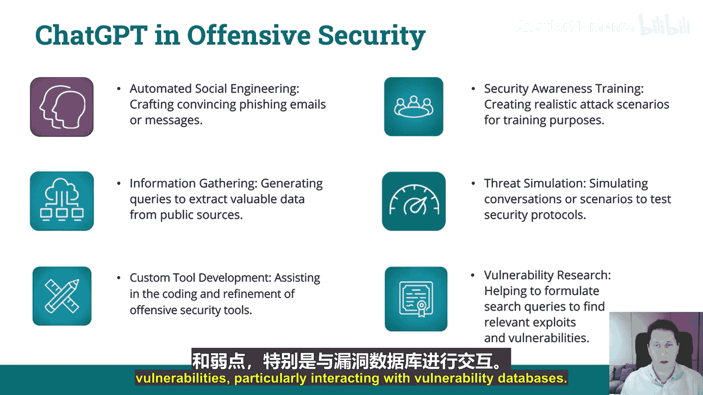
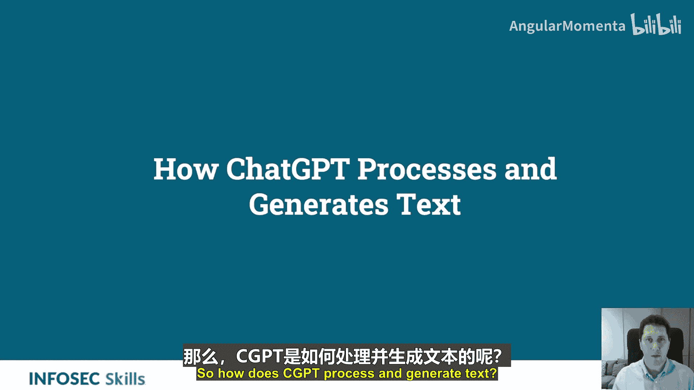
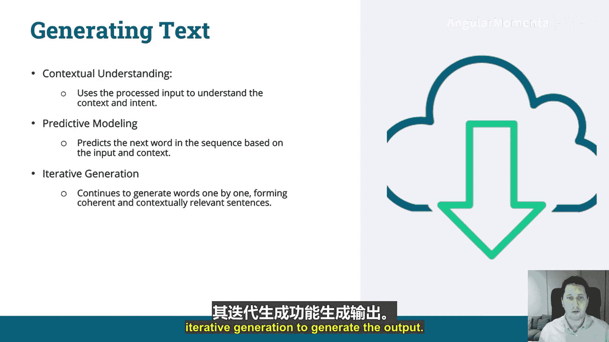
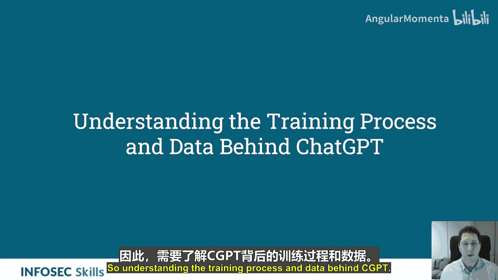
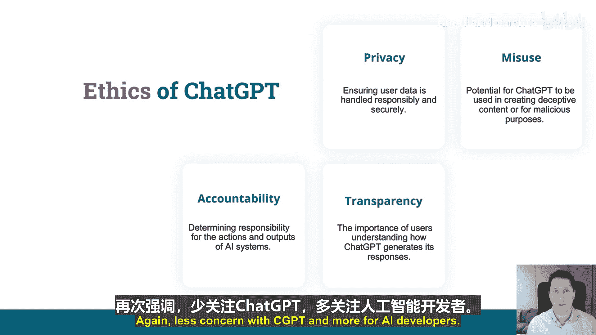

# 002：理解ChatGPT基础与能力

## 概述
在本节中，我们将学习ChatGPT的基础知识及其核心能力。我们将了解ChatGPT是什么，它如何工作，以及它在攻击性网络安全领域的具体应用案例。同时，我们也会探讨其局限性、背后的训练过程以及相关的伦理考量。

---

## 什么是ChatGPT？🤖

ChatGPT是GPT的一个变体，GPT代表**生成式预训练变换器**。这是一个专为对话式响应而设计的模型。它由OpenAI开发，旨在根据接收到的输入来理解和生成类人文本。

---

## ChatGPT的核心能力 💪

ChatGPT具备多项核心能力，使其能够处理复杂的语言任务。

以下是其主要能力：

*   **自然语言理解**：接收并理解自然语言输入（无论是文本还是语音）的能力。
*   **自然语言生成**：生成自然语言输出和响应的能力。
*   **上下文记忆**：在对话中保持上下文连贯性的能力。
*   **适应性**：能够从用户互动中学习，并随时间推移改进其响应。

---

## ChatGPT在攻击性网络安全中的应用 🛡️➡️⚔️

ChatGPT的能力使其在攻击性网络安全工作流中成为有用的工具。以下是几个关键的应用场景：

*   **自动化社会工程学**：利用ChatGPT的自然语言能力，可以制作出极具说服力的钓鱼邮件或信息，非常适合用于钓鱼攻击模拟和演练。
*   **信息收集**：生成查询语句，从公开来源提取有价值的数据。例如，ChatGPT可以作为渗透测试或网络枚举任务中的辅助工具。
*   **定制化工具开发**：协助编写和优化攻击性安全工具的代码，例如创建脚本或在不同编程语言间进行转换。
*   **安全意识培训**：创建逼真的攻击场景用于培训目的，能极大提高制作培训材料的效率。
*   **威胁模拟**：模拟对话或场景以测试安全协议的有效性。
*   **漏洞研究**：帮助构建搜索查询，以查找相关的漏洞和利用代码，特别是在与漏洞数据库交互时。

---

## ChatGPT如何处理和生成文本？🔧

上一节我们介绍了ChatGPT的应用场景，本节中我们来看看它内部是如何工作的。ChatGPT通过一个在多样化数据集上训练的模型来处理输入并生成文本。它利用了**GPT（生成式预训练变换器）** 架构。

以下是其核心处理流程：

1.  **分词**：将输入的文本转换为模型能够理解的**令牌**。
2.  **嵌入**：将令牌转换为能捕捉语义信息的**数值表示**（向量）。
3.  **注意力机制**：确定输入的哪些部分与生成响应最相关。这是GPT架构的核心，基于2017年谷歌工程师在论文《Attention Is All You Need》中提出的**变换器**技术。
4.  **生成文本**：
    *   **上下文理解**：利用处理后的输入来理解上下文和意图。
    *   **预测建模**：基于输入上下文预测序列中的下一个单词。
    *   **迭代生成**：逐个单词地持续生成，形成连贯且符合上下文的句子。

简单来说，ChatGPT首先理解你的输入，然后用其模型预测下一个词，最后通过迭代生成完整的输出。

---

## 理解ChatGPT的训练过程与数据 📚

了解了工作原理后，我们有必要看看它是如何被“教”会的。训练AI涉及向模型（即**大语言模型**）输入非常庞大的数据集，使其能够学习并进行预测。具体到ChatGPT，它是被专门训练来理解和生成类人文本的。

**数据来源**：ChatGPT在广泛的文本源上进行训练，包括书籍、网站和文章。其训练数据集容量可达数百GB的文本数据。

**训练目标**：掌握人类语言的细微差别，并生成连贯且具有上下文感知的响应。

**训练过程详解**：
1.  **预训练**：模型接触海量数据集，学习语言的基本结构。目标是理解和预测句子中的下一个单词。
2.  **监督微调**：在更具体、更狭窄的数据集上进行训练，以优化特定任务的表现。
3.  **基于人类反馈的强化学习**：根据人类对模型输出的反馈进行进一步调整和优化，类似于产品上线后根据用户反馈进行迭代。

---

## ChatGPT的局限性与伦理关切 ⚠️

尽管功能强大，但了解ChatGPT的局限性和伦理问题至关重要。**AI伦理**研究的是人工智能引发的道德问题和社会影响。

**主要局限性**：
*   **理解复杂上下文**：虽然先进，但在处理非常复杂或微妙的上下文时可能遇到困难。
*   **数据偏见**：可能反映其训练数据中存在的偏见，从而导致有偏见的输出。
*   **生成错误信息**：能够生成看似合理但实际上不准确或具有误导性的信息。
*   **数据集时效性**：其知识受限于训练数据，且存在截止日期（例如，GPT-3.5的知识截止到2021年）。

**伦理考量**：
*   **隐私**：确保用户数据得到负责任和安全地处理。输入模型的数据可能被用于训练或通过恶意提示工程暴露。
*   **滥用风险**：存在被用于创建欺骗性内容以进行恶意用途的潜在风险（这也正是攻击性安全中可能利用的一点）。
*   **责任归属**：确定对AI系统行为及输出结果的责任方。
*   **透明度**：让用户理解ChatGPT如何生成其响应的重要性。

---

## 总结
本节课中，我们一起学习了ChatGPT的基础知识。我们了解了它作为生成式预训练变换器的本质，其核心的自然语言理解和生成能力，以及在攻击性网络安全领域如社会工程学、工具开发等方面的实际应用。我们还探讨了其基于变换器架构的文本处理流程、背后的训练数据与方法，并认识了它在理解复杂语境、数据偏见等方面的局限性及相关的伦理问题。掌握这些基础知识是有效和安全地利用ChatGPT进行安全工作的第一步。