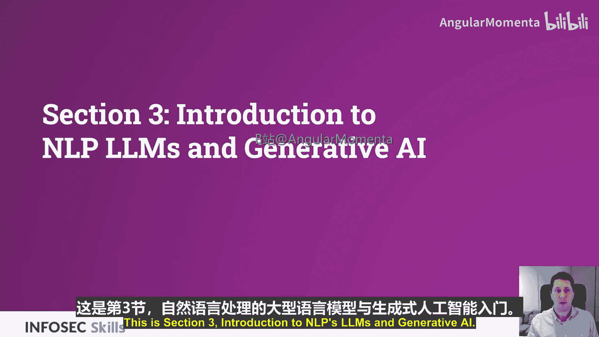
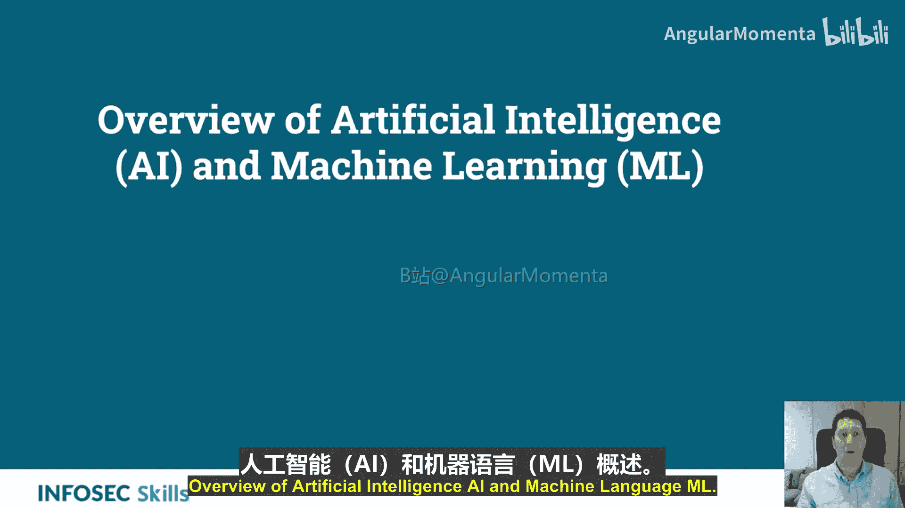
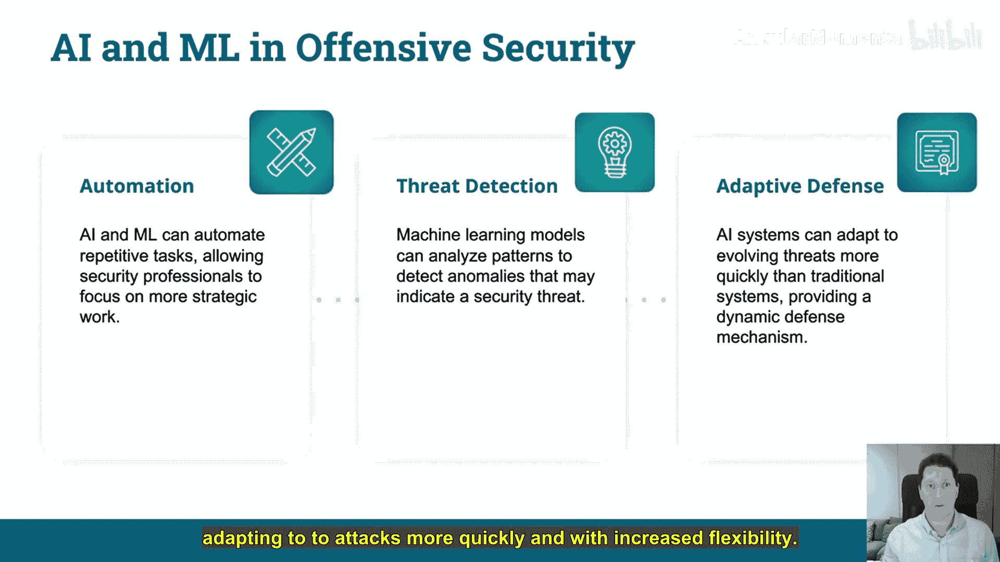
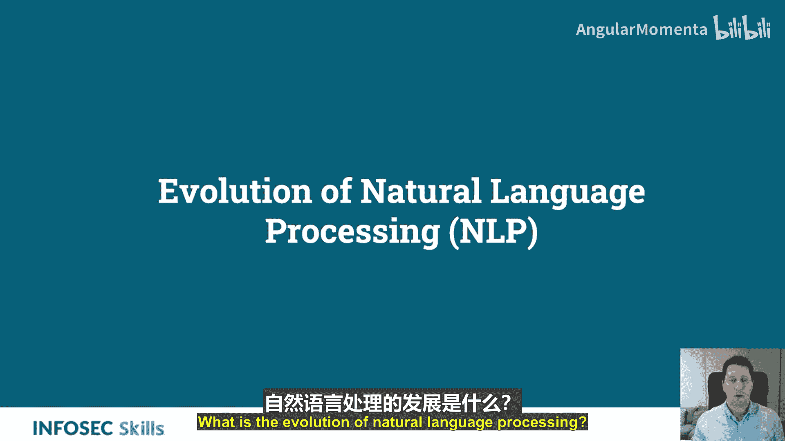
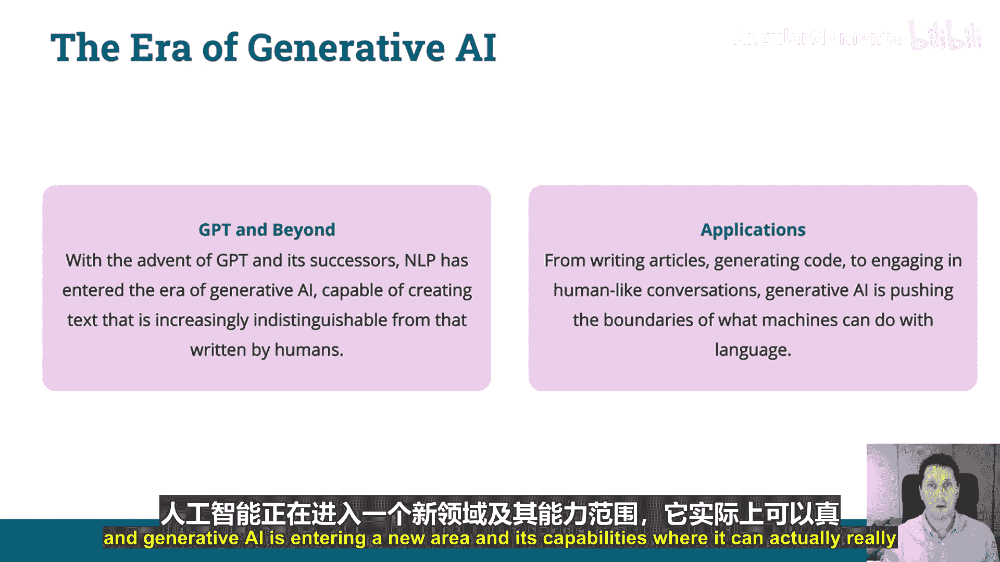
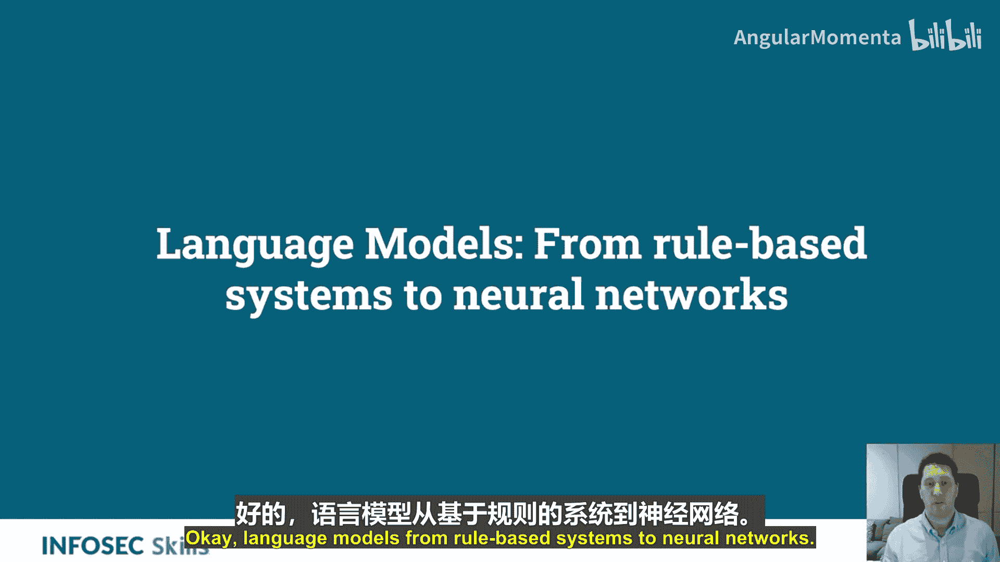
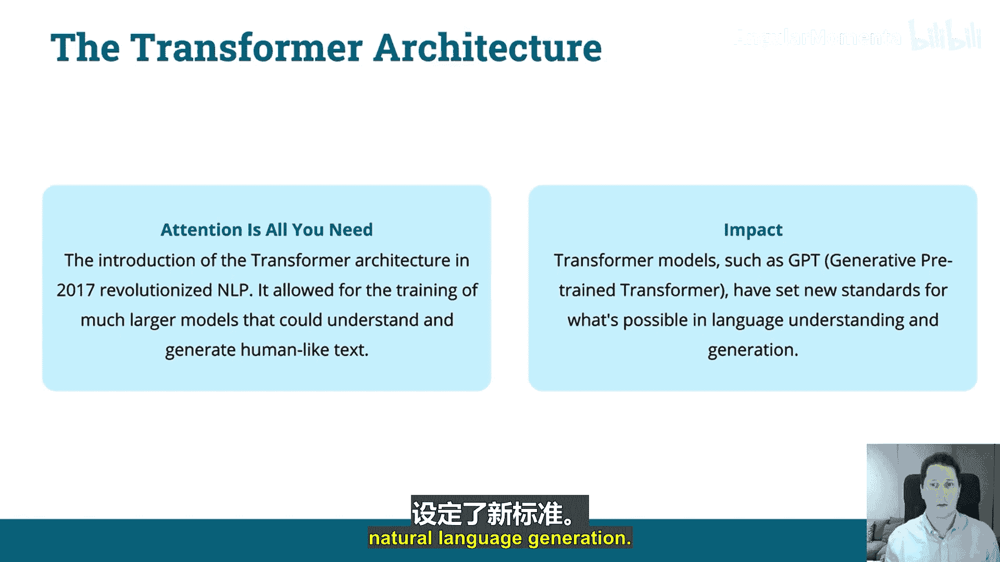
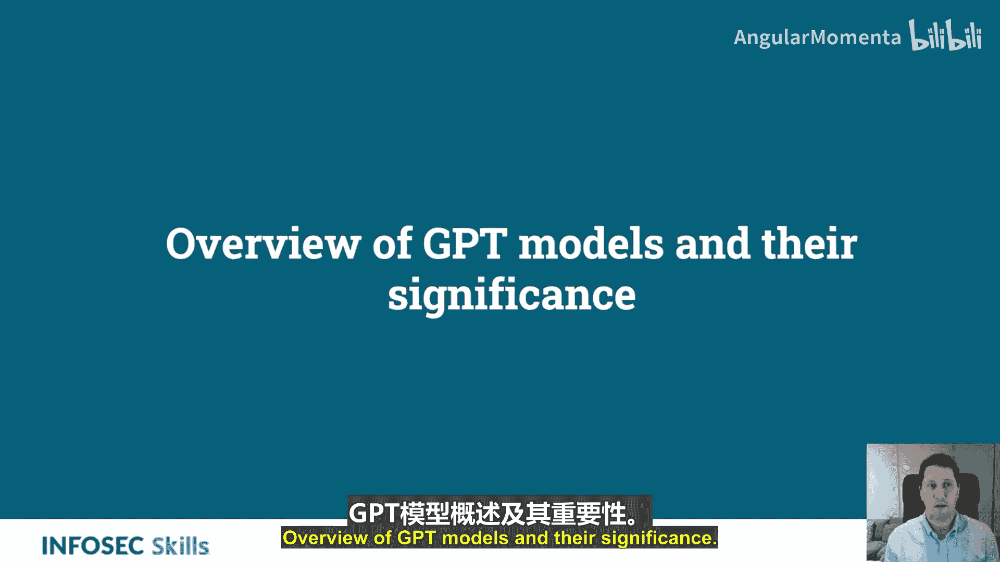
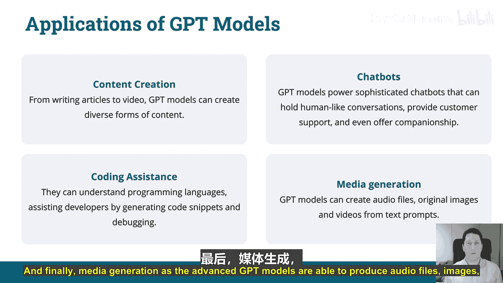

# 003：NLP、LLM与生成式AI入门 🧠

在本节课程中，我们将学习人工智能、机器学习和自然语言处理的基础知识，并了解以ChatGPT为代表的生成式AI模型是如何演变而来的。我们将探讨这些技术在攻击性安全领域的潜在应用。

---

## 人工智能与机器学习概述 🤖

首先，我们从宏观层面审视人工智能。人工智能致力于创建能够执行通常需要人类智能才能完成任务的系统。

请看下图，人工智能位于顶层，其下是机器学习。因此，机器学习是人工智能的一个子集，是其内部的一个研究领域。

机器学习赋予计算机无需明确编程即可学习的能力。深度学习与神经网络是机器学习的子集。神经网络是大型数学方程，为学习从A到B或从输入到输出的映射提供了有效技术，即接收输入、进行处理并给出输出。

深度学习是一种人工神经网络，允许多个输入通向一个输出。从深度学习衍生出监督学习、半监督学习和无监督学习。这些是训练模型的方法，我们稍后会进一步探讨。例如，监督学习是为模型提供带标签的数据进行训练。

ChatGPT是这些技术的产物。GPT模型经过训练，而ChatGPT是GPT-3.5的产物。

接下来，我们更深入地探讨人工智能与机器学习的关系。

人工智能是机器对人类智能的模拟。机器学习是人工智能的一个子集，是一种通过识别模式、理解数据来教会计算机从数据中学习的方法，无需人类干预。

人工智能与机器学习如何协同工作？这里涉及神经网络的概念。在ChatGPT中，利用了神经网络等人工智能技术来处理信息、进行对话。机器学习算法通过让模型接触海量文本数据，在训练ChatGPT中扮演核心角色，使模型能够学习模式、语言结构和语义关系。

机器学习作为一种神经网络，帮助GPT模型能够处理这些数据。在本课程中，我们将了解这是如何实现的。

---

## 机器学习的类型 🔄

上一节我们介绍了人工智能与机器学习的关系，本节我们来看看机器学习的几种主要类型。

以下是三种主要的机器学习类型：

*   **监督学习**：计算机通过示例学习，数据被明确标记。
*   **无监督学习**：计算机从未标记的数据中学习模式和关系。
*   **强化学习**：模型根据其行为接收奖励或惩罚。

---

## AI与ML在攻击性网络安全中的应用 ⚔️

了解了机器学习的基本类型后，我们来看看它们在攻击性安全领域的一些用例。

像ChatGPT这样的模型可以自动化你的网络安全工作流程，提高效率，让你能专注于更具战略性的工作。具体应用包括：

*   **威胁检测**：分析模式和趋势，检测异常。
*   **自适应防御**：更快地适应攻击，并提高灵活性。

---

## 自然语言处理的演进历程 📜

现在，让我们将目光转向自然语言处理，看看它是如何发展至今的。

NLP的历史始于1950年，当时使用简单算法，首个用例是尝试用机器翻译语言。1954年著名的“乔治城实验”使用自然语言处理翻译了60个俄语句子。这很重要，因为它首次提供了概念验证，表明这可能是一个可行的产品，并吸引了政府资助。

*   **统计方法的兴起**：20世纪80年代至90年代，焦点从基于规则的方法转向统计方法。这通过利用更大的数据集和更强大的计算机，实现了更灵活、更准确的语言处理。
*   **深度学习革命**：2010年至今，深度学习模型的引入改变了NLP。这些模型现在能够理解和生成类人文本。2017年出现突破，谷歌工程师的一篇名为《注意力就是你所需要的一切》的白皮书引入了Transformer的概念，这导致了像GPT这样更先进模型的创建。
*   **生成式AI时代**：随着GPT及其后续模型的出现，NLP进入了一个新时代，能够生成非常接近人类行为的文本。这有多种应用，例如撰写文章、生成代码、进行人类对话。生成式AI正在进入其能力的新阶段，能够真正模仿人类语言和言语。

---

## 语言模型：从基于规则到神经网络 🧬

我们已经了解了NLP的演进，本节我们聚焦于其中的核心——语言模型。

大型语言模型是一种预测单词序列可能性的模型，它是自然语言处理的支柱。早期模型依赖于手工制定的规则，而神经网络则依赖于深度神经层，这些层能够在向量之间建立连接。

*   **神经网络的崛起**：采用神经网络带来了突破，神经网络能够学习数据中更深层的模式。这导致了更准确、更具上下文感知能力的语言模型。关键概念在于，神经网络允许机器从示例中学习，而不是遵循明确编程的规则。
*   **Transformer架构**：如前所述，2017年《注意力就是你所需要的一切》白皮书及Transformer架构的引入，彻底改变了自然语言处理，使得训练能够理解和生成类人文本的更大型模型成为可能。其影响是，像GPT这样的Transformer模型为自然语言生成的可能性设定了新标准。

---

## GPT模型概述及其重要性 🚀

在了解了语言模型的发展后，我们重点介绍其中最具代表性的GPT模型。

生成式预训练Transformer是由OpenAI设计的一系列AI模型。这些模型能够根据接收到的输入理解和生成类人文本。GPT 1到4版本普及了基于LLM的应用程序，为可能实现的目标设定了标准。

让我们看看OpenAI发布GPT的时间线：

*   **GPT-1**：在2017年无监督学习取得突破后，GPT-1于2018年发布，展示了Transformer在语言理解方面的潜力，是对前述白皮书理论的实际应用。
*   **GPT-2**：于2019年发布，数据集显著更大，能生成更具上下文相关性的文本。
*   **GPT-3**：于2020年发布，这是当前免费的3.5版本模型。它拥有1750亿个参数，展示了生成类人文本的卓越能力，这也是近年来它广受欢迎的原因。
*   **GPT-4**：包含了更多的伦理考量，更注重数据权利和人类干预，使其进入可用于企业的生产就绪状态。GPT-4还在GPT-3的基础上有所进步，GPT-3主要关于文本生成，而GPT-4还具备文本转语音、语音转文本、图像转文本、文本转图像、声音和视频生成等功能。
*   **GPT-5**：计划于2025年发布，参数规模将显著增加，并具备更多功能，在伦理方面也肯定会有更多工作。

GPT模型如何工作？它们从海量数据集中学习，训练完成后能够根据输入生成内容，即**输入 -> 处理 -> 输出**，并能以非常可信的方式完成。

GPT模型有哪些应用？

*   **内容创作**：撰写文章、生成视频等多种内容。
*   **编码辅助**：协助编写脚本、修复代码、从零开始编写代码，以及将代码从一种语言转换到另一种语言。
*   **聊天机器人**：这些文本生成模型非常擅长以自然方式与人类互动，因此天然适合在客户服务等领域进行人类对话。
*   **媒体生成**：随着模型发展，能够生成音频文件、图像和视频。

---

## 总结 📝

在本节课中，我们一起学习了人工智能、机器学习和自然语言处理的基础概念。我们回顾了NLP从早期规则系统到现代神经网络和Transformer架构的演进历程，并深入了解了GPT系列模型的发展、工作原理及其在内容创作、编码辅助等多方面的应用。这些知识为我们后续探索如何将ChatGPT等工具应用于攻击性安全领域奠定了重要的理论基础。