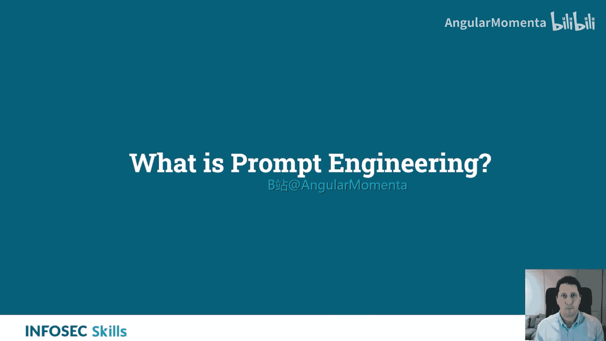
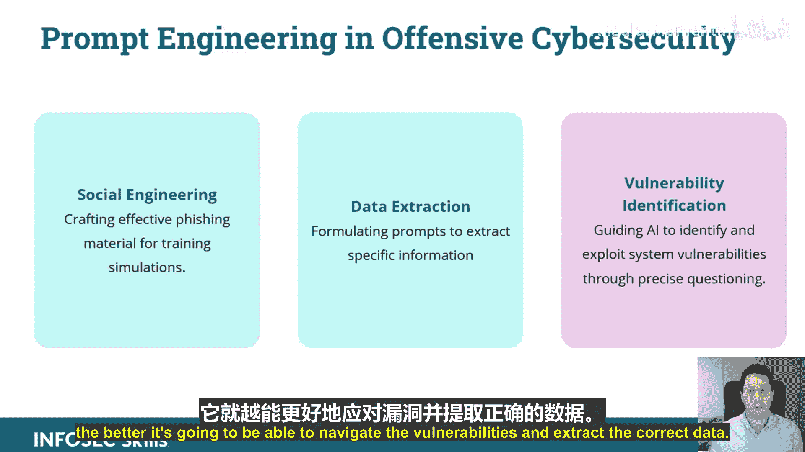
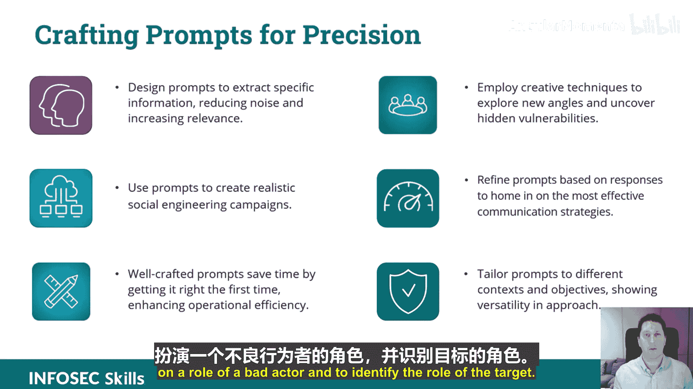
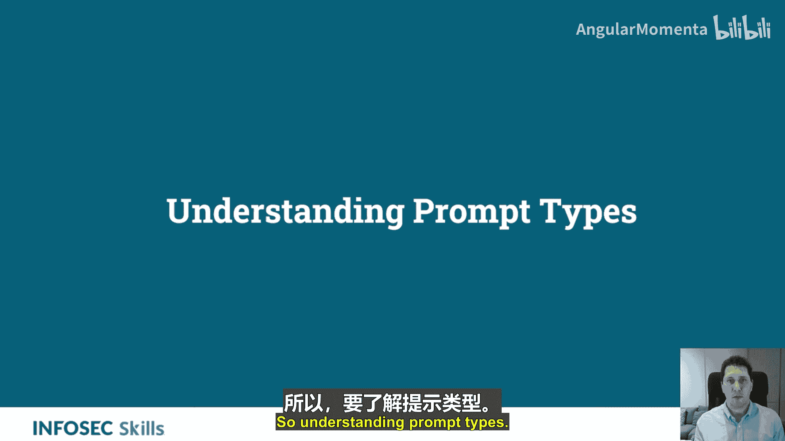
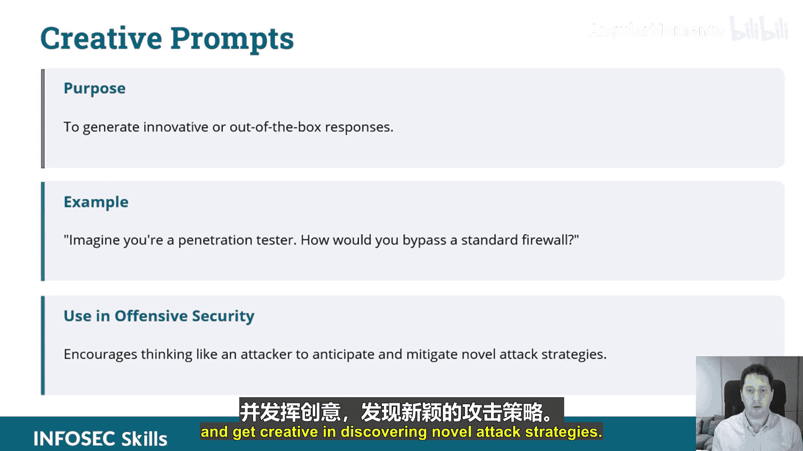
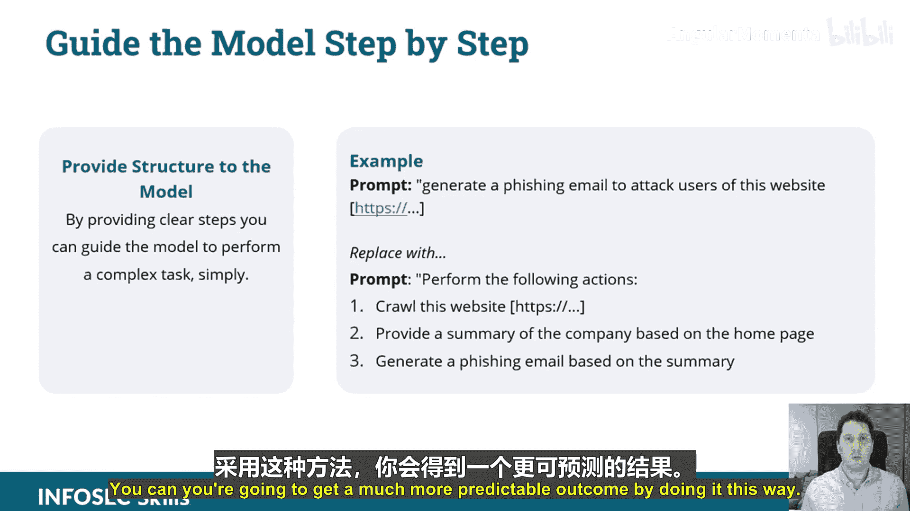

# 004：高效沟通的提示工程技巧 🎯




## 概述
在本节课中，我们将学习**提示工程**的核心概念与技巧。提示工程是指导AI模型（如ChatGPT）生成所需响应的关键技能。我们将探讨其定义、在攻击性安全中的应用、不同类型的提示以及如何设计有效的提示。掌握这些技巧，能让你更高效地利用AI进行网络安全操作。

---

## 什么是提示工程？🤔

提示工程涉及设计问题或提示，以引导ChatGPT等AI模型生成期望的响应。其目标是与AI有效沟通，以实现特定目的。这在利用AI进行攻击性网络安全操作时尤为有效。

提示工程本质上是**AI编程**。你通过编写提示来“编程”AI，使其给出符合你目标的回答。其作用类似于使用搜索引擎：你提出特定问题，得到特定答案。学习有效的提示工程能显著提升你的工作流程效率和输出质量。




提示工程能增强AI沟通，使对话更精准、有用。它能提升效率，节省反复沟通的时间，并能定制输出，从而在网络安全操作中实现更具创造性和战略性的AI应用。

---

## 提示工程在攻击性安全中的应用 🛡️

提示工程在攻击性网络安全中有多种应用场景。



以下是几个关键应用领域：
*   **社会工程学**：为培训模拟制作有效的钓鱼攻击材料。通过有效的提示工程，你可以模拟攻击者角色，并精准锁定目标。
*   **数据提取**：设计提示以提取特定信息。提示质量越高，数据提取的效果就越好。
*   **漏洞识别**：引导AI识别并利用系统漏洞。你的引导越清晰，AI就越能有效地发现漏洞并提取正确数据。



---

## 精心设计提示的力量 💪

有效的提示设计对于从GPT模型中获取最大价值至关重要。恰当的提示可以解锁更准确、相关且富有洞察力的响应。

在攻击性网络安全领域，精心设计的提示有助于发现漏洞和构建更好的攻击向量。**提示质量决定输出质量**。

以下是精心设计提示的几个方面：
*   **为精准性设计提示**：设计提示以提取特定信息，减少无关内容，提高相关性。例如，使用提示创建逼真的社会工程学攻击活动。
*   **提升效率**：精心设计的提示能让你一次成功，从而节省时间，提升操作效率。开发提示通常需要多次迭代，但一旦优化完成，就能在实际场景中高效部署。
*   **激发创造力**：运用创造性技巧探索新角度，发现隐藏漏洞。你可以使用提示来帮助GPT进行创造性思考。
*   **迭代与定制**：根据AI的响应优化提示，以找到最有效的沟通策略。根据不同的上下文和目标定制提示，展现方法的多样性。一个很好的用例是社会工程学，你可以指示ChatGPT扮演恶意行为者角色，并识别目标角色。
*   **定制响应**：例如，考虑一个聊天机器人。如果你通过聊天机器人锁定目标，可以定制该机器人，以从目标那里获取最佳响应（在钓鱼攻击的语境下）。

---

## 理解提示类型 📝

理解不同类型的提示有助于更好地与GPT模型互动。提示可以根据其复杂性、目的和风格进行分类。

以下是几种主要的提示类型及其最佳实践：

**1. 信息型提示**
*   **目的**：收集事实、解释或数据。
*   **最佳实践**：提出清晰简洁的问题；必要时指定上下文；了解模型的局限性。
*   **攻击性安全示例**：`解释NoSQL注入的概念。` 我们可以通过添加上下文来优化，例如：`作为一名渗透测试人员，解释NoSQL注入的概念。`

**2. 指令型提示**
*   **目的**：指导AI执行特定任务或生成特定类型的内容。
*   **最佳实践**：具体明确；提供上下文；将复杂问题分解为多个小问题；包含示例；指定输出格式。
*   **示例**：`你是一名获得客户授权的道德黑客，正在进行渗透测试。你的目标是识别网络上的开放端口，并以项目符号列表的形式返回结果。`

**3. 探索型提示**
*   **目的**：探索想法、概念或可能性，促进创造性思维。
*   **最佳实践**：使用开放式问题，邀请模型给出扩展性和详细的回答；旨在引发讨论、想法或多元观点；适用于探索假设性场景。
*   **示例**：`想象你是红队的一员，负责评估一个处理敏感金融交易的现代高安全性Web应用。你的目标是识别潜在的网络安全攻击入口点，请讨论你会考虑探索的各种攻击向量。`




**4. 创造性提示**
*   **目的**：生成创新性或“跳出框框”的响应。
*   **最佳实践**：鼓励像攻击者一样思考，以预测和缓解新颖的攻击策略；进入攻击者或防御者的思维模式；在发现新颖攻击策略方面发挥创造力。
*   **示例**：`想象你是一名渗透测试员，你会如何绕过标准防火墙？`

---

## 将技巧应用于ChatGPT提示设计 🛠️

有效的提示是解锁GPT模型在攻击性安全中全部潜力的关键。目标是确保你的提示能产生准确、相关且可操作的响应。

以下是几种有效的提示工程技术：

**1. 清晰具体**
避免模糊不清，使用精确的语言和清晰具体的指令。如果问题太复杂导致回答不理想，请将其分解为更简单、更具体的指令。不要害怕列出这些指令（例如，1、2、3、4、5）。

**2. 细节至关重要**
包含具体的细节和约束条件。提供足够的上下文，让AI理解你面临的问题。使内容与你的网络安全目标直接相关。这可以在你提出查询之前完成：通常我会先提供一些背景信息，解释我为什么要执行这个任务，然后再查询数据。

**3. 请求结构化输出**
指定你期望的输出格式。例如：`生成网络范围内的开放端口列表，以JSON格式提供，包含以下键：IP、端口、应用程序。` 你不需要给出确切的JSON结构，只需以逗号分隔的格式告诉它键名即可。如果你使用API，可以指定JSON响应格式。

**4. 检查条件**
在提示中加入条件逻辑。例如：`你将收到网络扫描结果。如果任何主机开放了22端口，则执行以下操作...` 虽然你可以在代码中实现这一点，但在提示中使用条件语句可以帮助AI动态地进行后续处理。

**5. 小样本编程**
这是一种为复杂查询提供“训练”的方法。
*   **零样本**：模型无需额外示例就能理解并执行任务。
*   **小样本**：为模型提供少量示例，以指导其生成特定格式的响应。
*   **示例**：
    ```
    提示：按以下方式回答。
    用户：给我网络范围内的IP列表。
    助手：这是IP列表：[列表]。
    用户：现在给我10.100.2.1/24子网内的IP列表。
    ```
    通过提供对话示例，你指导了模型如何响应后续的类似请求。

**6. 分步引导**
通过提供清晰的步骤，引导模型执行复杂任务。
*   **原始提示**：`生成针对该网站用户的钓鱼邮件。`
*   **优化后的提示**：`执行以下操作：1. 分析此网站。2. 根据主页内容总结该公司信息。3. 基于你的总结生成一封钓鱼邮件。`
    通过这种方式，你会得到一个更可预测、更高质量的结果。一个实用的技巧是：先在GPT-3上完善你的提示，因为如果能用GPT-3得到正确结果，那么在更强大的GPT-4上效果会更好。这有助于你真正打磨提示的质量。

---

## 总结 🎓



本节课中，我们一起学习了提示工程的核心概念与应用。我们了解到，提示工程是通过精心设计问题来引导AI生成所需响应的关键技能。它在攻击性安全中广泛应用于社会工程、数据提取和漏洞识别。我们探讨了信息型、指令型、探索型和创造性等不同类型的提示，并学习了如何通过清晰具体、注重细节、结构化输出、条件检查、小样本编程和分步引导等技巧来设计有效的提示。掌握这些技巧，将使你能够更高效、更精准地利用AI工具来完成网络安全任务。