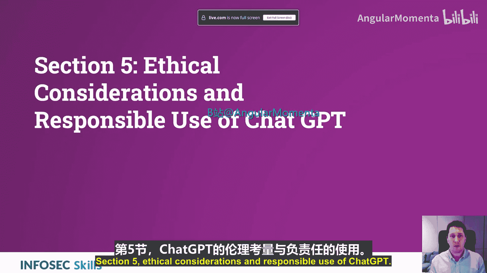
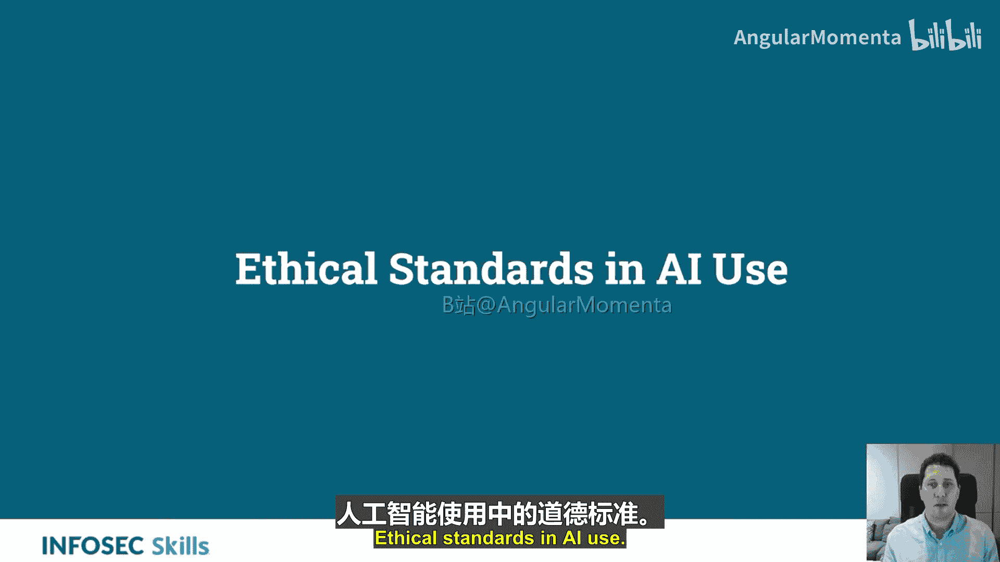
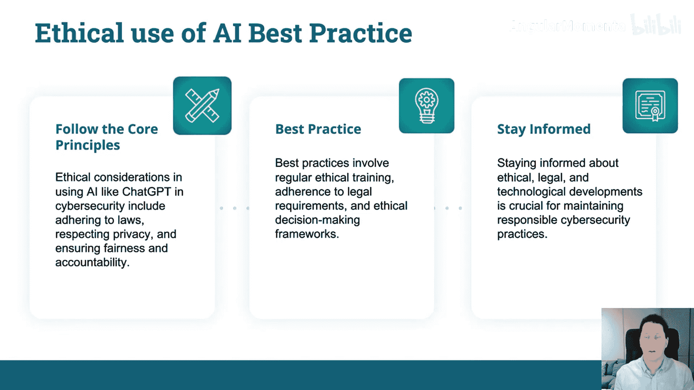

# 005：ChatGPT的局限性与伦理考量 🧭

在本节课中，我们将探讨在攻击性安全领域使用ChatGPT时面临的局限性以及至关重要的伦理考量。我们将了解如何负责任地使用这项强大的人工智能工具，确保其应用符合法律和道德标准，从而保护而非损害网络安全。

上一节我们介绍了ChatGPT在网络安全中的应用，本节中我们来看看其使用过程中的伦理边界与责任。

## 人工智能使用的伦理标准

在网络安全领域使用人工智能，如ChatGPT，可以增强威胁识别、分析和应对措施。但这需要伦理监督。伦理准则确保人工智能的力量被用于保护而非伤害，维护用户信任并遵守法律。

网络安全中创新与伦理的平衡，涉及尊重用户隐私、数据完整性以及获取同意。

## 伦理框架与核心原则

以下是网络安全和伦理黑客领域的核心伦理原则：

*   **不造成伤害**：伦理黑客旨在改善安全性，而非利用漏洞进行恶意目的。
*   **公平性**：确保人工智能决策的公正，避免歧视。
*   **隐私**：保护用户数据和隐私是首要任务。
*   **责任**：负责任地使用人工智能涉及应用这些原则，以防止不道德的数据操纵和隐私侵犯。

将伦理黑客和网络安全实践的核心原则，应用于攻击性安全中的ChatGPT使用。

## 隐私问题与概述

像ChatGPT这样的工具，如果没有严格的数据保护措施，可能会对数据隐私构成风险。

请注意你输入模型、用于查询和寻求代码帮助的数据。确保你已制定有效的政策与程序指南。

以下是关键的隐私保护措施：

*   **数据匿名化**：在处理数据前移除个人身份信息。
*   **严格的访问控制**：限制对敏感数据和AI模型的访问权限。
*   **遵守隐私法律**：如GDPR（通用数据保护条例）、CCPA（加州消费者隐私法案）等法律要求严格的数据安全和用户同意实践。这并非AI特有，但普遍适用。

## 偏见与歧视

这一点更具体地针对ChatGPT。包括ChatGPT在内的人工智能系统，可能会从其训练数据中继承偏见，从而影响网络安全决策。

请警惕这一点。如果你将偏见编程到模型中，或者模型本身已存在偏见，而你全盘使用其输出的数据，那么你得到的数据可能就是有偏见的。如果你自己使用了这些数据，你就成为了这个偏见链条的一部分。

以下是缓解AI偏见的努力：

*   **使用多样化数据集**：在训练和微调模型时使用来源广泛的数据。
*   **定期进行偏见审计**：持续评估模型输出是否存在偏见。
*   **持续评估与调整**：确保AI驱动的网络安全实践公平性，需要不断的评估和调整。

## 问责制与透明度

在网络安全中，AI驱动的决策必须是可追溯和可解释的，以确保问责制。

关于AI使用的透明度，能建立信任并符合伦理与法律合规要求。文档记录和审查流程对于AI辅助的网络安全行动中的问责制至关重要。

因此，不仅要在构建模型时保持透明，在使用模型时也应如此。

## 法律考量

以下是需要了解的关键法律：

*   **《通用数据保护条例》（GDPR）**：适用于数据保护。
*   **《计算机欺诈和滥用法案》（CFAA）**：规制未经授权的计算机访问。
*   **《网络安全信息共享法案》（CISA）**：促进网络安全威胁信息共享。

这些法律规范了伦理黑客活动以及网络安全工具的使用。

## ChatGPT在攻击性安全中的负责任使用

负责任的使用指南包括：

*   **仅针对已授权的系统**进行测试和协助。
*   **对发现保持机密性**。
*   **报告漏洞以供修复**。

ChatGPT可以被合乎伦理地使用，但务必**事先获得授权和同意**。伦理考量要求避免使用恶意软件，并尊重法律和隐私规范。

## 人工智能伦理使用的最佳实践

遵循核心原则是在网络安全中使用ChatGPT的伦理基础。

最佳实践包括进行定期的伦理培训、遵守法律要求以及采用伦理决策框架。

**保持信息更新**，随时了解该领域的最新发展。

---

本节课中，我们一起学习了在攻击性安全领域应用ChatGPT时必须考虑的伦理问题和局限性。核心在于将“不伤害”、“公平”、“隐私”和“责任”等原则融入实践，通过数据匿名化、偏见审计、确保透明度和遵守GDPR等法律来负责任地使用AI。记住，强大的工具需要同等的责任感，始终以提升安全、保护系统为目标，才能在创新与伦理之间取得平衡。