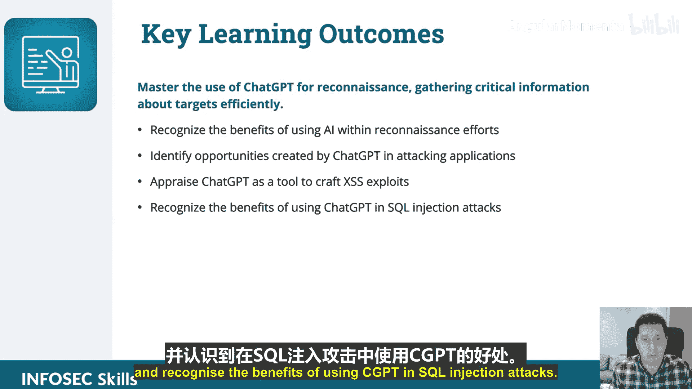

# 006：课程概述 🎯

在本课程中，我们将学习如何利用ChatGPT（以下简称CGPT）来增强攻击性应用安全技能。课程将深入探讨CGPT在网络应用漏洞侦察与利用中的实际应用。

## 课程简介

本课程旨在为网络安全专业人士提供一个深度探索使用CGPT进行攻击性网络安全的平台。课程的核心是**攻击性应用安全**，重点在于利用CGPT进行实际操作。

## 学习目标

完成本课程后，你将能够掌握以下关键技能：

以下是本课程的核心学习成果列表：

*   **掌握侦察技能**：你将能够熟练运用CGPT高效地收集关于目标的**关键信息**。
*   **认识AI优势**：你将能够识别在侦察工作中使用**人工智能（AI）** 所带来的益处。
*   **识别攻击机会**：你将能够发现CGPT在攻击应用程序过程中所创造的**机会**。
*   **评估工具能力**：你将能够将CGPT评估为一种工具，用于**构建跨站脚本（XSS）攻击**。
*   **理解SQL注入应用**：你将能够认识到在**SQL注入攻击**中使用CGPT的好处。

## 课程内容概览

上一节我们介绍了课程的整体框架和学习目标。本节中，我们来看看课程的具体覆盖范围。

本课程将涵盖CGPT在**网络应用漏洞的侦察与利用**方面的实际应用。内容设计旨在通过使用CGPT，帮助学员提升其攻击性应用安全的能力。

## 总结

本节课中，我们一起学习了本课程的概述、核心学习目标以及主要内容方向。我们了解到，本课程专注于利用CGPT这一强大工具，来增强我们在攻击性应用安全领域，特别是网络应用漏洞挖掘方面的实践技能。接下来，我们将逐步深入各个具体的技术环节。