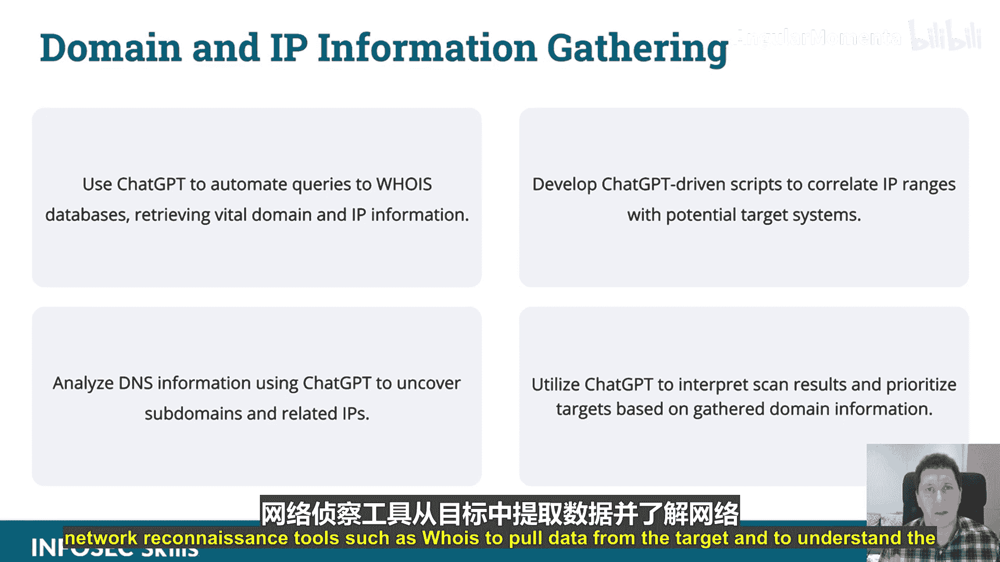

# 007：使用ChatGPT进行侦察技术

在本节课中，我们将学习如何利用ChatGPT在攻击性安全侦察阶段提升效率。我们将探讨ChatGPT处理和分析大量文本数据的能力，并了解它如何帮助安全人员节省时间、编写自定义脚本以及动态处理数据。

上一节我们介绍了ChatGPT在攻击性安全中的整体应用，本节中我们来看看它在侦察阶段的具体技术。

## 侦察技术概述

ChatGPT擅长处理和生成自然语言，这在侦察阶段非常有用。你可以利用这个工具来显著提升效率，节省大量时间。

## 域名与IP信息收集

在常规的侦察阶段，你会使用诸如`whois`这样的网络侦察工具来从目标获取数据并了解网络信息。以下是使用ChatGPT辅助此过程的方法。

首先，我们通过一个简单的理论介绍来了解基本概念。

---

在本节课中，我们一起学习了如何将ChatGPT应用于攻击性安全的侦察阶段，特别是利用其文本处理能力来辅助域名和IP信息收集，从而提升工作效率。