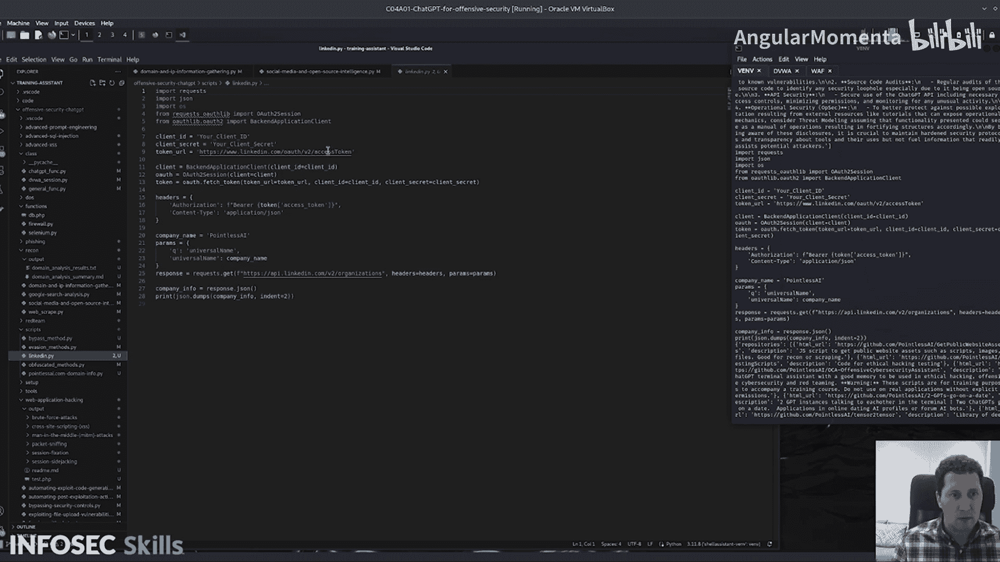

# 008：社交媒体与开源情报 🕵️


在本节课中，我们将学习如何利用脚本模拟收集社交媒体信息，并通过调用GitHub API来获取和分析目标数据。整个过程将涵盖数据获取、处理与分析，并展示如何利用AI工具提升效率。

---

## 脚本初始化与模拟数据

首先，我们需要为脚本设置一些变量。这里使用一个模拟的社交媒体帖子数组作为数据源。在实际应用中，你可以将其替换为真实的API调用，例如从Facebook、Twitter或LinkedIn获取帖子数据。

```python
# 模拟社交媒体帖子数据
social_media_posts = [
    "刚刚部署了新的服务器，IP是192.168.1.100，使用了默认密码！",
    "公司团建照片分享，背景里好像有内部系统的登录界面。",
    "吐槽：公司的VPN最近总是断开，是不是防火墙规则又改了？"
]
```

---

## 生成LinkedIn API查询脚本

接下来，我们将生成一个能够与LinkedIn API交互的脚本。这个脚本可以帮助我们自动化地从LinkedIn收集公开的职业信息。

以下是生成的脚本示例：

```python
import requests

def query_linkedin_api(profile_url):
    # 此处应替换为真实的LinkedIn API端点与认证信息
    headers = {'Authorization': 'Bearer YOUR_ACCESS_TOKEN'}
    response = requests.get(profile_url, headers=headers)
    return response.json()
```

---

## 社交媒体帖子分析

在获取了模拟的社交媒体帖子后，我们需要对其进行分析，以识别潜在的安全风险或信息泄露。



以下是分析社交媒体帖子的函数：

```python
def analyze_social_media_posts(posts):
    security_issues = []
    for post in posts:
        if "密码" in post or "IP" in post:
            security_issues.append(f"潜在信息泄露: {post}")
        if "VPN" in post or "防火墙" in post:
            security_issues.append(f"基础设施信息: {post}")
    return security_issues
```

运行此函数后，我们可以得到一系列可能指示安全疏漏的要点。通过分析大量社交媒体帖子，你可能会获得非常有价值的、可付诸行动的情报。

---

## 调用GitHub API获取数据

现在，我们将查询目标公司的GitHub公开仓库，以获取其代码库信息。

以下是获取GitHub数据的函数：

```python
import requests

def get_github_data(username):
    url = f"https://api.github.com/users/{username}/repos"
    response = requests.get(url)
    return response.json()
```

此函数会向GitHub API发起请求，并返回目标用户的所有公开仓库信息。

---

## 处理与分析GitHub数据

获取GitHub数据后，我们需要对其进行处理和分析，以评估公司的技术活跃度与关注领域。

以下是处理和分析数据的函数：

```python
def analyze_github_repositories(repos):
    analysis = []
    for repo in repos:
        repo_info = {
            "name": repo.get('name'),
            "url": repo.get('html_url'),
            "description": repo.get('description'),
            "language": repo.get('language'),
            "stars": repo.get('stargazers_count')
        }
        analysis.append(repo_info)
    return analysis
```

通过分析这些仓库，我们可以获得关于公司技术栈和项目重点的洞察，这些信息可用于进一步的侦察工作。

---

## 结合AI工具进行高效分析

在上述脚本中，我们主要利用AI工具完成了两项任务：生成LinkedIn API调用脚本，以及分析社交媒体和GitHub数据。这避免了手动处理大量数据的繁琐。

让我们仔细看看 `get_github_data` 函数。直接打印API返回的原始JSON数据会得到难以解读的巨大对象。

**方法一：纯代码处理**
```python
# 高数据完整性，但代码僵化，仅适用于特定用例
for repo in repos:
    print(f"仓库: {repo['name']}, 语言: {repo.get('language', 'N/A')}")
```

**方法二：AI辅助分析**
我们可以采用混合方法，结合代码的准确性和AI的灵活性。例如，用代码循环遍历数据，但在循环内调用AI对每个条目进行智能解析和总结。

**方法三：使用jq工具**
对于熟悉命令行的用户，也可以使用 `jq` 工具在终端高效地处理和过滤JSON数据。

每种方法都在数据完整性和处理灵活性之间有所权衡，你可以根据具体场景选择最适合的方式。

---

## 总结

本节课我们一起学习了如何构建一个用于攻击性安全的脚本。主要内容包括：
1.  使用模拟数据或API调用收集社交媒体信息。
2.  生成自动化脚本与LinkedIn等平台的API交互。
3.  分析社交媒体帖子，提取潜在的安全风险信息。
4.  调用GitHub API获取目标的公开代码仓库数据。
5.  处理并分析GitHub数据，以获得公司技术活动的洞察。
6.  探讨了结合传统代码与AI工具进行数据处理的混合方法，以平衡效率与准确性。

通过将这些技术结合起来，你可以在侦察阶段更高效地收集和分析开源情报，为后续的安全评估工作奠定基础。