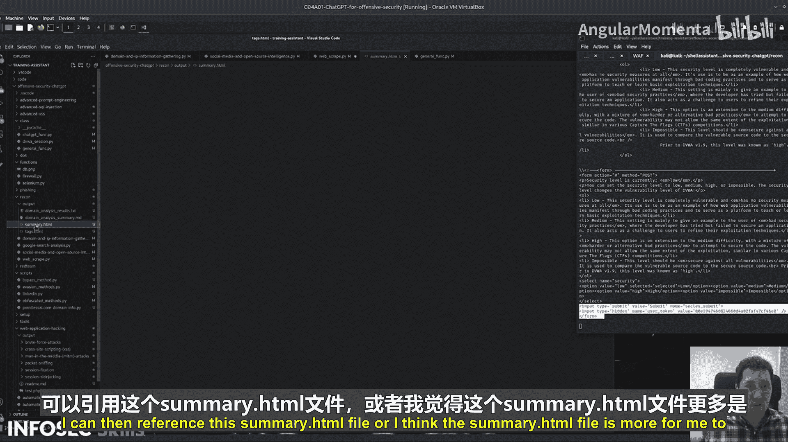

# 009：ChatGPT在攻击性安全中的应用 p09 02_01_04_网页抓取


在本节课中，我们将学习一个名为 `Webscrape` 的最终侦察脚本。该脚本的功能如其名，它会抓取网站内容，并根据我们提供的HTML标签来组织返回的信息。

## 脚本功能概述

`Webscrape` 脚本的核心是抓取目标网页的HTML代码，然后提取并分析我们指定的标签内容。通过这种方式，我们可以高效地收集目标网站的架构和内容信息，为后续的安全评估做准备。

## 配置目标标签

首先，我们需要定义希望脚本返回的HTML标签名称。初始列表可能包含过多标签，我们可以根据需求进行精简。

例如，获取整个 `<html>` 标签的内容会过于庞大，通常获取 `<head>` 标签的信息就已足够，因为它包含了标题（`<title>`）和元数据（`<meta>`）。对于 `<body>` 部分，我们可以选择所有可能相关的标签，如 `<h1>`, `<h2>`, `<h3>`, `<form>` 等。

以下是定义标签列表的示例代码：
```python
target_tags = [‘head‘, ‘h1‘, ‘h2‘, ‘h3‘, ‘form‘]
```

## 执行抓取与分析

配置好标签后，我们调用脚本的主函数。假设我们正在分析一个名为 `security.php` 的页面，并且已经建立了有效的会话。

脚本会请求该页面，获取其完整的HTML响应。接着，它会遍历我们指定的标签列表，提取每个标签内的所有内容，包括其内部HTML、ID和类名等属性。

与使用 `BeautifulSoup` 等传统解析库不同，本脚本的创新之处在于使用 **ChatGPT** 来动态处理这些提取出的数据。对于每一个标签块，我们向ChatGPT发送如下提示：

> “你正在处理以下HTML代码片段。你的任务是以自然语言总结这段信息。”

这样，ChatGPT会分析每个标签的内容，并生成易于理解的语言描述，而不是直接输出原始的、可能杂乱无章的HTML代码。

## 输出与结果应用

处理完成后，脚本会生成两个主要输出文件：
1.  **标签详情文件**：包含每个指定标签的原始或初步处理后的信息。这份文件更偏向于给代码或工具后续处理使用。
2.  **总结报告文件**：这是ChatGPT对每个标签内容进行分析后生成的、用自然语言编写的总结。这份报告对于安全分析师进行人工复核和快速理解网站结构至关重要。

在实战中，你可以用此脚本爬取目标网站的多个页面，将所有页面的总结报告合并，从而获得关于目标应用全面、可操作的洞察。例如，从 `<form>` 标签的总结中，你可以快速识别出所有输入字段，这对于发现潜在的注入点或逻辑漏洞非常有帮助。

## 总结



本节课我们一起学习了 `Webscrape` 侦察脚本。我们了解到，该脚本通过抓取网页并提取指定标签，然后利用 **ChatGPT** 对提取的内容进行智能分析和总结，最终生成易于安全分析师阅读的报告。这种方法比传统静态解析更灵活，能更好地理解上下文，极大地提升了信息收集阶段的效率和质量。在后续课程中，我们可以利用这些收集到的结构化信息来指导更深入的漏洞探测和攻击模拟。

