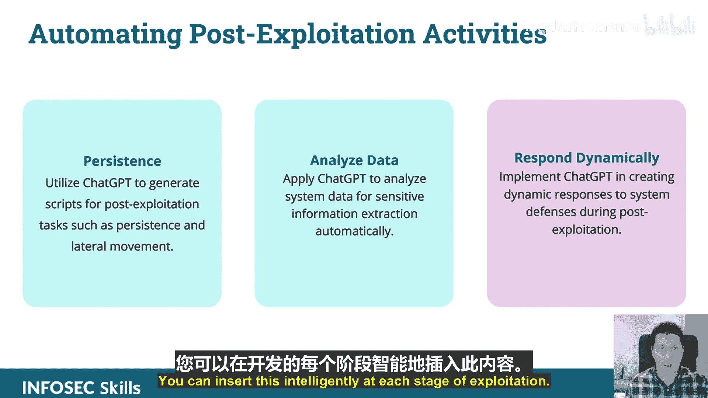

# 010：利用ChatGPT进行应用程序功能利用

在本节课中，我们将学习如何利用ChatGPT进行应用程序安全测试。这是本课程的第三部分，主题是利用ChatGPT进行应用程序功能利用。

本节内容概述如下：我们将探讨应用程序功能利用。我们将理解ChatGPT在识别和利用应用程序功能以进行攻击性安全测试中的作用。我们将应用ChatGPT来分析文档、漏洞和潜在的滥用案例。最后，我们将使用ChatGPT生成利用特定应用程序功能的攻击载荷。

我们将通过一些演示来学习，但首先介绍一些理论知识。

## 模糊测试与ChatGPT 🧪

如果你之前做过模糊测试，就会知道这是识别Web应用程序漏洞（特别是SQL注入漏洞）的一种非常有效的方法。那么，如何将ChatGPT整合到这个过程中，用它来生成模糊测试向量呢？虽然已有现成的模糊测试库，但它们的局限性在哪里？

ChatGPT可以用于创建基于你侦察结果的、具有上下文感知能力的智能模糊测试向量，而不是盲目地发送大量随机数据。你可以使用ChatGPT来分析模糊测试结果，并识别成功的利用尝试。你可以将其集成到脚本中，动态地解释这些结果，或者在得到结果后，使用ChatGPT来总结发现。

此外，你可以应用ChatGPT来自动化分类和优先排序通过模糊测试发现的漏洞。你可以创建由ChatGPT驱动的脚本来根据优先级组织这些结果。

你还可以开发一种ChatGPT辅助的方法，将AI能力增强到传统的模糊测试工具中。你不太可能单独使用ChatGPT，更可能的是将ChatGPT与传统模糊测试工具集成使用。

## 绕过安全控制 🛡️

你可以利用ChatGPT来识别和制定绕过安全控制（如WAF和速率限制）的策略。我发现ChatGPT在一个领域特别有效：分析内容安全策略并生成可以绕过它们的脚本或载荷。

你可以应用它来生成绕过这些防护的载荷，并开发规避技术。例如，要绕过传统防火墙，如果你发送给Web应用程序的载荷被防火墙阻止，你可以执行一系列操作。你可以使用ChatGPT将该载荷转换为不同的格式，进行混淆，并以多种不同的格式发送，而不仅仅是尝试另一个不同的载荷。

实际上，你可以创建一个非常简单的脚本，如果结果不符合预期，就提示将其转换为另一种格式并再次尝试，循环执行，你就能看到它的强大之处。

## 会话劫持与令牌操纵 🔑

ChatGPT如何用于增强这方面？你可以利用ChatGPT制定策略，例如基于侦察结果，确定执行此操作的最佳策略。你可以动态生成脚本，例如生成一个劫持会话令牌的脚本。如果不起作用，就尝试另一个，循环进行，最终你会得到一个能提供有效结果的脚本。

应用其分析能力来预测会话攻击的影响。下一步可能是：现在你获得了这个会话令牌，下一步是什么？让我们来实现它。

## 利用文件上传漏洞 📁

使用ChatGPT来识别常见的文件上传漏洞，并生成利用策略。例如，分析表单的HTML代码，将其传递给ChatGPT，生成一个攻击载荷，然后分析数据以利用它。

## 自动化后期利用活动与持久化 ⚙️

开发持久化脚本、分析数据脚本，并动态响应。你可以将这种智能集成到利用过程的每个阶段。

现在，让我们进入演示环节。

---

**总结**

本节课中，我们一起学习了如何将ChatGPT应用于攻击性安全的多个方面。我们探讨了ChatGPT在模糊测试、绕过安全控制、会话劫持、利用文件上传漏洞以及自动化后期利用活动中的作用。通过结合ChatGPT的智能分析能力，我们可以更高效、更智能地进行安全测试和漏洞利用。