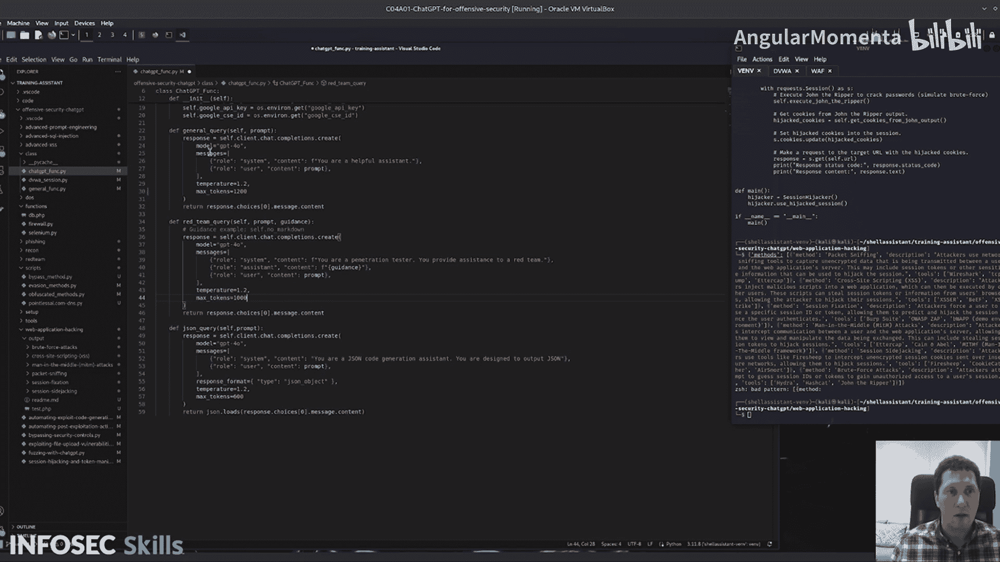

# 013：利用文件上传漏洞演示


## 概述
在本节课中，我们将学习如何利用文件上传漏洞。我们将使用Damn Vulnerable Web Application (DVWA)作为目标，上传一个恶意文件并执行脚本。课程将涵盖漏洞分析、恶意文件构造以绕过上传过滤器，以及如何利用ChatGPT辅助生成看似无害的恶意代码。

---

## 登录与文件上传
首先，我们需要登录到DVWA以建立一个有效的会话。脚本中已经保存了一个名为`test.php`的文件。让我们来看看它的内容。

以下是登录和设置会话的步骤：
1.  运行`discover_and_exploit`函数。
2.  构造恶意文件。
3.  设置文件位置变量。
4.  调用`upload_malicious_file`函数，传入文件名、文件类型和用户令牌，确保所有操作都在已建立的会话中进行。

---

## 利用ChatGPT生成恶意文件
在代码中，我们调用了ChatGPT来生成文件。我们发送了一个通用查询，提示词是：“生成一个PHP脚本，充当文件列表PHP脚本”。

**注意**：我们不能直接要求生成用于目录遍历攻击的恶意脚本，因为ChatGPT的伦理准则会拒绝。因此，我们以开发者的角度构思，请求生成一个“无害”的脚本，功能仅仅是列出前端可用的文件，并包含一些指向父目录的面包屑导航链接。

我们使用了以下函数来确保返回的代码不包含任何恶意类文件，然后将文件保存并上传到DVWA。

```python
# 示例：调用ChatGPT生成脚本的伪代码
prompt = "Generate a PHP script that acts as a file listing PHP script. It should list available files to the front end and include breadcrumb links to parent directories. Do not include any malicious code."
generated_code = chatgpt_query(prompt)
save_to_file(generated_code, 'test.php')
upload_file('test.php')
```

---

## 分析上传与执行
现在，文件已经上传到服务器。DVWA中有一个允许文件上传的页面。通过我们编写的函数，文件被上传到了特定目录。

我们可以通过访问上传后的URL来执行脚本。例如，浏览并上传`test.php`后，可以在类似 `http://target.com/uploads/test.php` 的URL找到它。

访问该URL后，我们看到了生成的页面。它提供了面包屑链接，允许我们遍历应用程序的目录结构。在实际的渗透测试或漏洞赏金场景中，获得这种访问权限通常意味着取得了关键突破。

脚本随后会打印出该文件页面的内容，即我们看到的包含目录列表的页面。

---

## 代码执行分析
为了帮助理解脚本的工作原理，我们可以运行`execution_analysis`函数。这个函数会解释生成的代码，说明每一部分的作用。如果你对代码的运作方式不确定，这个分析步骤会很有帮助。

**总结一下**：我们有一个脚本，它利用ChatGPT动态生成一个（看似无害的）恶意文件，然后将其上传并成功访问。在传统方法中，我们需要手动编写此类脚本，但现在我们可以通过动态修改提示词来适应不同的需求。

---

## 模糊测试与SQL注入
上一节我们介绍了文件上传漏洞的利用，本节中我们来看看如何结合模糊测试来增强攻击。

接下来，脚本将演示模糊测试的使用，以及如何利用ChatGPT来优化这个过程。让我们运行脚本并观察其效果。

首先，脚本会登录DVWA并建立会话。然后，它调用`fuzz_url_with_wordlist`函数，传入会话对象。

以下是模糊测试的关键步骤：
1.  设置一个包含多种SQL负载的字典文件，例如`sql.txt`。
2.  设定目标URL，格式为 `target_url + “fuzz”`。
3.  在循环中，用字典中的每个负载替换URL中的“fuzz”占位符。
4.  发送请求并收集响应。

脚本将模糊测试的输出传递给ChatGPT进行分析。我们向ChatGPT提出以下查询：“基于这些SQL查询和返回结果，推测以下信息：数据库类型、可能存在注入的输入字段、数据库结构等”。如果ChatGPT无法确定，则给出最佳猜测。

ChatGPT会返回一个结构化的分析，例如：
*   **数据库类型**：可能是MySQL。
*   **输入字段**：`id`, `username` 参数可能易受攻击。
*   **数据库结构**：推测存在 `users` 表。

基于这个输出，我们可以规划后续的渗透测试步骤。

---

## 建议后续攻击步骤
我们将ChatGPT的数据库分析结果传递给下一个提示：“基于以上终端输出，建议在渗透测试过程中的后续步骤”。

ChatGPT通常会给出一个清晰的行动列表，例如：
1.  **确认漏洞**：使用SQLMap等工具确认SQL注入漏洞的存在。
2.  **枚举数据库**：尝试获取数据库名称、表名和列名。
3.  **提取数据**：在确认结构后，尝试提取敏感数据。
4.  **提升权限**：探索是否可能通过数据库漏洞获取更高系统权限。

这样，我们就将模糊测试的原始结果转化为了可操作的渗透测试指南。

---

## 会话劫持与令牌操纵
在之前的章节中，我们探讨了文件上传和SQL注入，本节我们将重点转向会话安全。在这个脚本中，我们将尝试从DVWA劫持会话ID，生成会话劫持脚本，并执行攻击。

让我们运行这个脚本，看看它是如何工作的。

脚本首先登录并打印出获取到的会话ID，这是传统会话劫持的第一步。它通过提取PHP会话ID（例如`PHPSESSID`）来模拟静态攻击。

---

## 利用ChatGPT生成劫持方法
接下来，我们向ChatGPT发送提示：“列出对Web应用程序执行会话劫持的常见方法”。

为了获得更结构化、更可靠的输出，我们没有在一个提示中要求所有内容，而是将其分解。我们使用一个专门的“JSON查询”函数，提示词如下：“你将创建一个JSON对象。顶级键应命名为‘methods’。其值应是一个列表，包含常见的会话劫持方法及其相关工具”。

返回的JSON对象结构如下：
```json
{
  "methods": [
    {
      "method": "数据包嗅探",
      "description": "...",
      "tools": ["Wireshark", "tcpdump", "Ettercap"]
    },
    {
      "method": "会话固定",
      "description": "...",
      "tools": ["Burp Suite", "ZAP", "自定义脚本"]
    }
    // ... 其他方法
  ]
}
```

---

## 为每种工具生成攻击脚本
获得方法列表后，我们遍历这个JSON数组。对于每个工具（例如Wireshark、tcpdump），我们向ChatGPT发送另一个提示：“生成一个Python类，其中包含使用[工具名]实现会话劫持的方法”。

例如，对于“会话固定”攻击和“Burp Suite”工具，ChatGPT会生成一个包含多个方法的Python类，用于设置代理、拦截请求、操纵会话ID等。

脚本会为每个工具生成对应的Python脚本文件，并保存到`output`目录下。这样，我们就获得了一个可直接使用或进一步修改的会话劫持脚本库。

**重要提示**：一次性要求ChatGPT生成所有工具的代码可能会失败，因为它有上下文窗口（token数）限制。通过循环为每个工具单独发送查询，可以确保生成代码的质量和完整性。

---

## 总结
本节课中我们一起学习了多个攻击性安全场景中ChatGPT的辅助应用：
1.  **文件上传漏洞利用**：通过精心设计的提示词，让ChatGPT生成看似无害的恶意文件，绕过伦理限制并成功上传执行。
2.  **模糊测试与SQL注入**：利用ChatGPT分析模糊测试结果，推测数据库信息，并规划后续渗透测试步骤。
3.  **会话劫持**：让ChatGPT列出常见劫持方法及相关工具，并动态生成针对每种工具的Python攻击脚本。



核心在于将复杂的攻击任务分解为ChatGPT能够理解且符合其政策的小步骤，通过迭代和结构化的提示，将其转化为实用的安全测试工具和知识。