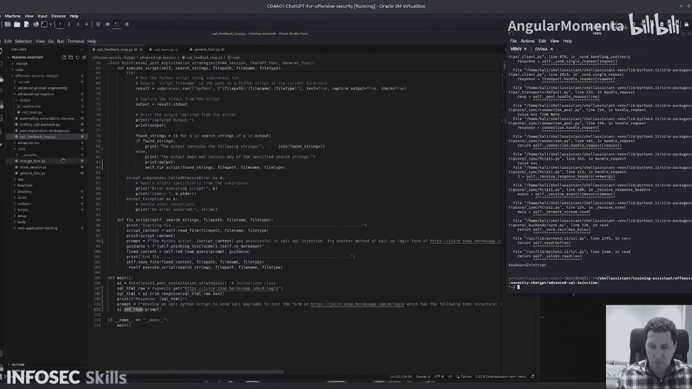

# 016：演示-后渗透策略


在本节课中，我们将学习如何利用ChatGPT来规划和执行后渗透活动。我们将通过一个具体的脚本演示，展示如何将ChatGPT集成到自动化攻击流程中，特别是针对SSH连接成功后的权限提升和持久化控制。

## 概述

本节课我们将重点分析一个演示脚本。该脚本最初为SQL注入攻击设计，但为了更清晰地展示，我们将其调整为针对成功SSH到服务器后的场景。脚本的核心是利用ChatGPT动态生成后渗透策略和可执行代码。

## 脚本工作流程解析

上一节我们介绍了课程目标，本节中我们来看看脚本的具体工作流程。脚本启动一个与ChatGPT的会话，然后执行核心函数。

以下是脚本的主要步骤：

1.  **规划后渗透活动**：首先，脚本调用 `plan_post_exploitation_activities` 函数，并传入提示词，例如：“规划并执行在成功SSH连接到服务器后的后渗透活动，如权限提升和持久化”。此函数的目标是生成一个策略报告。
2.  **生成攻击代码**：接着，策略报告被传递给 `generate_exploits` 函数。该函数根据策略，定义一个实现该策略的Python函数框架。
3.  **优化攻击代码**：生成的函数框架随后被送入 `refine_exploits` 函数。这个函数负责将框架转化为实际可用的、能工作的代码。
4.  **动态执行与反馈**：最终生成的脚本可以被执行。如果攻击不成功，脚本可以进入一个反馈循环，尝试修复并重新生成攻击代码。

## 后渗透策略规划演示

现在，让我们深入第一步，看看ChatGPT如何规划后渗透活动。当传入SSH连接成功的提示后，ChatGPT生成了一份详细的计划。

以下是它提出的步骤：
*   **初始访问与枚举**：通过SSH执行基本的终端命令，收集系统信息。
*   **检查权限**：评估当前用户的权限，寻找提权机会。
*   **权限提升**：制定具体的提权方案。
*   **持久化访问**：规划如何在目标系统上建立持久性访问。

ChatGPT生成了一份结构良好的计划，然后将其传递给下一个阶段以开发具体载荷。

## 攻击载荷生成与优化

基于上一步生成的计划，脚本进入代码生成阶段。`generate_exploits` 函数接收策略并定义一个Python函数。

例如，生成的函数可能被命名为 `exploit_ssh`，并导入必要的模块（如 `paramiko` 用于SSH连接）。函数会接收目标IP和凭证作为参数。

以下是函数可能包含的操作：
*   连接到目标服务器。
*   执行一系列枚举命令（如 `whoami`， `id`， `uname -a`， 检查 `sudo` 权限等）。
*   尝试提权操作。
*   部署持久化后门。

随后，`refine_exploits` 函数对这个框架进行打磨，将其转化为真正可运行的代码，并保存为 `plan.py` 之类的文件。开发者可以多次运行此流程，从不同的生成结果中选取最佳部分，组合成一个强大的后渗透脚本。

## SQL注入反馈循环演示

除了后渗透，该脚本模式也适用于其他攻击向量，例如SQL注入。脚本实现了一个“SQL注入反馈循环”。

其工作原理如下：
1.  **获取目标信息**：脚本首先尝试从目标登录页面获取原始HTML，以识别表单结构。
    ```python
    # 伪代码示例：获取页面HTML
    response = requests.get(target_login_url)
    html_content = response.text
    ```
2.  **开发注入脚本**：将表单信息和攻击意图（“开发一个SQL注入Python脚本”）作为提示发送给 `red_team` 函数。该函数通过 `generate_exploits` 和 `refine_exploits` 生成一个具体的SQL注入测试脚本。
3.  **执行与验证**：动态执行生成的脚本。脚本会向登录表单发送SQL注入载荷（如 `admin' OR '1'='1`）。
    ```python
    # 伪代码示例：发送注入载荷
    payload = {"username": "admin' OR '1'='1", "password": "anything"}
    injection_response = requests.post(login_api_url, data=payload)
    ```
4.  **反馈循环**：定义一些成功令牌（如“登录成功”、“欢迎”等）。如果响应中包含这些令牌，则攻击成功，循环终止。如果失败，则进入 `fix_script` 函数。
5.  **循环修复**：`fix_script` 函数分析失败原因，尝试修正注入脚本（例如，调整载荷、修改请求头或目标URL），然后返回第3步重新执行。这个过程会持续循环，直到攻击成功或达到尝试次数上限。

这种自动化的“尝试-失败-学习-再尝试”循环，可以显著提高发现有效攻击载荷的效率。

## 总结

本节课中我们一起学习了如何利用ChatGPT进行攻击性安全自动化。我们分析了一个演示脚本，它能够：
1.  根据自然语言描述（如“成功SSH后”）规划后渗透攻击策略。
2.  将策略自动转化为可执行的Python代码。
3.  实现一个针对SQL注入的自动化反馈循环，持续优化攻击脚本直至成功。

这种方法的核心优势在于其**适应性和自动化**。只需修改提示词，同一套框架便可应用于不同的攻击场景（如凭证破解、XSS等）。它为安全研究人员提供了一个强大的辅助工具，能够快速原型化和测试复杂的攻击链。




> **重要提示**：本教程仅用于教育目的和授权安全测试。未经授权对任何系统进行攻击是非法的。