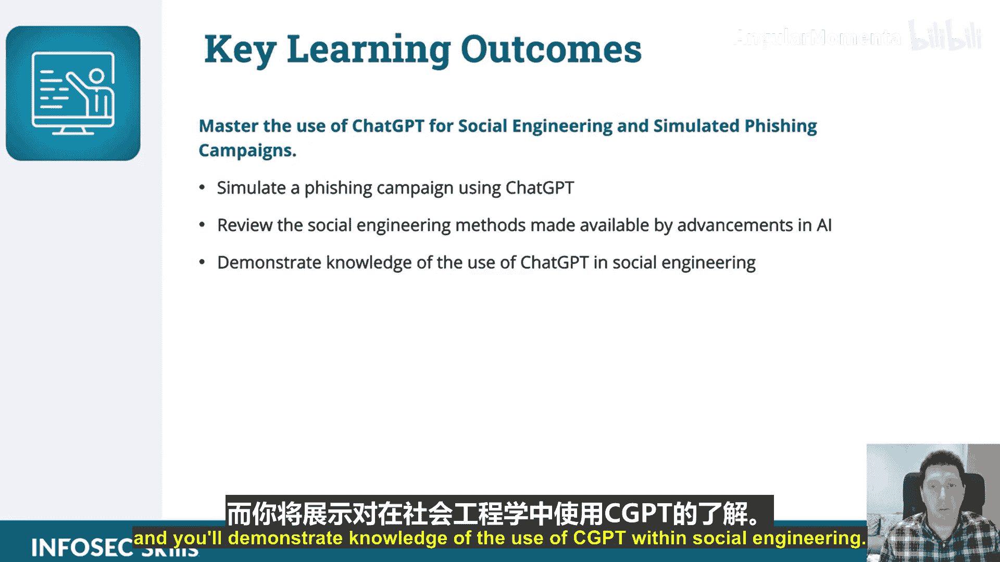

# 017：社会工程与钓鱼攻击中的ChatGPT入门 🎣

在本节课中，我们将要学习ChatGPT在社会工程与钓鱼攻击活动中的应用。这是本课程的第一节，课程概述。

## 课程概述

本节课程介绍将帮助我们理解ChatGPT在攻击性操作和模拟钓鱼攻击活动中的潜力。

我们将探索ChatGPT在社会工程和钓鱼攻击中的应用，学习如何利用ChatGPT策划有效的钓鱼攻击，以及如何使用人工智能自动化和调整这些模拟攻击。

以下是本课程的主要学习目标：

*   **核心目标**：掌握使用ChatGPT进行社会工程和模拟钓鱼攻击活动。
*   **实践目标**：你将使用ChatGPT模拟一次钓鱼攻击活动。
*   **知识目标**：你将回顾人工智能进步所带来的社会工程方法，并展示对ChatGPT在社会工程中应用的理解。

## 开始学习

现在，让我们开始学习。