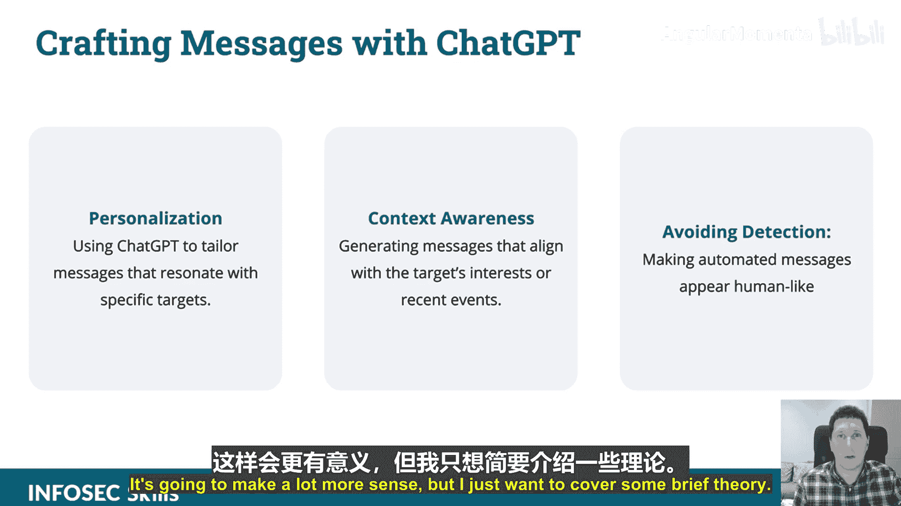

# 018：03_01_02_利用ChatGPT进行社会工程学攻击


在本节课中，我们将要学习如何利用ChatGPT进行社会工程学攻击。社会工程学是一种利用人类心理而非技术漏洞的攻击方式。我们将探讨ChatGPT如何自动化生成具有说服力的钓鱼信息，并识别潜在的数据提取目标。

## 概述：利用ChatGPT进行社会工程学攻击

上一节我们介绍了社会工程学的基本概念。本节中，我们来看看ChatGPT如何具体应用于此类攻击。ChatGPT的对话能力使其成为社会工程学攻击的有力工具。

以下是ChatGPT在社会工程学攻击中的三个主要应用方向：

1.  **利用对话能力**：攻击者可以利用ChatGPT的自然语言生成能力，模拟真实的人类对话，与潜在目标进行互动。
2.  **自动化生成信息**：ChatGPT可以自动化创建具有说服力且符合特定情境的钓鱼邮件或消息。
3.  **识别潜在目标**：通过分析对话或数据，ChatGPT可以帮助攻击者识别哪些目标可能更容易泄露敏感信息或授予系统访问权限。

## 使用ChatGPT生成钓鱼信息

现在，我们将通过一个演示来具体了解这个过程。理论部分会变得更加清晰。

以下是生成钓鱼信息的关键步骤：

1.  **定义目标**：明确你想要从目标人物那里获取什么信息（例如，登录凭证、个人信息）。
2.  **设定场景**：创建一个合理的对话场景（例如，冒充IT支持人员、同事或客服）。
3.  **输入提示**：向ChatGPT提供详细的提示，描述你的角色、目标以及希望生成的对话内容。
4.  **优化输出**：根据ChatGPT的初始回复，进一步调整提示，使生成的信息更加自然和具有说服力。

例如，一个用于生成冒充IT支持钓鱼邮件的提示可能如下：

```text
你是一名公司的IT支持专员。需要给一位员工发送一封紧急邮件，通知他/她的账户存在异常登录活动，要求其立即点击一个链接重置密码。邮件需要显得专业、紧急且可信，避免引起怀疑。
```

通过这种方式，攻击者可以快速生成大量看似来自合法来源的定制化钓鱼信息。

## 总结



本节课中，我们一起学习了如何将ChatGPT应用于社会工程学攻击。我们了解到，ChatGPT能够自动化生成逼真的钓鱼信息，并协助识别易受攻击的目标。理解这些技术有助于我们更好地认识现代网络威胁，并采取相应措施进行防范。