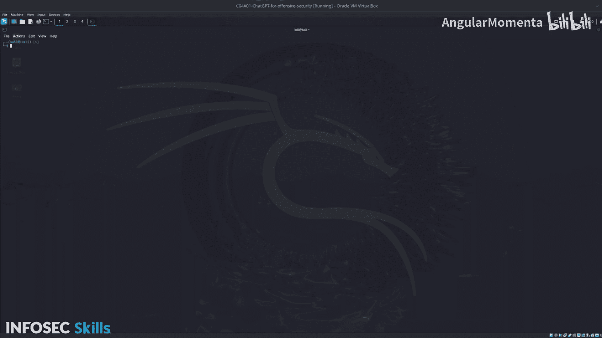

# 020：用于攻击性安全的ChatGPT工具对比实验概述 🧪

在本实验中，我们将学习如何利用多种基于ChatGPT的终端工具来辅助攻击性网络安全工作。我们将在一个Kali Linux环境中，对比和测试四个不同的工具，以了解它们各自的特点和适用场景。

## 实验目标与工具概览

本实验的核心目标是让您亲身体验并比较几种能够集成到攻击性安全工作流中的AI终端工具。我们将依次测试以下四个工具：

上一节我们介绍了实验的整体目标，本节中我们来看看将要测试的具体工具列表。

以下是本实验将要操作的四个工具：

1.  **EI**：一个基础的终端AI系统，是了解AI在终端中能力的良好入门工具。
2.  **Demo AI Shell**：一个用户友好的终端系统，拥有良好的用户界面，并能通过管道等方式与现有命令集成。
3.  **SGPT (Shell GPT)**：一个多功能工具，可用于创建代码、生成可执行的Shell命令以及提供通用的终端协助。它是本实验中最先进的工具，包含定制和扩展其功能的能力。
4.  **TGPT (Terminal GPT)**：该工具支持使用多个提供商和模型。这意味着可以访问庞大的AI模型库，更重要的是，它能够在没有互联网连接、无需API密钥的环境下本地运行，例如在隔离网络中。

在逐一探索了这些现成工具之后，我们将进行一项实践，以巩固对AI辅助终端工作原理的理解。

最后，您将创建一个自定义的Shell GPT脚本，作为一个基础的AI Shell系统。

## 总结

本节课中，我们一起学习了用于攻击性安全的多种ChatGPT终端工具。我们概述了EI、Demo AI Shell、SGPT和TGPT这四种工具的核心特点与应用场景。接下来，就让我们开始动手实验，深入探索每个工具的具体功能吧。