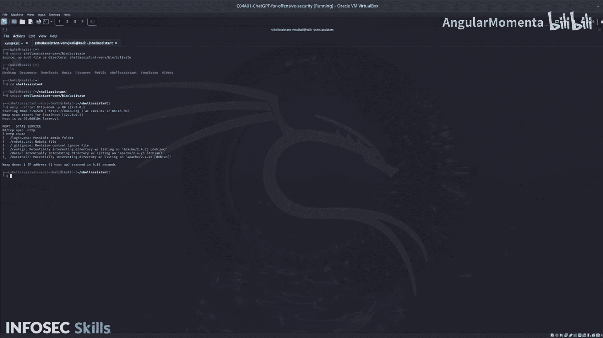

# 021：04_01_04_输出与设置


## 概述
在本节课中，我们将学习如何利用ChatGPT作为助手，对Damn Vulnerable Web Application的登录页面进行暴力破解。我们将从环境准备开始，验证目标应用是否运行，并介绍后续将使用的工具。

## 环境准备与目标验证
上一节我们介绍了课程目标。本节中，我们来看看如何设置测试环境并确认目标应用状态。

首先，需要启动Damn Vulnerable Web Application。该应用是一个包含多种已知漏洞的Web应用程序，我们通过Docker镜像运行它。

打开一个新的终端标签页，因为该应用应运行在80端口。接着，通过输入以下命令来激活Python虚拟环境：
```bash
source venv/bin/activate
```

但可能当前目录不正确。首先需要进入正确的`shell_assistant`目录。
```bash
cd path/to/shell_assistant
```

现在，已在`shell_assistant`目录中打开了Python虚拟环境。

接下来，需要测试Damn Vulnerable Web Application是否确实在运行。我们将执行一个Nmap命令来枚举本地主机80端口，以发现潜在的漏洞或配置信息。
```bash
nmap -sV -p 80 localhost
```

从扫描结果中，可以看到`login.php`以及一个可能的`admin`目录。如果在浏览器中访问`login.php`，将看到一个登录表单，这正是我们即将尝试暴力破解的目标。

## 后续步骤
至此，我们已成功设置环境并确认了目标。在下一个视频中，我们将开始使用第一个工具进行实际操作。



## 总结
本节课中，我们一起学习了如何搭建测试环境、激活Python虚拟环境，并使用Nmap验证了目标Web应用的运行状态，为后续的暴力破解攻击做好了准备。