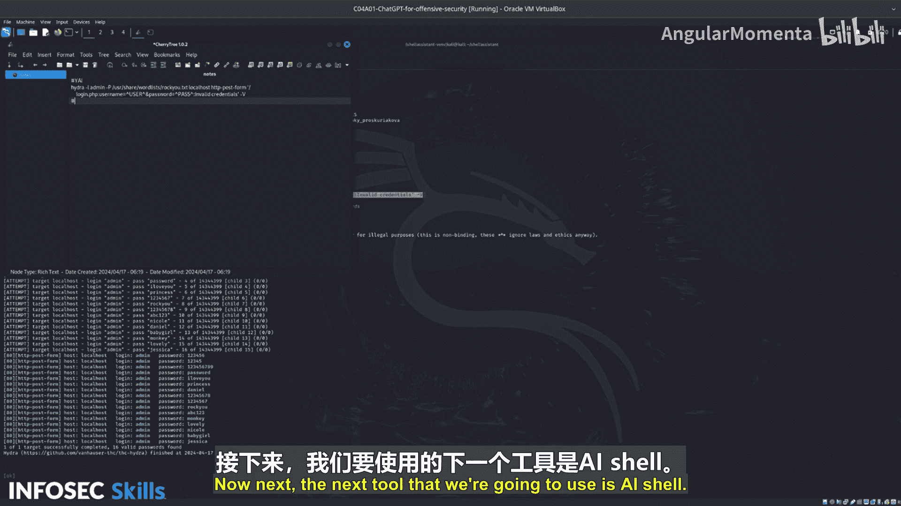

# 022：运行YAI工具 🛠️


## 概述
在本节课程中，我们将学习如何运行名为“YAI”的终端AI工具，并利用它来尝试对“Damn Vulnerable Web Application”（DVWA）的登录页面进行暴力破解。这是一个展示AI在终端环境中强大能力的入门实践。

---

## 获取并配置API密钥

首先，你需要从 `platform.openai.com` 获取一个API密钥。该平台提供免费试用密钥。免费试用结束后，你可以充值5美元，这将允许你进行大量请求。对于本教程的目的，免费试用密钥已经足够。

YAI工具已经预先安装。如果你尝试运行 `yai help` 命令，可能会收到“找不到配置文件”的错误提示，这意味着你需要输入你的API密钥。

以下是配置步骤：
1.  运行命令输入你的API密钥。
2.  配置完成后，工具即可正常工作。

例如，你可以测试一个简单的问题：
```bash
yai capital of France
```
工具会尝试将其作为Shell命令执行，并返回“Paris”。

---

## 测试YAI的基本功能

为了验证YAI是否正常工作，我们可以让它执行一些基础的终端命令。

例如，我们可以要求它列出当前目录的文件：
```bash
yai list files
```
YAI会返回命令 `ls`，并在你确认（输入`Y`）后执行，显示目录内容。

我们还可以让它列出正在运行的Docker容器：
```bash
yai list running docker images
```
它会生成相应的 `docker ps` 命令，执行后可以确认DVWA容器正在运行。

---

## 使用YAI进行暴力破解尝试

现在，让我们尝试使用YAI对本地DVWA应用进行暴力破解。

**初次尝试：**
我们输入一个非常基础的指令：
```bash
yai brute force the application on localhost
```
YAI理解了我们的意图，并生成了一个使用 `hydra` 工具的命令。它自动推断出用户名为“admin”，并尝试使用Kali Linux中的RockYou单词列表，以及目标URL为 `localhost/login.php`。

**结果分析：**
这次尝试成功了，它生成了一个可执行的命令。这展示了仅用简单描述，AI就能完成大量上下文推断和工作。

**处理复杂情况：**
然而，并非所有简单指令都能一次成功。有时你需要提供更多上下文。

例如，如果第一次生成的命令因为单词列表路径错误而失败，我们可以给出更明确的指令：
```bash
yai brute force the application on localhost specifying port 80 using the kali rockyou word list
```
通过指定端口和更精确的单词列表名称，YAI能够生成更准确的命令。如果路径仍有问题，可以进一步澄清：
```bash
yai use the /usr/share/wordlists/rockyou.txt word list
```
经过几次交互和澄清，YAI最终能生成正确的、可成功运行的暴力破解命令。

**保存输出：**
你可以指示YAI将命令输出保存到文件，例如：
```bash
yai save this output to a file called hash.txt
```

---

## 总结

本节课中，我们一起学习了如何配置和运行YAI终端AI工具。我们实践了用它执行基本命令，并重点演练了如何通过自然语言指令，引导AI辅助完成对Web应用登录页面的暴力破解测试。关键点在于：简单的指令有时能直接生效，但若遇到问题，需要通过提供更具体的上下文（如端口、文件路径）来引导AI生成正确的命令。这初步展示了AI在渗透测试工作流中的辅助潜力。

---



接下来，我们将要使用的工具是 **AI Shell**。