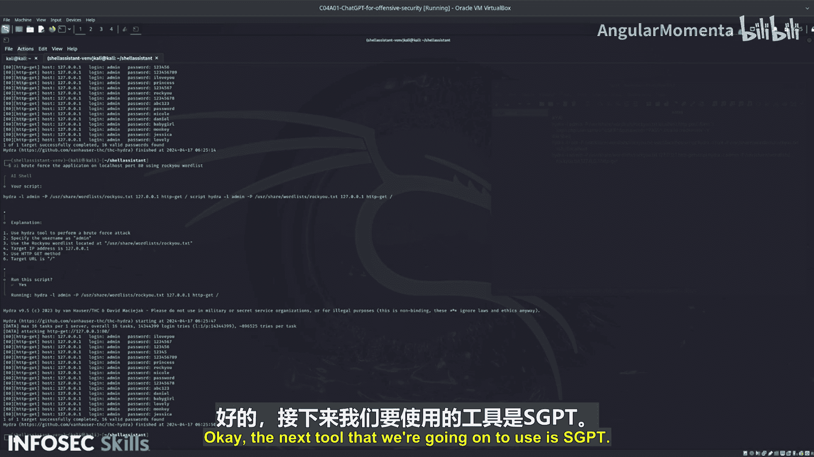

# 023：运行AI Shell

## 概述
在本节课程中，我们将学习并测试一个名为AI Shell的工具。这是一个用户友好的终端系统，拥有良好的用户界面，并能通过管道等方式与现有命令集成。我们将通过一系列命令来评估该工具在协助暴力破解一个易受攻击的Web应用方面的能力。

## 配置API密钥
首先，我们需要配置API密钥才能使用AI Shell。如果未提供正确的API密钥，工具将无法运行。

以下是配置步骤：
1.  将API密钥添加到配置文件中。
2.  确保密钥格式正确。

配置完成后，我们可以开始测试基础命令。

## 测试基础命令
上一节我们完成了配置，现在让我们测试一个基础功能：列出文件。

输入命令 `AI list files`。AI Shell会返回 `ls` 命令，并提供一个详细的解释，询问是否要执行。与之前测试的简单工具相比，AI Shell提供了更详细的解释和更友好的图形界面。你可以使用方向键浏览信息，并选择编辑命令、复制、取消或直接运行。

按下回车执行命令后，可以看到工具输出了当前目录的文件列表。

## 暴力破解Web应用
接下来，我们将尝试使用AI Shell暴力破解一个Web应用，并与之前测试的工具输出进行比较。

我们输入一个基础命令：`AI brute force the application on localhost`。AI Shell生成的命令与我们之前看到的有所不同。执行该命令后，发现它试图攻击本地的SSH服务，这并非我们的目标。

因此，我们需要取消该命令，并尝试提供更具体的指令。

## 优化攻击指令
为了使指令更精确，我们尝试提供更多细节。输入命令：`AI brute force the application on localhost port 80`。

这次，AI Shell生成了一个更合理的命令。执行后，我们成功获得了预期的输出结果。

如果你需要更具体的攻击方式，还可以尝试更详细的变体。例如，输入：`AI brute force the application on localhost port 80 using the RockYou wordlist`。

运行此脚本，同样能够成功执行并获得输出。

## 总结
本节课我们一起学习了AI Shell工具的基本使用方法。我们首先配置了API密钥，然后测试了列出文件的基础功能。接着，我们重点探索了如何使用它辅助进行Web应用的暴力破解，并通过提供更具体的端口和字典信息，成功优化了攻击指令，获得了有效输出。这展示了AI Shell在理解自然语言指令并生成相应命令行操作方面的实用性。