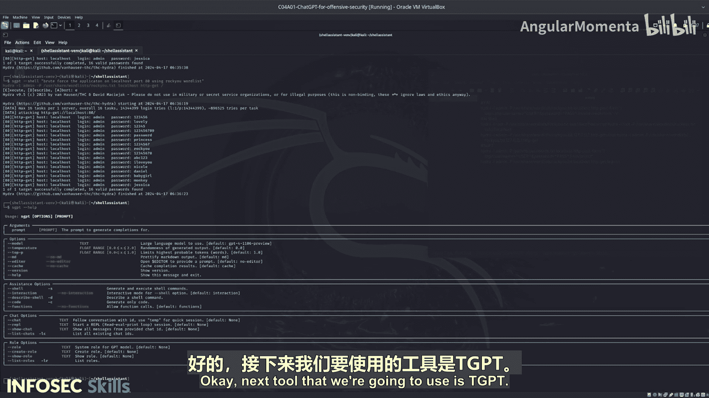

# 024：运行SGPT工具 🛠️


在本节中，我们将测试SGPT工具。SGPT是一个多功能工具，可用于生成代码、创建可执行的Shell命令以及提供通用的终端辅助。它是本系列中最先进的工具，包含定制和扩展其功能的方法。

上一节我们介绍了其他AI工具的基本用法，本节中我们来看看功能更强大的SGPT。

## 设置与初步测试

SGPT已预先安装在当前系统中。现在，我们将输入一系列命令，测试其在协助暴力破解DVWA应用方面的能力。

首先，需要导出API密钥。请注意，演示中使用的密钥将在课程发布后被更改。

以下是初始测试步骤：

1.  **测试基础功能**：输入命令 `sgpt “list files”` 来列出文件。你会发现，SGPT要求将指令放在双引号内，这与之前介绍的工具不同。
2.  **执行Shell命令**：SGPT不会立即建议可执行的命令，而是提供详细的信息。为了让它生成并执行Shell命令，需要添加 `--shell` 参数。

## 深入使用与暴力破解测试

现在，让我们尝试更具体的任务：暴力破解本地主机上的应用。

我们首先尝试不带 `--shell` 参数的指令：

```
sgpt “brute force the application on localhost”
```

SGPT会提供非常详细的响应，建议多种可用于此任务的工具，例如Hydra、Burp Suite、OWASP ZAP和John the Ripper，并可能生成一个示例命令。这展示了其智能化的信息整合能力。

接下来，我们尝试生成可直接执行的命令。以下是具体步骤：

1.  **生成并执行命令**：在指令中添加 `--shell` 参数。例如：`sgpt --shell “brute force the application on localhost”`。这次，SGPT更有可能生成一个包含具体参数（如主机、端口、用户名列表）的完整命令。
2.  **指定参数**：为了获得更精确的命令，可以在指令中明确指定参数。例如：`sgpt --shell “brute force the application on localhost on port 80 using the rockyou wordlist”`。这样生成的命令将更具针对性和可执行性。

## SGPT的高级功能

SGPT的功能远不止于此，它提供了多种运行模式以满足不同需求：

*   **代码模式 (`--code`)**：此模式仅生成代码片段，而不涉及Shell命令，适用于开发场景。
*   **聊天模式 (`--chat`)**：此模式提供带有上下文的对话交互，适合进行多轮、复杂的咨询。
*   **自定义角色 (`--role`)**：这是SGPT一个非常强大的功能。你可以创建特定角色（例如“渗透测试员”、“道德黑客”、“红队成员”、“蓝队成员”），并为这些角色提供额外的训练或上下文。这能极大地增强模型在特定领域的表现，使其输出更符合专业场景的需求。

我鼓励你深入探索SGPT的各种选项和模式，这将帮助你更高效地将其应用于实际的安全测试工作中。

## 总结



本节课中我们一起学习了SGPT工具的核心用法。我们了解到，SGPT需要通过双引号输入指令，并使用 `--shell` 参数来生成可执行的命令。通过暴力破解DVWA的实例，我们实践了如何通过添加具体参数来获得更精确的命令输出。最后，我们简要介绍了SGPT的代码模式、聊天模式和强大的自定义角色功能，这些功能使其成为一个高度可定制和强大的安全辅助工具。