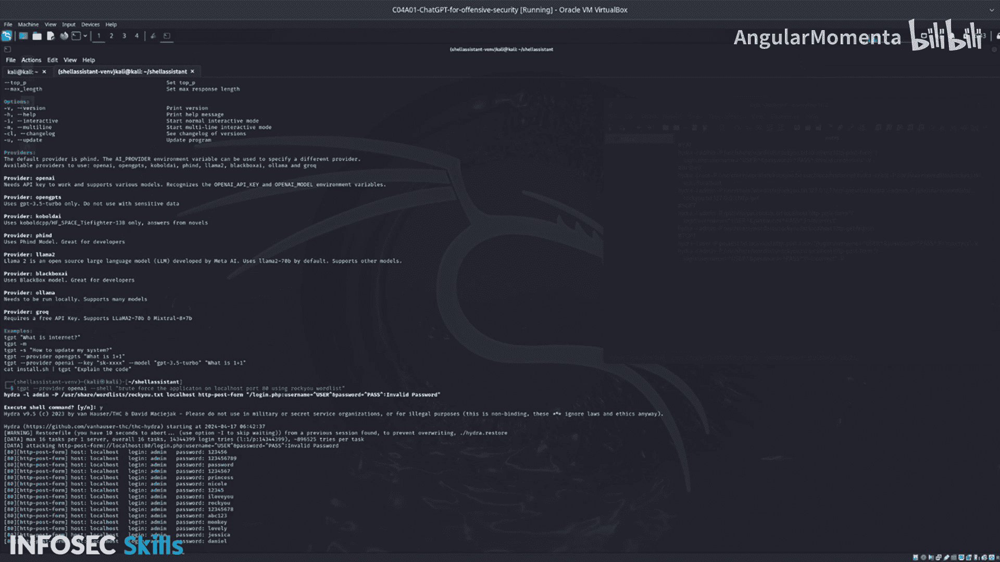

# 025：04_01_08_步骤四-运行TGPT工具


在本节课中，我们将学习如何使用TGPT工具。TGPT支持多种AI模型提供商，这意味着你可以访问一个庞大的AI模型库，并且更重要的是，它能够在没有互联网连接和API密钥的情况下本地运行。

上一节我们介绍了工具的安装，本节中我们来看看如何运行TGPT，并比较它在辅助渗透测试和暴力破解DVWA应用时的两种不同输出。

## 测试TGPT基础功能

首先，我们测试TGPT的基本功能。由于TGPT已安装且无需API密钥，我们可以直接开始。

以下是测试TGPT列出文件功能的命令：

```bash
TGPT list files
```

执行此命令后，TGPT会返回一个文件列表。这个功能与使用 `SGP` 工具的 `--shell` 标志类似，它提供了一个基础的Shell命令，但没有额外的描述信息。例如，运行 `top` 或 `ps` 命令会显示相应的系统进程信息。

## 尝试使用TGPT进行暴力破解

接下来，我们尝试用TGPT做一些更有用的事情，比如对本地主机上的DVWA应用进行暴力破解。

以下是请求TGPT生成暴力破解命令的示例：

```bash
TGPT show brute force the application on localhost
```

初始返回的命令看起来可行，但存在一些问题：它没有提供执行选项，并且引用了一个不存在的单词列表 `parcel_list_stock.txt`。此外，它假设的用户名是 `admin`，而DVWA默认使用的是 `user`。因此，这个命令不太可能成功。我们可以先将这个命令保存下来以供参考。

## 改进TGPT的提示词

为了获得更好的结果，我们需要改进给AI的提示词，提供更详细的上下文。

以下是包含更多细节的改进版提示词示例：

```
暴力破解运行在本地主机上的DVWA应用的登录页面，安全级别设为“低”，使用Rockyou单词列表。
```

使用这个更详细的提示后，生成的命令看起来更有希望：它包含了正确的参数和单词列表名称。然而，它仍然没有提供直接执行的选项。让我们尝试执行这个生成的命令。

执行后发现，命令确实运行了，但输出结果不理想。它似乎输出了所有尝试的请求（包括错误响应），并且使用的是 `POST` 方法而非更快的 `GET` 方法。`POST` 方法导致速度非常慢，并且输出了大量无关信息，这不是我们想要的结果。这表明需要对生成的命令进行一些调整。

## 探索TGPT的不同提供商

现在，让我们看看TGPT的另一个强大功能：支持不同的AI模型提供商。

首先，查看TGPT的帮助选项：

```bash
TGPT --help
```

在这里，TGPT的优势得以体现。虽然作为终端助手，它可能不如某些工具，但它能够连接众多不同的AI提供商，其中许多支持离线使用。

例如，我们可以指定使用OpenAI提供商（这需要有效的API密钥）来询问同一个暴力破解命令：

```bash
TGPT --provider openai "show brute force the application on localhost"
```

通过指定提供商为OpenAI，我们得到了一个可以直接执行的Shell命令，并且质量显著提高。这与之前使用默认提供商（可能是 `PPHnd` 或 `PHIND`）时产生的杂乱输出形成了鲜明对比。关键区别在于所使用的**模型**。默认提供商可能更适合开发场景，而对于我们的渗透测试需求，OpenAI模型产生了更相关、可用的结果。



## 总结

本节课中我们一起学习了如何使用TGPT工具。我们测试了它的基础功能，尝试用它生成暴力破解命令，并通过提供更详细的上下文改进了输出结果。最重要的是，我们探索了TGPT支持多AI提供商的特性，并发现通过指定合适的提供商（如OpenAI），可以获得质量高得多的、可直接用于攻击性安全测试的命令。下一节，我们将继续深入TGPT，学习如何在无网络连接的隔离环境中本地使用这些模型。