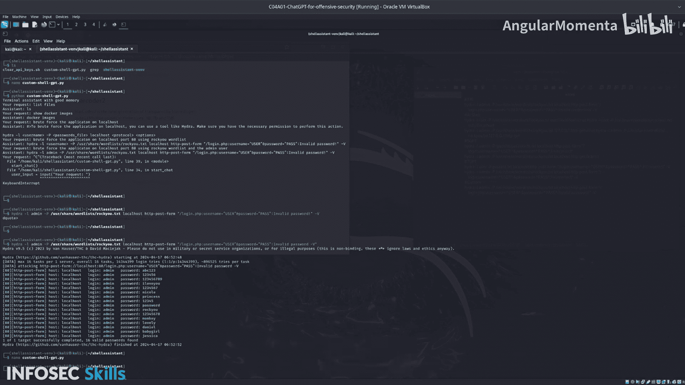

# 027：04_01_10_步骤6-检查你的脚本

在本节课中，我们将完成脚本的检查与清理工作，并总结整个实验的学习要点。

上一节我们介绍了如何运行脚本，本节中我们来看看如何安全地清理API密钥并总结整个课程。

---

现在，我将运行这个脚本来完成清理工作，清除所有API密钥。

使用`ls`命令查看，可以看到目录中有一个脚本文件`clear_api_keys.sh`。

运行这个脚本后，你的API密钥将被自动清除。脚本内容是我编写的，这没有问题。这个示例脚本目前并未在实际环境中使用。

让我们查看一下这个脚本的内容。

可以看到，脚本执行了以下操作：它将环境变量`OPENAI_API_KEY`、`AI_CONFIG_KEY`和`openai_key`（小写）的值都设置为0。接着，如果配置文件存在，脚本会将其删除。

请放心，这些操作会自动完成清理。

---

## 后续学习步骤建议

在完成本实验后，你的下一步学习应该是尝试在本地安装以下一个或多个工具，并探索其功能。

以下是具体建议：

1.  **安装并查看帮助选项**：安装工具后，使用`--help`标志查看所有可用的工具选项和参数。
2.  **探索本地模型**：你可以决定使用由TGPT工具支持的本地模型。提供商Alma提供了许多有趣的模型，你可以在`Alma.com`上查看。结合TGPT使用这些模型，可以让你在**离线环境**（air-gapped environment）中工作。
3.  **进一步开发自定义脚本**：完整的自定义脚本实现是免费开源的。你可以访问提供的代码仓库链接获取。该仓库包含了一个可执行的Shell助手功能。虽然它目前是一个最小可行产品（MVP），但你可以自由使用、修改并使其成为你自己的工具。

---

## 工具使用场景总结

本节课中我们一起学习了不同工具的适用场景，建议根据需求选择使用：

*   **YAI或AI Shell**：适合集成到你的**日常终端工作流**中，提高效率。
*   **SGPT**：推荐用于**红队演练、攻击性安全及道德黑客**相关任务。
*   **TGPT**：当需要在**离线环境工作**或希望**使用不同模型**时，这个工具是理想选择。

感谢你的学习。