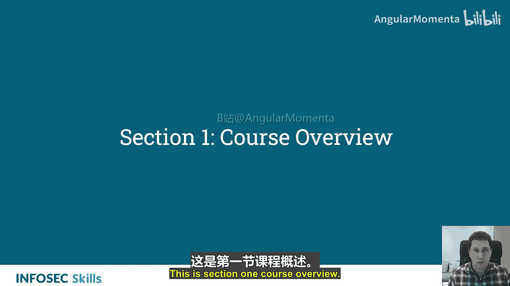
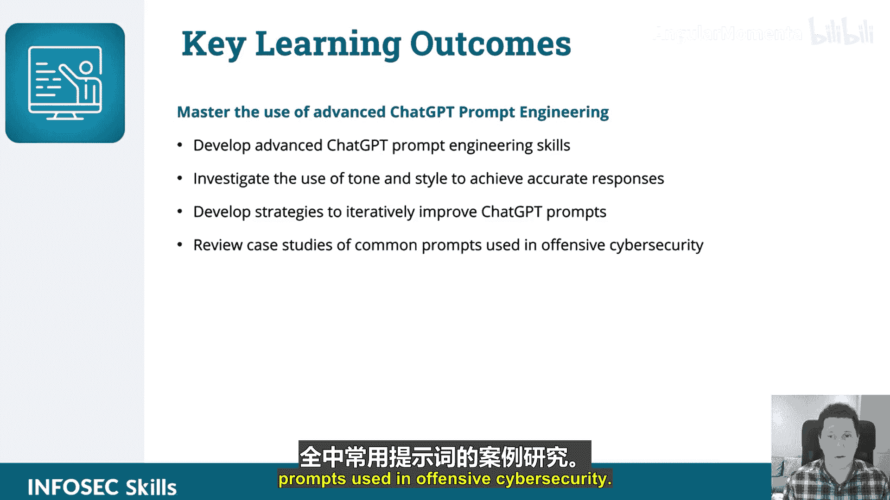

# 028：高级提示工程技巧概述

在本课程中，我们将学习用于攻击性网络安全的高级ChatGPT提示工程技巧。你将掌握如何优化提示以获得更高质量的响应，并学习控制AI输出的语气、风格和内容，使其适应特定的网络安全场景。

## 课程介绍

本课程旨在教授用于攻击性网络安全的高级提示工程技术。

你将学习如何优化ChatGPT提示，并掌握提升网络攻防操作中响应质量的技术。你将学习如何控制输出的语气、风格和内容，并学会操纵GPT的输出以适应特定的网络攻防场景。你还将学习迭代优化的策略。

## 关键学习目标

以下是本课程结束后你将掌握的核心技能：

*   **掌握高级ChatGPT提示工程的使用**：你将能够运用复杂技巧引导AI生成更精确的响应。
*   **发展高级ChatGPT提示工程技能**：你将构建一套实用的提示设计与优化方法。
*   **研究语气与风格对响应准确性的影响**：你将学会通过调整提示的语气和风格来获得更符合预期的答案。
*   **制定迭代优化ChatGPT提示的策略**：你将掌握通过多次交互和调整来持续改进提示效果的方法。
*   **回顾网络安全中常见提示的案例研究**：你将分析实际网络攻防场景中使用的提示范例，加深理解。

## 课程结构

上一节我们介绍了课程的整体目标和学习成果，本节中我们来看看课程是如何组织的。

本课程内容将围绕上述学习目标展开，通过理论讲解、技巧演示和案例分析相结合的方式，帮助你逐步构建高级提示工程能力。我们将从基础概念回顾开始，逐步深入到复杂场景的应用。

在本节课中，我们一起学习了“攻击性安全中的ChatGPT应用”课程的第一章概述，明确了高级提示工程的学习目标与课程结构。接下来，我们将深入具体的工程技巧。