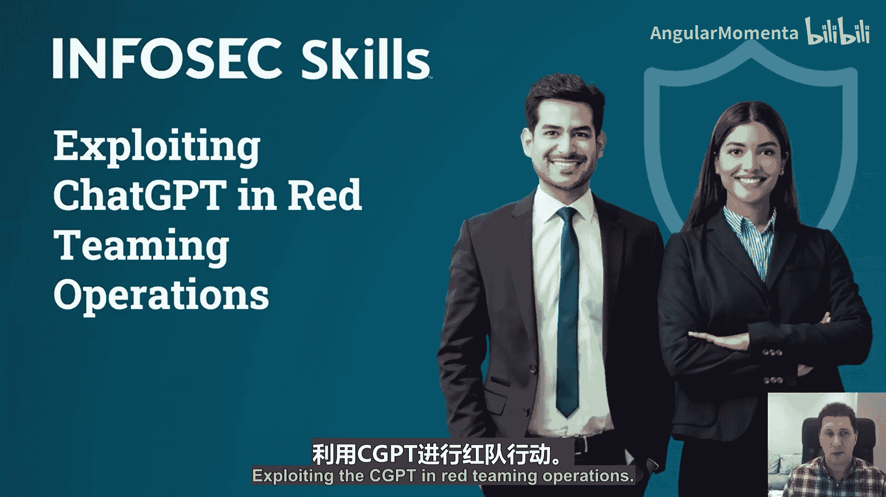
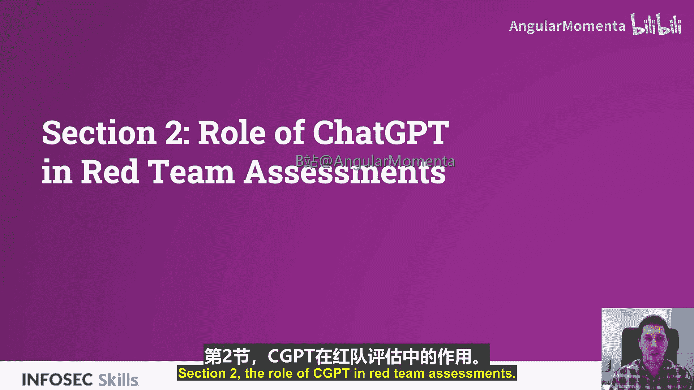
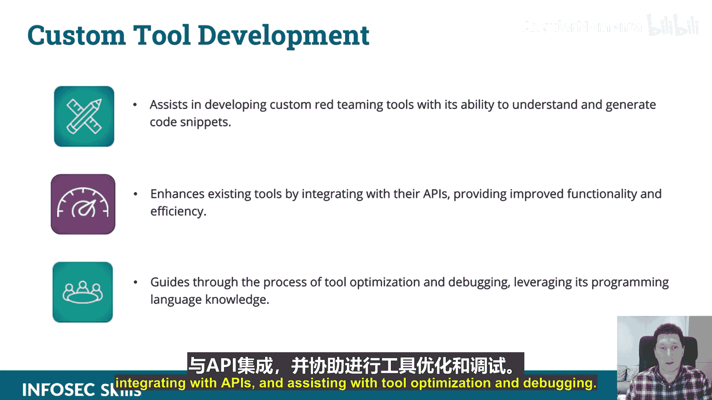
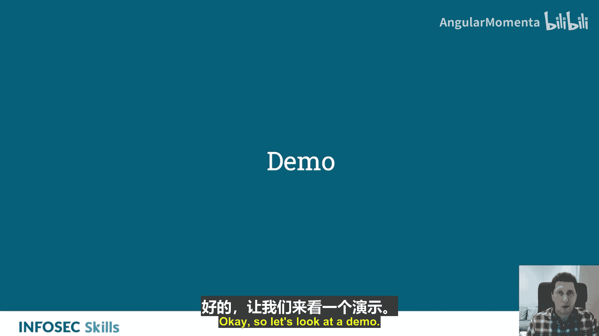
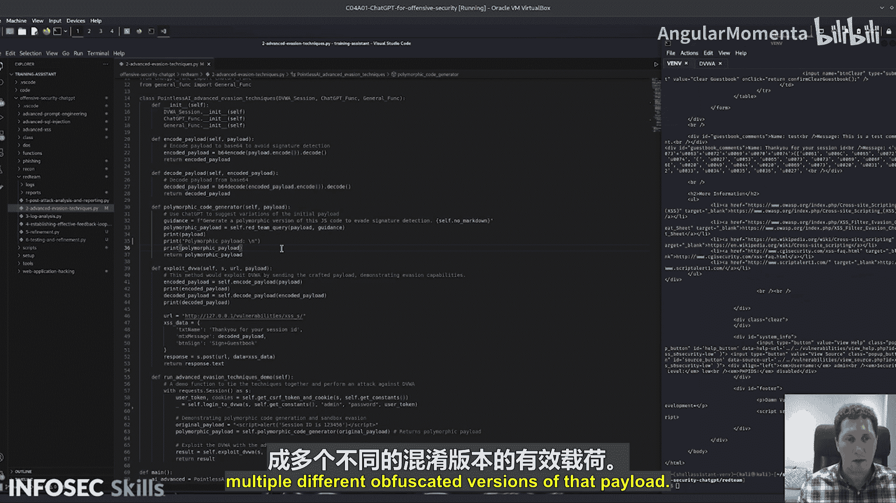

# 030：ChatGPT在红队评估中的角色 🛡️🤖






在本节课中，我们将学习ChatGPT在红队评估中的具体角色和应用。红队评估旨在模拟真实攻击者的行为，以测试和提升组织的安全防御能力。我们将探讨ChatGPT如何通过自动化、智能分析和策略优化来增强红队行动的效率和效果。

---

上一节我们介绍了ChatGPT在攻击性安全中的潜力，本节中我们来看看它在红队评估中的具体角色。

ChatGPT能够分析海量数据集，以识别目标数字足迹中的潜在漏洞。其语言能力可以实现自动化的社会工程学攻击，从而提升红队行动的效率。将ChatGPT集成到红队工具中，可以简化评估流程，更高效地识别攻击向量。

以下是ChatGPT在红队评估中的几个核心应用领域：

*   **增强漏洞识别与代码分析**：ChatGPT可以协助分析代码中的漏洞，解释错误信息和日志以提示潜在的安全缺陷，并基于这些数据生成报告。虽然这些工作没有ChatGPT也能完成，但它能显著提升操作效率，并实现无需人工干预的动态分析。
*   **社会工程学攻击模拟**：ChatGPT可以生成针对特定情境的、令人信服的钓鱼邮件，模拟社会工程学通话，编写脚本并创建虚假个人资料，以支持社会工程学活动。我们将在后续的演示中详细探讨这一点。
*   **情报收集与侦察**：ChatGPT可以处理公开数据并提取有价值的信息，用于执行侦察任务。例如，分析招聘信息、公开文档，以理解目标组织的技术栈。众所周知，招聘信息是了解组织技术栈的绝佳免费资源。它还能帮助识别组织内潜在的内部威胁或薄弱环节。
*   **策略优化**：ChatGPT能够建议红队策略，为工具和技术选择提供推荐，并协助规划攻击序列。
*   **自动化常规任务**：ChatGPT可以协助编写脚本、生成载荷、进行文档记录等常规任务的自动化。
*   **定制工具开发**：ChatGPT可以协助开发定制的红队工具，或与现有工具集成，包括API集成以及工具优化和调试辅助。



---



接下来，让我们通过一个演示来看看其中一些功能是如何实际运作的。

这个脚本将演示一些高级的规避技术，例如将代码转换为多态形式以绕过检测。其工作原理是：首先设置一个存在漏洞的Web应用程序会话。原始载荷是一个经典的跨站脚本（XSS）载荷。然后，我将把这个载荷发送给一个多态代码生成器，该生成器会修改代码，使其有可能绕过Web应用程序防火墙。

以下是多态代码生成器的核心思路，它接收一个经典XSS载荷，并生成其多态版本以规避签名检测，从而绕过传统防御：

```python
# 示例：一个简化的多态代码生成概念
def generate_polymorphic_code(original_payload):
    # 此处逻辑：对原始载荷进行混淆、编码或结构变换
    # 例如，将 alert(‘session_id’) 转换为等价的、但形式不同的JavaScript代码
    polymorphic_version = obfuscate_payload(original_payload)
    return polymorphic_version
```

首先，我发送原始载荷 `script alert(‘session_id’)`。我们可以看到原始载荷、转换后的多态代码以及返回的HTML。这表明XSS攻击成功执行，弹出了包含session_id的警告框。

现在，我将改用生成的多态代码进行攻击。使用ChatGPT这类工具的优势在于其灵活性。例如，我们可以创建一个函数，要求ChatGPT“生成10种不同的混淆此代码或规避签名检测的方法”，并将结果放入一个数组。然后，我们可以用这个数组中的不同载荷版本多次运行攻击代码。

虽然当前演示的最终输出可能没有完美显示，但其理论已经得到验证。建议的下一步是扩展此功能：如果你需要规避防火墙或入侵检测系统，可以发送载荷，并通过类似函数生成该载荷的多个不同混淆版本进行测试。

---



本节课中，我们一起学习了ChatGPT在红队评估中的多方面角色。从漏洞分析、社会工程学模拟到情报收集和策略规划，ChatGPT作为一个强大的辅助工具，能够显著提升红队行动的自动化水平和效率。关键在于将其能力与安全专家的判断相结合，以进行更有效、更智能的安全测试。