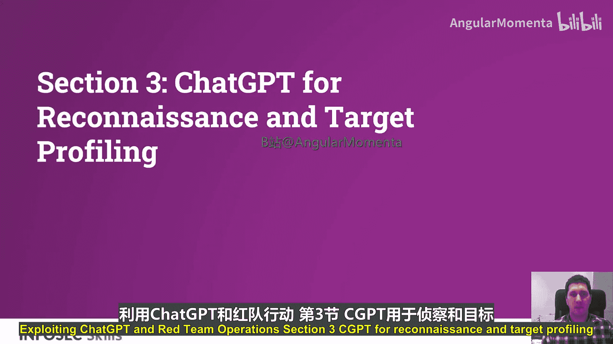
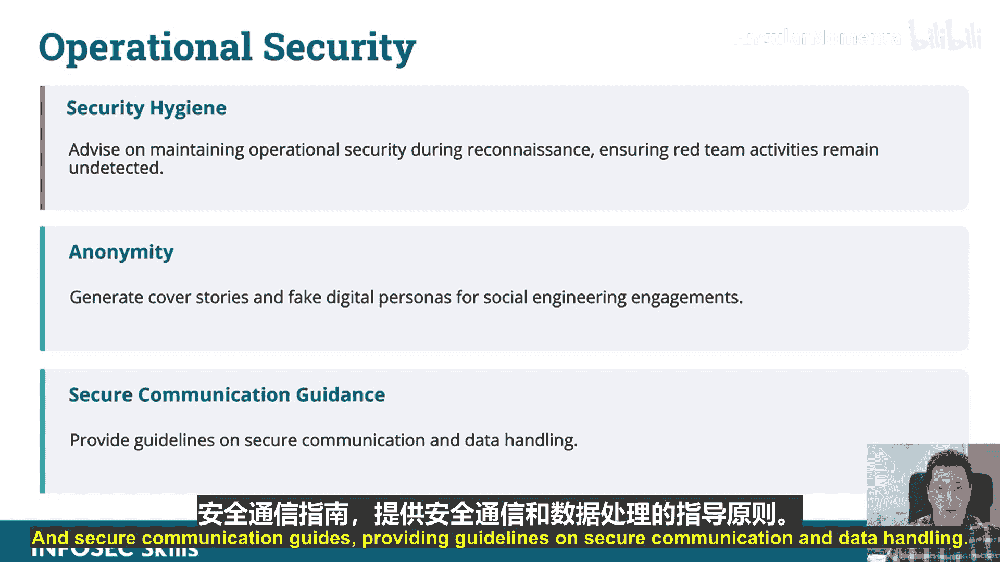
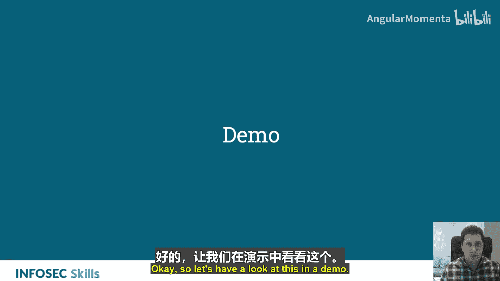
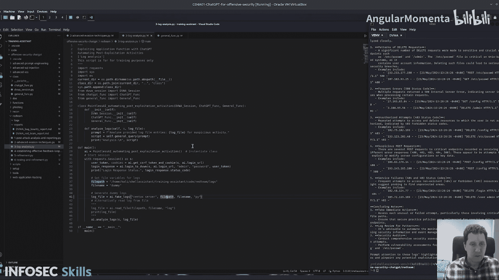

# 031：利用ChatGPT进行侦察与目标画像 🎯

在本节课中，我们将学习如何利用ChatGPT来加速和增强红队行动中的侦察与目标画像阶段。我们将探讨ChatGPT如何自动化数据收集、分析公开信息，并帮助构建目标的详细画像。

## 侦察阶段加速

在红队侦察中，ChatGPT通过自动化目标数据收集，加速了网络行动的初始阶段。它可以分析公开记录、网站和社交媒体，为目标构建全面的画像。

上一节我们介绍了ChatGPT在红队行动中的潜力，本节中我们来看看它在具体侦察任务中的应用。使用传统方法构建目标画像通常非常耗时。在这方面，ChatGPT可以真正充当一个智能助手，它能够处理你从侦察中获得的所有信息，并根据你提供的提示词，构建出目标的画像。

## 高级目标画像

以下是ChatGPT在高级目标画像中的几个关键应用：

*   **生成关键人员详细画像**：你可以通过向ChatGPT输入所有相关数据并运行脚本，生成组织内关键人员的详细画像，包括其社交习惯和网络关联。
*   **分析内部威胁**：通过处理来自内部监控工具的数据，并将其推送到ChatGPT函数进行分析，可以寻找恶意活动的模式和迹象。
*   **识别关键目标**：基于公开信息，帮助绘制目标组织的基础设施地图，从而识别关键目标。

## 定制化搜索与分析

ChatGPT提供了定制化的搜索能力。你可以利用高级搜索技术来筛选海量数据。传统方法可能是，如果你通过API调用接收到一个大型JSON数据包，你会使用类似`jq`的工具来过滤信息，并创建非常固定的函数来生成报告。而ChatGPT可以更动态地完成这项工作。例如，你可以说“在这个日志中寻找可疑活动”或“寻找符合此模式的活动”，这种方式灵活得多。

你可以使用自然语言查询来发现关于目标及其系统的、难以找到的信息。现在，你不再需要记住每一个`nmap`命令，你可以用自然语言告诉ChatGPT你想要做什么，它会为你生成相应的命令。这简化了从论坛和加密聊天服务等来源收集情报并理解大型数据集的过程，无需人工干预。

## 操作安全实践应用

ChatGPT在操作安全方面也有实际应用。你可以将其视为红队顾问，向其咨询在侦察期间如何保持隐蔽性、确保不被发现的最佳实践和方法。

以下是ChatGPT在操作安全中的具体用途：

*   **生成掩护故事和虚假数字身份**：ChatGPT非常擅长生成逼真的虚假身份，用于社会工程学活动。
*   **提供安全通信指南**：提供关于安全通信和数据处理的指导方针。

## 演示：日志分析

现在，让我们通过一个演示来看看具体如何操作。这个演示将展示如何在日志分析中使用ChatGPT。

首先，演示创建了一个假日志文件。这是通过调用类中的一个函数来生成假日志。让我们看看这个类。它设置了一个提示：“创建一个Python脚本，用于生成指定类型的日志，并包含一个函数将其保存到指定文件路径和文件名。”

然后，日志脚本向ChatGPT发送请求以生成查询。接着，打印并执行这个由ChatGPT生成的、用于创建假日志的脚本。执行后，我们读取生成的文件。

一旦假日志生成，就使用ChatGPT对其进行分析。提示是：“分析提供的日志文件条目，寻找可疑活动。”在这个例子中，它生成了一个CentOS服务器的假日志。这也可以用于攻击后的混淆，例如在利用后上传一堆生成的日志以制造混乱。

现在，ChatGPT正在分析这些日志，并将提供一份报告。分析结果显示，日志条目揭示了许多潜在的安全问题。例如，存在大量针对敏感和关键端点的删除请求模式，这是入侵的明显迹象，表明有人试图掩盖踪迹，但做得并不好。报告还指出了其他可疑的POST请求和一些服务故障，并提供了如何处理这些问题的总结性建议。

## 总结

本节课中，我们一起学习了如何将ChatGPT作为红队侦察和目标画像阶段的强大工具。我们了解到，ChatGPT能够自动化信息收集、分析复杂数据集、生成详细的目标画像，并提供操作安全指导，从而显著提高红队行动的效率和隐蔽性。通过将ChatGPT整合到你的工作流程中，你可以更智能、更快速地理解目标环境。