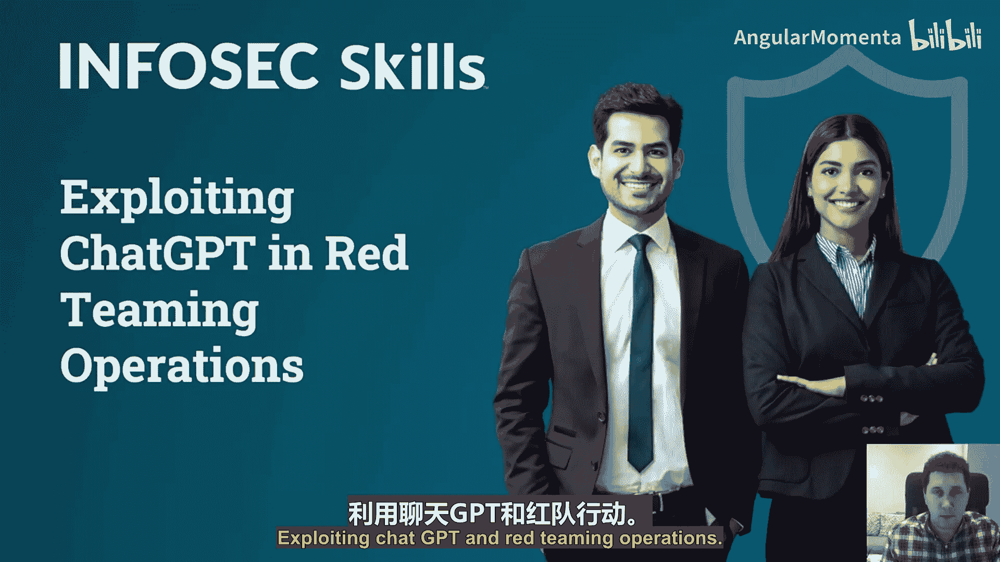
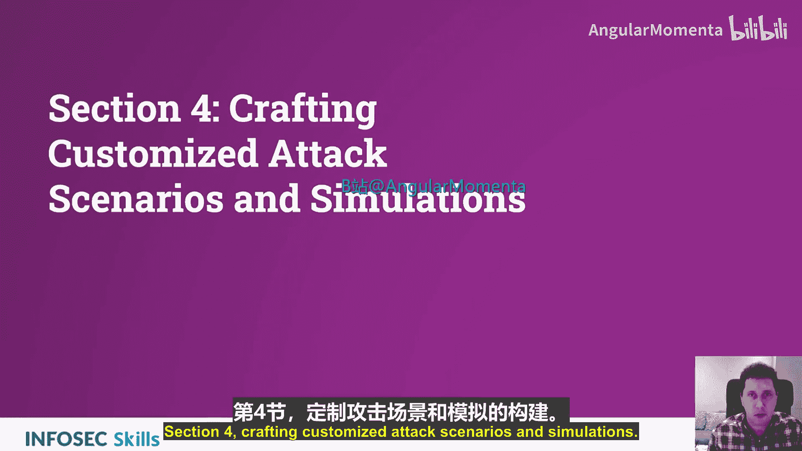
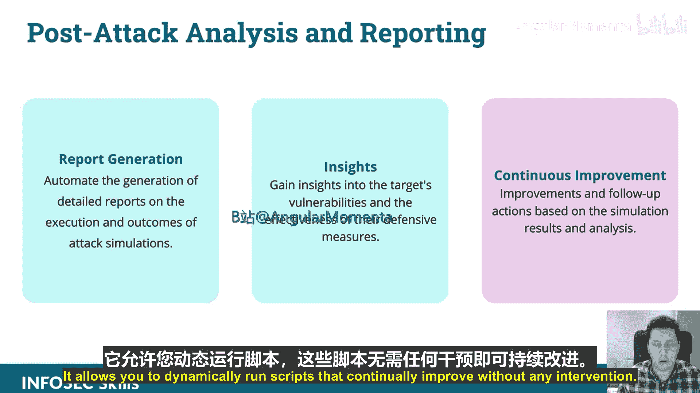
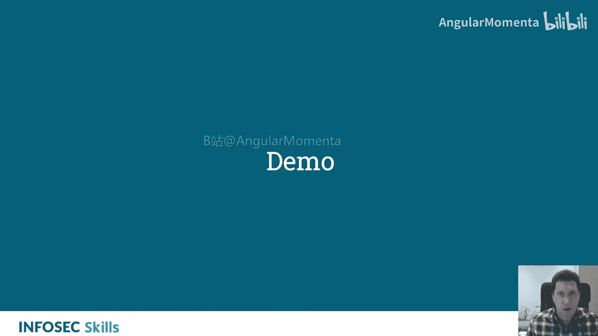
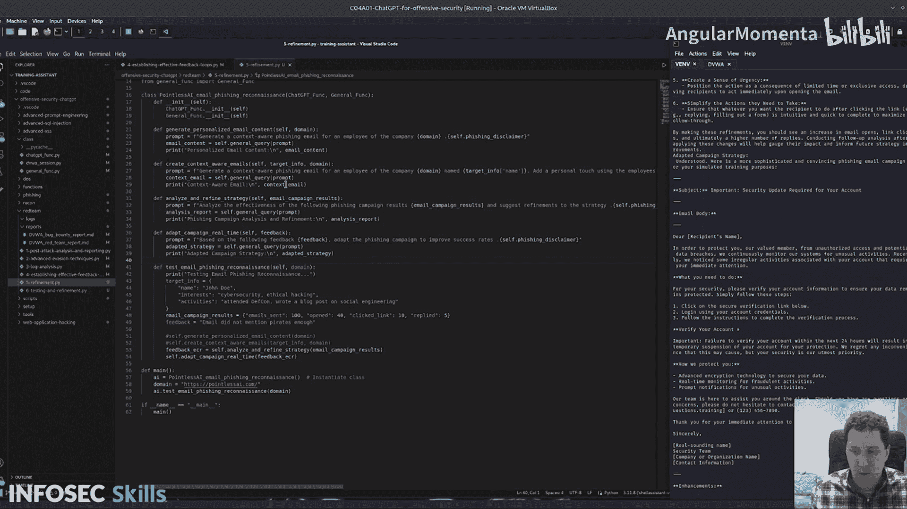

# 032：定制化攻击场景与模拟演练 🎯

在本章中，我们将学习如何利用ChatGPT来设计和执行高度定制化的网络攻击场景与模拟演练。我们将探讨从场景规划到事后分析的完整流程，并通过具体示例展示如何实现自动化与持续改进。

## 场景开发概述

上一节我们介绍了ChatGPT在红队行动中的基本应用。本节中，我们来看看如何利用它进行定制化攻击场景的开发。

ChatGPT能够协助基于目标的特定漏洞，开发出逼真的网络攻击场景。显然，你需要先进行侦察，然后将信息输入。ChatGPT随后会协助你制定一个逼真的模拟场景。

以下是ChatGPT在场景开发中的主要功能：

*   **生成模拟攻击的叙事**：包括网络钓鱼、勒索软件和内部威胁等场景。
*   **定制场景以反映最新的网络安全趋势和威胁**：这在以前是一项非常手动的任务，但现在很大程度上可以自动化。

## 模拟演练规划

在模拟演练规划方面，ChatGPT能提供详细帮助。稍后我们将通过演示来具体了解。

它有助于规划网络攻击模拟的执行，包括**时机、方法和目标系统**。你可以告诉它你的意图，然后通过优化提示词来完善你的场景。

以下是规划阶段的关键点：

*   **建议应对措施**：提出目标方可能采取的、现实的响应和反制措施，从而增强模拟的真实性和评估价值。
*   **影响评估**：提供评估模拟攻击对目标组织影响的功能。

## 钓鱼活动定制

你可以开发个性化的钓鱼邮件和消息，以模仿目标的常用沟通模式。只需提供一个沟通模式的例子，或解释你想要的语气和风格。

以下是定制钓鱼活动的步骤：

*   **基于目标公司文化和员工个人资料设计社会工程学策略**：ChatGPT可以根据你提供的侦察信息智能地进行推断。
*   **分析活动效果**：提供改进的见解。

## 绕过防御措施

分析目标的防御策略，以建议在模拟中绕过这些策略的方法。这涉及到根据模拟攻击的反馈来调整策略，并识别目标即时响应和缓解策略中的弱点。

这个过程非常具有互动性，并涉及到紫队协作。你可以发起一次模拟攻击，接收反馈，然后将其输入ChatGPT，以提高活动的有效性。

## 事后分析与报告

在事后分析与报告阶段，ChatGPT同样表现出色。

*   **报告生成**：只要你给出正确的格式提示，ChatGPT非常擅长生成报告。
*   **提供洞察**：深入分析目标的漏洞及其防御措施的有效性。
*   **持续改进**：在演示中你会看到，迭代和持续改进是ChatGPT的一大优势。它允许你动态运行脚本，无需干预即可持续优化。

## 演示一：建立有效的反馈循环

这个演示将展示如何通过提示词优化的方法，利用ChatGPT建立有效的反馈循环。

首先，我们设定了目标URL和初始提示词（发送跨站脚本载荷）。然后，我们有一个优化后的提示词数组（一个Python列表），用于提高提示词的准确性和性能指标。

我们通过一个函数来评估提示词优化过程的效率。该函数通过发送精心构造的载荷并观察响应来实现。接着，我们测量提示词的有效性，并模拟收集外部反馈。

在演示代码中，初始提示词“发送跨站脚本载荷”的有效性被评定为10。随后，优化提示词1（为提高准确性）和优化提示词2（为进行核心调整）的有效性也被评定为10。

这里的有效性分数实际上是硬编码为10的。这只是为了演示如何根据指标分析响应。在实际应用中，你可以引入逻辑来动态评估提示词响应的性能指标，并采取相应行动。例如，你可以设定规则：如果响应包含“登录成功”，则分数加10；如果不包含，则分数加2。这样就能基于实际反馈动态计算有效性分数。

## 演示二：使用提示词优化与响应优化

这个演示将展示如何在ChatGPT中使用提示词优化和响应优化。

脚本首先调用一个测试邮件侦察的函数，该函数包含一些虚拟的目标信息、活动结果和反馈（其中明确提到“邮件没有足够提及海盗”）。

以下是脚本执行的主要步骤：

1.  **生成个性化邮件内容**：
    *   第一种方法为该公司的一名员工生成具有上下文感知的邮件。
    *   第二种方法基于员工的近期活动和兴趣，为邮件添加个人化色彩。这些兴趣和活动信息可以作为输入，用于生成钓鱼模拟邮件。
2.  **分析与优化策略**：
    *   脚本会分析邮件活动结果（这些数据可以来自你的客户关系管理系统），并基于此分析和优化策略。
3.  **实时调整活动**：
    *   脚本会根据收到的反馈（例如硬编码的“邮件没有足够提及海盗”）实时调整活动，并生成相应的优化提示词。

在演示输出中，我们看到了生成的邮件示例：
*   **第一封邮件**：主题为“需要操作：我们的安全政策重要更新”，是一封来自IT部门的标准化钓鱼邮件。
*   **第二封邮件**：利用了用户的兴趣和活动信息（例如，提及用户最近参加的Defcon会议），是一封高度个性化、更具说服力的钓鱼邮件。

接着，脚本分析了活动指标（如发送量、打开率、链接点击率），并基于这些指标提供了优化见解。这些数据可以传递给另一个ChatGPT函数，用于生成更有效的优化邮件。

最后，脚本根据反馈（“邮件没有足够提及海盗”）调整了钓鱼活动，生成了一个更复杂、更具说服力的钓鱼邮件示例，主题为“您的账户需要重要的安全更新”。

在实际应用中，反馈可以不是硬编码的，而是基于对活动结果的分析自动生成的。例如，可以将活动结果作为输入，让ChatGPT分析其优缺点，并据此生成优化反馈和新的活动策略。

---

本节课中，我们一起学习了如何利用ChatGPT进行定制化攻击场景与模拟演练。我们涵盖了从场景规划、钓鱼活动定制、绕过防御措施到事后分析与报告的完整流程，并通过两个演示具体展示了如何建立反馈循环以及进行提示词与响应的优化。利用这些技术，红队可以更高效、更自动化地设计和执行逼真的安全测试。