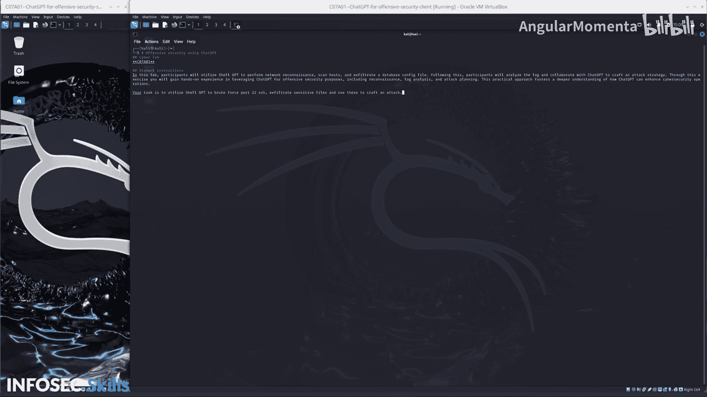

# 034：07_01_04_使用ChatGPT模拟真实世界攻击-实验概述 🚀

在本节课程中，我们将学习如何利用ChatGPT进行攻击性安全实战演练。我们将通过一个模拟实验，涵盖网络侦察、主机扫描、数据窃取以及攻击策略制定等关键环节，以理解ChatGPT如何增强网络安全操作。

## 实验简介

欢迎来到“使用ChatGPT进行攻击性网络安全”的实战网络实验室。

在这个实验中，参与者将利用Shell GPT（一种模拟的AI工具）执行网络侦察、扫描主机并窃取一份数据库配置文件。

## 实验目标与流程

完成上述步骤后，参与者需要分析相关日志，并与CEPT（模拟的协作规划工具）合作，共同制定一份攻击策略。

通过这个练习，你将获得利用ChatGPT实现攻击性安全目的（包括侦察、日志分析和攻击规划）的实践经验。

这种实践方法有助于更深入地理解ChatGPT如何提升网络安全运营的效能。

## 你的具体任务

你的任务是利用Shell GPT对22号端口（SSH服务）进行暴力破解，窃取敏感文件，并利用这些信息来策划一次攻击。

---

### 核心步骤分解

以下是本次实验需要完成的主要步骤列表：

1.  **网络侦察**：使用工具识别目标网络中的活跃主机和服务。
2.  **端口扫描与暴力破解**：针对目标的22号SSH端口进行扫描和密码破解尝试。
3.  **数据窃取**：成功入侵后，定位并窃取关键的数据库配置文件。
4.  **日志分析**：审查系统或应用日志，以了解攻击痕迹和系统状态。
5.  **攻击策略制定**：基于窃取的数据和日志分析结果，规划下一步的攻击行动。

---

### 总结

本节课中，我们一起学习了如何在一个模拟的实战环境中使用ChatGPT执行攻击性安全任务。我们概述了从网络侦察到攻击策略制定的完整流程，明确了利用AI工具进行端口暴力破解、数据窃取和协作规划的具体任务。这个实验旨在为你提供将AI技术应用于真实网络安全场景的初步体验。