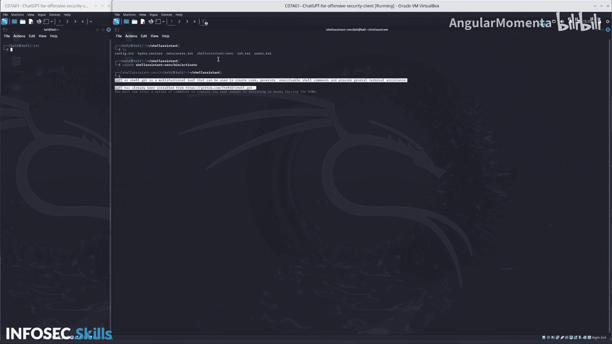

# 035：07_01_05_初始实验环境设置 🛠️


在本节课中，我们将学习如何为后续的渗透测试实验设置初始环境。我们将登录虚拟机，配置必要的工具，并准备好与AI助手交互的终端环境。

## 初始设置

登录到虚拟机后，你会看到系统中包含一个**客户端**和一个**服务器**。

## 配置客户端环境

上一节我们介绍了实验环境的整体构成，本节中我们来看看如何配置客户端以使用AI助手。

首先，在客户端机器上，需要切换到AI助手所在的目录。使用以下命令：
```bash
cd /path/to/Youll_assistant_directory
```
进入该目录后，你将看到一个Python虚拟环境脚本。

以下是激活虚拟环境的步骤：
1.  使用 `source` 命令激活虚拟环境。
2.  激活后，使用以下命令导出你的OpenAI API密钥：
    ```bash
    export OPENAI_API_KEY='你的API密钥'
    ```

## 介绍SGPT工具

在本练习中，我们将使用一个名为 **SGPT**（或称为 Shell GPT）的工具。这是一个多功能工具，可用于创建代码、生成可执行的Shell命令以及提供一般的终端协助。

SGPT工具已从其公开的GitHub仓库安装完毕。

---



本节课中我们一起学习了如何设置基础的渗透测试实验环境。我们登录了虚拟机，在客户端激活了Python虚拟环境并配置了API密钥，同时介绍了即将用于辅助安全测试的SGPT工具。环境现已准备就绪，可用于后续的练习。