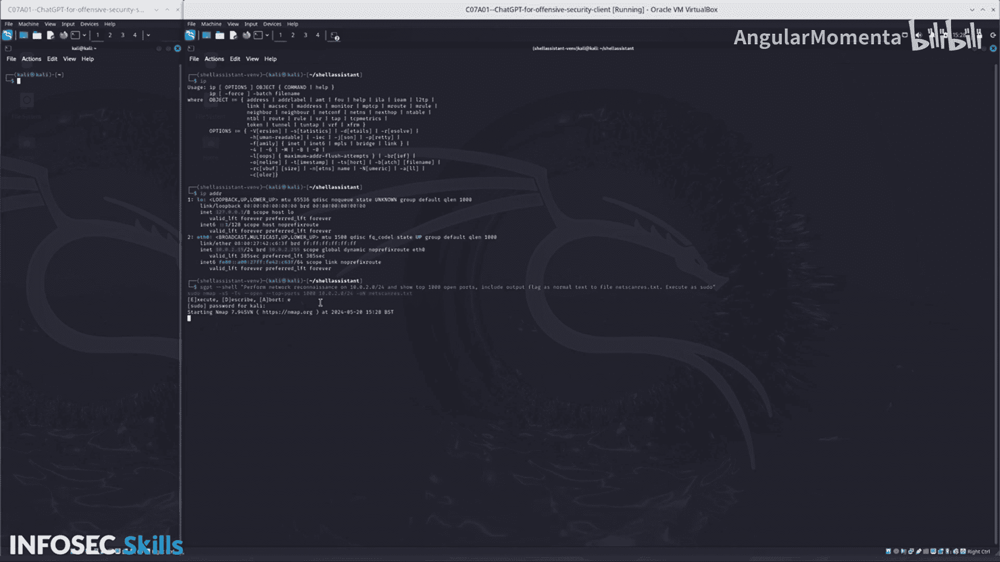

# 036：扫描网络主机


## 概述
在本节课中，我们将学习如何利用ChatGPT进行网络侦察的第一步：识别本地网络中的活动主机。我们将通过一个具体的任务来演示，即使用自然语言指令让ChatGPT生成并执行网络扫描命令。

## 任务一：执行网络侦察
我的第一个任务是找出我的IP地址。

执行命令 `ip addr show` 后，我虚拟机的IP地址是 **10.0.2.15/24**。这意味着我处于 **10.0.2.0** 网络中。

接下来，我将运行一个ChatGPT命令，以识别网络上的其他主机和端口。

## 构建ChatGPT指令
我向ChatGPT发出的自然语言指令是：
> 使用 `-d shell` 标志返回一个shell命令，对我刚识别的网络执行网络侦察，扫描前1000个开放端口，并使用输出标志将结果保存为普通文本文件 `netcaras.txt`。

可以看到，我进行了相当多的提示词优化。我的初始提示“对此IP执行网络侦察”耗时过长。随后我增加了“扫描前1000个开放端口”的限定。接着，为了将结果输出到文件，我补充了“输出到文件”的指令，但得到的命令有误。因此，我进一步优化为“包含输出标志，将结果保存为普通文本文件至此文件”。最后的错误是命令需要以 `sudo` 权限运行。经过这三轮优化，我得到了最终的提示词。

我执行了这个优化后的提示，ChatGPT返回了以下Nmap命令：
```bash
sudo nmap -sS -sV -O -p 1-1000 -oN netcaras.txt 10.0.2.0/24
```
如果你是经验丰富的从业者，可能会直接写出这个命令。但此处的强大之处在于，**任何人**都可以使用自然语言来完成这项任务，而无需记忆复杂的命令语法。

现在，我们开始执行这个命令来扫描本地网络。

## 扫描结果与分析
扫描成功完成。为了查看特定主机的详细信息，我们可以输入命令 `cat netcaras.txt | grep 10.0.2.6`。



结果显示，在IP地址 **10.0.2.6** 上发现了一个开放的端口：**22端口**（此端口是为演示目的而开放的）。

## 最佳实践建议
一个好的做法是：**将此命令复制并保存到你的笔记中，以备下次使用**。这能帮助你快速重用有效的指令，并积累自己的安全操作知识库。


## 总结
本节课中，我们一起学习了利用ChatGPT进行初步网络侦察的流程。我们从获取自身IP地址开始，通过自然语言与ChatGPT交互，逐步优化提示词，最终生成并执行了有效的Nmap扫描命令，成功发现了网络中的活动主机及其开放端口。这个过程展示了如何将复杂的命令行工具转化为易于理解和操作的自然语言任务。