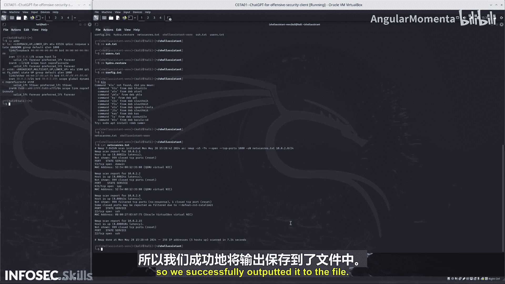

# 037：07_01_07_步骤二-访问易受攻击的机器

在本节课程中，我们将学习如何利用ChatGPT（特别是SGPT工具）辅助渗透测试工作流。我们将从分析扫描结果开始，识别开放端口，并最终对目标主机进行暴力破解攻击。整个过程旨在展示如何将AI工具无缝集成到安全测试中，以自动化繁琐任务并提高效率。

## 分析扫描结果

上一节我们可能进行了网络扫描。本节中，我们来看看如何处理扫描输出的结果。

首先，我们调整了终端大小以确保能完整查看屏幕内容。运行扫描命令后，其输出被保存到了 `nextcas.txt` 文件中。为了工作区整洁，我们先进行了一些清理操作。

以下是检查输出文件的步骤：
1.  使用 `cat` 命令查看 `nextcas.txt` 文件内容。
2.  确认文件内容与终端原始输出一致，这表示文件输出成功。

现在，我们得到了包含扫描结果的 `Neca.res` 文件。

## 使用SGPT提取关键信息

在成功获取扫描结果后，下一步是从中提取对我们有用的特定信息。

我们将文件内容传递给SGPT进行处理。这次我们不使用SGPT执行Shell命令，而是希望它直接分析文本信息。我们向SGPT提供的提示是：“从提供的文本中，列出开放了22号端口的主机ID”。

SGPT随后给出了一个清晰的列表，指明了哪些主机开放了SSH服务（端口22）。这帮助我们快速定位了潜在的攻击目标。

## 对目标进行暴力破解

在识别出开放22号端口的目标主机后，我们接下来尝试对其进行暴力破解攻击。

我们再次让SGPT生成一个可执行的Shell命令。我们给出的提示是：“暴力破解我刚发现的这台易受攻击主机上开放的22号端口，使用用户名‘Carly’（在实际场景中需要更多侦察），并包含输出标志，将任何有效的用户名密码保存到 `S_H.txt` 文件中”。我们只关心最终有效的凭证。

SGPT返回的命令建议使用 `hydra` 工具进行暴力破解。对于一个新手而言，可能并不了解 `hydra` 是什么，但通过自然语言指令，SGPT自动选择了合适的工具、指定了IP、端口、用户名（并据此推断出可能使用的密码字典 `Carly.txt`）以及输出文件。我们直接执行该命令。

命令执行后，生成了 `S_H.txt` 文件。其内容可能不够规整，因此我们再次将其传递给SGPT进行信息提取和整理，以得到清晰的结果。

## 课程总结

本节课中我们一起学习了如何将SGPT/ChatGPT应用于渗透测试的实操步骤。我们经历了三个主要阶段：首先确认并整理扫描结果；然后利用AI快速从大量文本中筛选出关键目标（开放特定端口的主机）；最后，通过自然语言指令让AI生成具体的攻击命令（如暴力破解），并对输出结果进行二次处理。这个过程演示了AI如何帮助安全测试人员自动化信息提取和工具调用，即使是对某些工具不熟悉的“外行”，也能通过高层指令有效完成任务，从而提升工作效率和专注度。