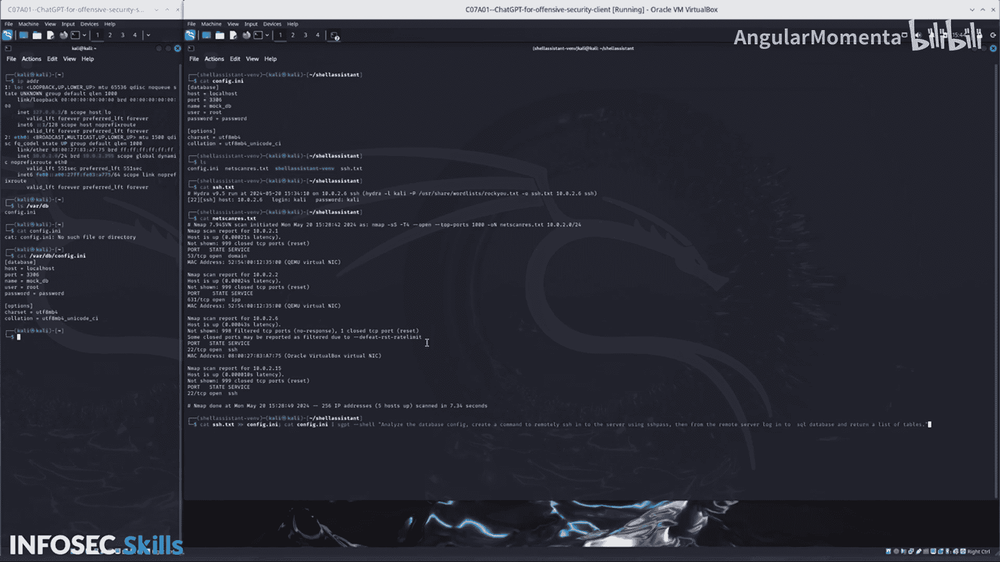

# 039：分析日志与数据库


在本节课中，我们将学习如何分析从目标系统中提取的日志和配置文件，并利用这些信息来探索数据库结构。我们将重点关注如何整合信息，并使用自动化命令远程访问数据库。

---

上一节我们提取了关键的配置文件。现在，我们来分析这些文件的内容，并据此探索目标服务器上的数据库。



以下是分析整合后的配置文件 `config.txt` 所得到的核心信息：
*   **SSH 登录凭证**：用户名 `carly`，密码 `carly`。
*   **目标服务器地址**：`10.0.2.6`，SSH 端口 `22`。
*   **数据库连接信息**：包含在 `config.txt` 中。

---

为了高效地探索数据库，我们需要从目标服务器内部执行查询，以避免可能的防火墙拦截。我们可以使用 `sshpass` 工具通过 SSH 在远程服务器上执行命令。

以下是通过 ChatGPT 生成的自动化命令，用于登录目标服务器并列出数据库中的所有表：

```bash
sshpass -p 'carly' ssh carly@10.0.2.6 'mysql --user=db_user --password=db_pass --database=mock_db -e "SHOW TABLES;"'
```

执行此命令后，我们获得了数据库 `mock_db` 中的表列表：
*   `accounts`
*   `users`

---

本节课中，我们一起学习了如何分析整合的日志文件，并利用提取的凭证和配置信息，构造自动化命令来远程探索目标数据库的结构。我们成功获取了数据库中的表名，为后续的数据探查奠定了基础。将这类已验证的命令保存下来，可以极大地提高后续自动化渗透测试脚本的效率。