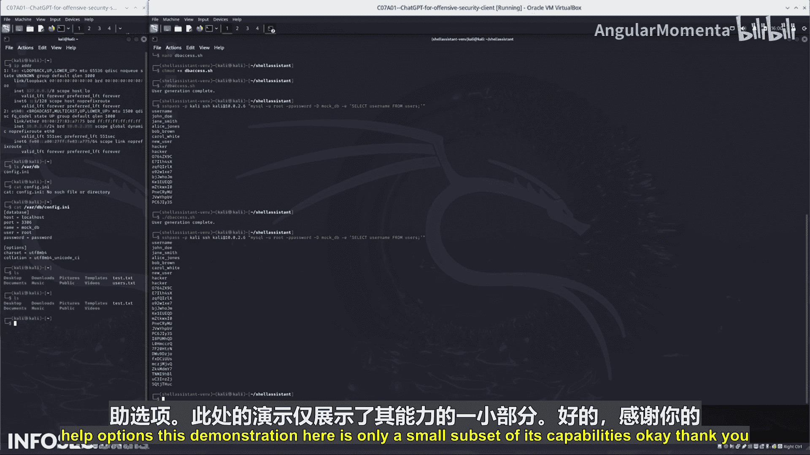

# 041：第07_01_11节-步骤6-创建Bash脚本


在本节中，我们将学习如何利用ChatGPT生成一个Bash脚本，用于自动化在目标服务器上创建随机用户的操作。这是渗透测试中利用已获取的数据库凭证进行横向移动的常见步骤。

上一节我们介绍了如何利用ChatGPT生成攻击载荷。本节中，我们来看看如何将多个步骤整合成一个自动化脚本。

作为最后一步，我需要制作某种攻击脚本。

在服务器上，我将运行一个命令。这个命令将获取所有登录详情和用户信息，以及数据库信息，然后生成一个Bash脚本。该脚本将访问服务器并创建随机用户。

以下是生成脚本的核心命令逻辑：
```bash
# 此命令整合数据库凭证并生成创建随机用户的脚本
sshpass -p '[数据库密码]' ssh [用户名]@[服务器IP] 'mysql -u [数据库用户] -p[数据库密码] [数据库名] -e "INSERT INTO users (username, password) VALUES (...)"'
```

可以看到，这里生成了一个不错的小脚本。然而，它绕过了某些检查。实际上，脚本使用了`sshpass`和`ssh`命令。它可能会成功。让我们试一试。

我在想是否需要更具体一些。这个脚本没有执行。我不知道是否需要使用`sudo`。让我们尝试不使用`sudo`来执行。好的。

脚本正在写入。我们期望它做的是生成一大批随机用户。我不确定它是否对所有内容都生效。

让我们查看数据库表。哦，是的。看看这个，很好。让我们再次运行这个脚本。实际上，第一次尝试就成功了，这让我有点惊讶。我认为之前的提示不够简洁。

是的，现在我有了一个非常强大的脚本，因为我可以在数据库中创建随机用户。我可以创建一百万个用户。

现在，你已经完成了这个实验。在本实验中，你使用了ChatGPT来侦察网络、识别易受攻击的主机，并生成利用服务器错误配置的载荷。

你学习的下一步应该是在本地环境中安装Shell GPT，并探索其帮助选项。



这里的演示只是其功能的一小部分。好的，感谢你的时间。

## 总结
本节课中，我们一起学习了如何利用ChatGPT生成一个自动化的Bash脚本，用于在渗透测试中向目标数据库批量添加随机用户。我们了解了从整合信息到生成可执行脚本的完整流程，并认识到将复杂任务自动化的强大之处。