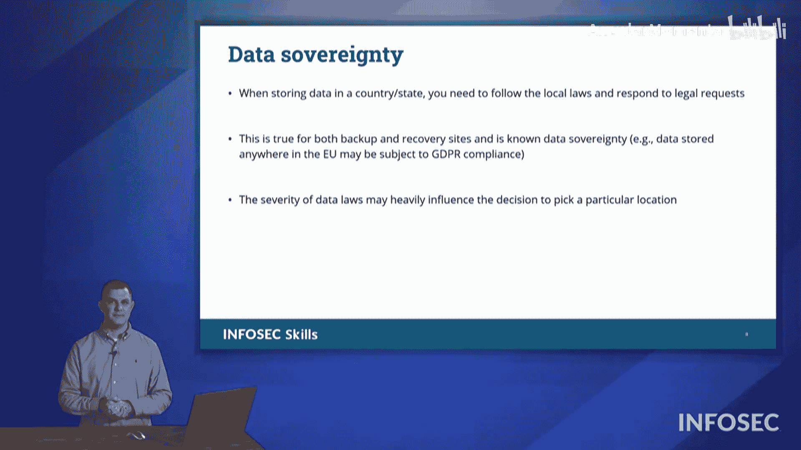

# 002：核心安全概念与术语 🛡️

在本节课中，我们将学习信息安全领域最核心的基础概念和术语。理解这些术语是构建后续所有安全知识框架的基石。

## CIA三要素 🔺

上一节我们介绍了课程的整体目标，本节中我们来看看信息安全最著名的模型——CIA三要素。它通常被描绘成一个三角形，包含**保密性**、**完整性**和**可用性**。这三个主题在网络安全中反复出现，尤其是在评估特定漏洞的影响时。

以下是CIA三要素的具体内容：

*   **保密性**：核心是**保持秘密信息不被泄露**。你不希望第三方访问到内容，因此会使用加密等手段来保护。我们使用**加密**来保护保密性。
*   **完整性**：核心是**确保数据不被未经授权或意外地更改**。你需要防范信息被篡改，保护数据的完整性。
*   **可用性**：核心是**确保数据或服务在你需要时能够被访问和使用**。信息和服务的可用性至关重要。

CIA三要素构成了网络安全工作的基础。事实上，任何网络安全事件，都至少是这三要素中某一方面的失败。

## AAA框架 🔐

理解了如何保护资产（CIA）后，接下来我们需要了解如何管理对这些资产的访问。这就是AAA框架，它代表了**认证、授权和审计**。

以下是AAA框架的三个组成部分：

*   **认证**：这是你**声明自己身份**的过程，例如输入用户名。
*   **授权**：这是你**证明自己身份**的过程，传统上通过密码、PIN码等方式实现。多因素认证也属于此范畴。
*   **审计**：这是**确保需要账户的用户拥有账户，并追踪用户在系统上的活动**的过程，主要通过记录系统日志来实现。

AAA框架是网络安全中访问控制的核心机制。

## 数据的三种状态 💾

在讨论了访问控制之后，我们需要思考数据本身在不同场景下的安全。数据在网络或组织内部可以存在于三种状态。

以下是数据的三种状态：

*   **传输中数据**：指**正在网络中传输的数据**。
*   **静态数据**：指**被存储起来的数据**，例如在电脑或文件服务器上。我们通常通过加密来保护静态数据的安全。
*   **使用中数据**：指**正在被处理或生成的数据**。一个例子是赛车比赛时，车辆传感器实时生成的数据。即使数据正在产生，也应考虑对其进行保护（如加密），以防被窃听。

确保数据在所有三种状态下都安全是至关重要的。

## 其他关键术语 📚

除了上述核心模型，还有一些频繁出现的关键术语需要掌握。

以下是其他几个重要的安全概念：

*   **不可否认性**：指**信息接收方能够确认信息的来源，且发送方事后无法否认其发送行为**。例如，通过数字签名签署的电子合同，可以防止发送方抵赖。
*   **差距分析**：指**通过对比组织当前的安全状况与应有的安全标准或最佳实践，找出其中存在的差距**。这有助于发现需要改进的安全领域。
*   **漏洞、威胁与风险**：这三个概念常被混用，但有明确区别。
    *   **漏洞**：是**系统或组织流程中固有的弱点**。例如，计算机需要电力才能运行，断电就是一个漏洞。
    *   **威胁**：是**可能利用漏洞并造成损害的事件或行为**，可以是人为的（威胁行为者）或自然的。它是**可能被实现的漏洞**。
    *   **风险**：是**对威胁的衡量，结合了该威胁可能造成的影响（影响程度）及其发生的可能性（概率）**。公式可表示为：**风险 = 影响 × 概率**。
*   **数据主权**：指**关于个人数据的法律和治理权力归属于该个人所在的国家或地区，而不取决于数据实际存储的地理位置**。例如，欧盟的《通用数据保护条例》（GDPR）规定，即使收集欧盟公民数据的企业不在欧盟境内，该数据仍受GDPR管辖，保护数据主体的权利。

本节课中我们一起学习了信息安全的基础词汇，包括CIA三要素、AAA框架、数据的三种状态，以及不可否认性、差距分析、漏洞/威胁/风险的区别和数据主权等关键概念。理解这些术语将为后续深入学习具体的安全技术和策略打下坚实的基础。