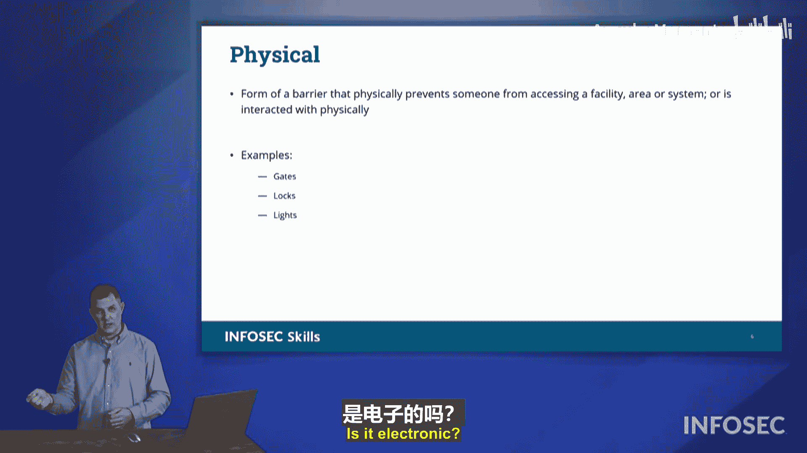

# 003：1.1.3 安全控制类别与类型

在本节中，我们将学习安全控制的类别，以及这些类别下的具体类型。了解这些分类有助于我们理解组织如何通过多种方式防御各种安全漏洞。

需要指出的是，在考试中，你**不需要**严格区分某个控制措施属于“类别”还是“类型”，也无需死记硬背所有列表。更重要的是理解这些概念背后的原理，而不是机械记忆。为了便于记忆，我们可以将主要类别简记为 **STOMP**：**S**ecurity（技术性）、**T**echnical（技术性）、**O**perational（操作性）、**M**anagerial（管理性）、**P**hysical（物理性）。但请记住，考试不会要求你默写这个列表。

现在，让我们深入了解这些安全控制类别。

## 技术性控制

上一节我们介绍了安全控制的整体框架，本节中我们首先来看技术性控制。在日常生活中，当人们提到“技术”时，通常指的是电子或信息系统相关的事物。在安全控制领域，**技术性控制**也遵循这个含义，它指的是通过计算系统来提供安全防护的措施。

以下是一些常见的技术性控制示例：
*   **入侵检测系统**：监控网络或系统中的恶意活动。
*   **防病毒软件**：检测、阻止并清除恶意软件。
*   **防火墙**：控制网络流量，基于安全规则允许或阻止数据包。

## 操作性控制

接下来，我们看看操作性控制。这类控制关注的是组织在结构上是如何运作的，特别是**人员**在安全运营中扮演的角色。在考试中，操作性控制通常与人及其职责相关。

以下是操作性控制的一些典型角色：
*   **首席信息安全官**：负责制定和监督整个组织的信息安全计划。
*   **设施安全官**：负责物理场所的安全。
*   **数据处理器/数据保管员**：负责处理或维护特定数据集的安全。

## 管理性控制

了解了人员角色后，我们来看看管理性控制。这类控制涉及管理层如何制定和监督组织的安全策略与流程。识别管理性控制的一个关键方法是：**这是由管理者决定要做的事情**，而非出于技术或物理上的必然要求。

例如：
*   管理者决定安全门禁卡必须每12个月重新认证一次。
*   管理者制定密码策略，要求每3个月更换一次密码。

这些决策并非因为门禁卡会“发霉”或技术本身要求频繁更改，而是管理者基于风险评估做出的行政决定。

## 物理性控制

最后，我们来看最容易识别的类别——物理性控制。这类控制涉及有形的、实体的屏障或设备，用于阻止未经授权的物理访问或行动。

物理性控制的例子非常直观：
*   安全闸门
*   上锁的门
*   照明系统（用于增强可视性和威慑）

关于物理性控制的一个常见疑问是：像电子门禁读卡器这样既涉及电子技术又控制物理门锁的设备，到底属于技术性还是物理性控制？请放心，Security+考试不会在这种模棱两可的问题上为难你。考题通常会非常明确，例如“安全闸门”显然属于物理性控制，不会让你在细微差别上纠结。

---

本节课中，我们一起学习了安全控制的四个主要类别：**技术性**、**操作性**、**管理性**和**物理性**。记住，重点是理解每类控制的核心理念和应用场景，而不是死记硬背分类。在接下来的章节中，我们将深入探讨安全控制的具体类型。