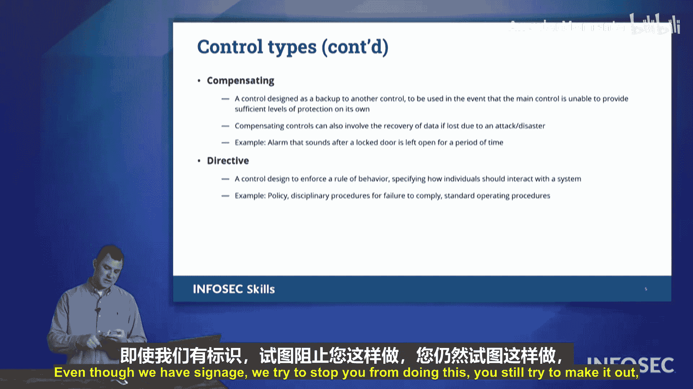

# 004：安全控制类型 🔐

在本节课中，我们将学习六种核心的安全控制类型。理解这些类型是构建有效安全策略的基础，它们帮助组织从不同层面防御威胁、检测事件并恢复系统。

## 概述

安全控制是组织为保护其资产（如信息、系统和人员）而采取的措施。它们可以根据其功能分为不同的类型。本节将详细介绍**威慑、预防、检测、纠正、补偿和指令**这六种控制类型。

## 威慑控制

上一节我们介绍了安全控制的基本概念，本节中我们来看看第一种类型：威慑控制。威慑控制旨在通过增加心理障碍，让潜在的攻击者“三思而后行”，从而阻止恶意行为的发生。它并不直接阻止行动，而是发出警告。

以下是威慑控制的常见例子：
*   **警示标语**：例如“禁止停车”或“监控区域”的标识。
*   **安全策略声明**：在登录系统前显示的“仅授权用户可使用”的横幅。
*   **可见的安保人员**：他们的存在本身就能起到威慑作用。

## 预防控制

如果威慑控制是“口头警告”，那么预防控制就是“物理封锁”。预防控制旨在主动阻止安全事件或违规行为的发生。它直接设障，使攻击难以成功。

以下是预防控制的常见例子：
*   **门锁**：防止未经授权的物理进入。
*   **围栏**：划定安全边界。
*   **登录认证**：要求用户名和密码才能访问系统。
*   **防火墙**：根据规则阻止或允许网络流量。

## 检测控制

即使部署了威慑和预防控制，事件仍可能发生。此时，检测控制就变得至关重要。检测控制用于发现正在发生或已经发生的安全事件。它们就像安全领域的“侦探”，帮助识别问题。

以下是检测控制的常见例子：
*   **安全摄像头**：记录活动以供事后审查。
*   **入侵检测系统（IDS）**：监控网络或系统中的恶意活动。
*   **日志审计**：定期检查系统日志，寻找异常模式。
*   **防病毒软件警报**：通知用户检测到恶意软件。

## 纠正控制

当检测控制发现一个问题后，我们需要采取行动来修复损害。这就是纠正控制的作用。纠正控制旨在减轻安全事件造成的影响，并将系统恢复到正常状态。

以下是纠正控制的常见例子：
*   **数据备份与恢复**：从备份中还原被勒索软件加密或意外删除的文件。
*   **系统重建**：将受感染的系统重装为干净状态。
*   **补丁管理**：在漏洞被利用后，紧急安装安全补丁。

## 补偿控制

没有任何单一的控制是完美的。补偿控制用于弥补其他主要安全控制的不足或弱点。当主要控制无法完全消除风险时，补偿控制提供了额外的安全层。

以下是补偿控制的常见例子：
*   **多因素认证（MFA）**：当密码（预防控制）可能太弱或被窃取时，MFA要求提供额外的验证因素（如手机验证码），从而补偿了单一密码的弱点。
*   **监控和审计**：作为预防性防火墙的补充，持续监控可以检测到绕过防火墙的攻击。

## 指令控制

最后，我们来了解指令控制。指令控制通过政策、法规、培训或指南来指导或强制人员采取特定的安全行为。它旨在塑造人的行为，使其符合组织安全要求。

以下是指令控制的常见例子：
*   **安全策略文档**：规定员工必须如何创建和管理密码。
*   **强制性安全培训**：要求所有员工完成网络安全意识课程。
*   **可接受使用政策（AUP）**：明确规定了公司IT资源的使用规则。

## 现实世界类比：零售商店

为了更好地理解这些控制类型，让我们通过一个零售商店的场景来回顾它们：
*   **威慑**：“店内装有监控摄像头”的标识。
*   **预防**：将贵重商品锁在防盗展示柜中。
*   **检测**：实际工作的监控摄像头，记录店内活动。
*   **纠正**：保安拦截未付款的顾客并收回商品。
*   **补偿**：尽管有摄像头和锁柜，商店仍设置单向出口闸机，并安排员工在出口检查收据，以弥补其他控制可能存在的漏洞。
*   **指令**：对员工进行防损培训，指导他们如何识别和应对可疑行为。

## 总结

本节课中我们一起学习了六种关键的安全控制类型：**威慑**、**预防**、**检测**、**纠正**、**补偿**和**指令**。每种类型在安全防御体系中扮演着独特的角色。一个强大的安全计划通常会综合运用多种控制类型，形成纵深防御，以更有效地保护组织资产。理解这些类型是准备CompTIA Security+考试以及在实际工作中设计和评估安全措施的基础。